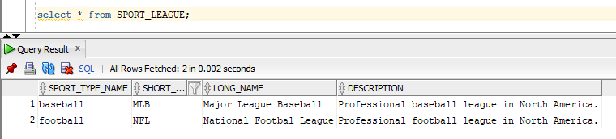
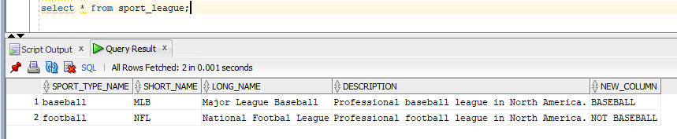

# DMS를 활용한 Raw Data Conversion Test


1. Target DB Schema 생성

```
create user newuser identified by newuser default tablespace users temporary tablespace temp quota unlimited on users;
grant connect,resource, dba to newuser;
```


---

2. sport_league table DDL

```
 CREATE TABLE "DMS_SAMPLE"."SPORT_LEAGUE" 
   (	"SPORT_TYPE_NAME" VARCHAR2(15) NOT NULL ENABLE, 
	"SHORT_NAME" VARCHAR2(10) NOT NULL ENABLE, 
	"LONG_NAME" VARCHAR2(60) NOT NULL ENABLE, 
	"DESCRIPTION" VARCHAR2(120), 
	 CONSTRAINT "SPORT_LEAGUE_PK" PRIMARY KEY ("SHORT_NAME")
  USING INDEX PCTFREE 10 INITRANS 2 MAXTRANS 255 COMPUTE STATISTICS 
  STORAGE(INITIAL 65536 NEXT 1048576 MINEXTENTS 1 MAXEXTENTS 2147483645
  PCTINCREASE 0 FREELISTS 1 FREELIST GROUPS 1
  BUFFER_POOL DEFAULT FLASH_CACHE DEFAULT CELL_FLASH_CACHE DEFAULT)
  TABLESPACE "USERS"  ENABLE, 
	 SUPPLEMENTAL LOG DATA (PRIMARY KEY) COLUMNS, 
	 CONSTRAINT "SL_SPORT_TYPE_FK" FOREIGN KEY ("SPORT_TYPE_NAME")
	  REFERENCES "DMS_SAMPLE"."SPORT_TYPE" ("NAME") ENABLE
   ) SEGMENT CREATION IMMEDIATE 
  PCTFREE 10 PCTUSED 40 INITRANS 1 MAXTRANS 255 
 NOCOMPRESS LOGGING
  STORAGE(INITIAL 65536 NEXT 1048576 MINEXTENTS 1 MAXEXTENTS 2147483645
  PCTINCREASE 0 FREELISTS 1 FREELIST GROUPS 1
  BUFFER_POOL DEFAULT FLASH_CACHE DEFAULT CELL_FLASH_CACHE DEFAULT)
  TABLESPACE "USERS";
```


---

3. Query SPORT_LEAGUE;

```
select * from sport_league;
```




---

4. DMS TASK Table Mapping

```
{
    "rules": [
        {
            "rule-type": "transformation",
            "rule-id": "478893211",
            "rule-name": "478893211",
            "rule-target": "schema",
            "object-locator": {
                "schema-name": "DMS_SAMPLE"
            },
            "rule-action": "rename",
            "value": "NEWUSER",
            "old-value": null
        },
        {
            "rule-type": "transformation",
            "rule-id": "2",
            "rule-name": "2",
            "rule-action": "add-column",
            "rule-target": "column",
            "object-locator": {
                "schema-name": "DMS_SAMPLE",
                "table-name": "SPORT_LEAGUE"
            },
            "value": "NEW_COLUMN",
            "expression": " CASE WHEN ($SHORT_NAME)=='MLB' THEN 'BASEBALL' ELSE 'NOT BASEBALL' END",
            "data-type": {
                "type": "string",
                "length": 50
            }
        },
        {
            "rule-type": "selection",
            "rule-id": "478883988",
            "rule-name": "478883988",
            "object-locator": {
                "schema-name": "DMS_SAMPLE",
                "table-name": "SPORT_LEAGUE"
            },
            "rule-action": "include",
            "filters": []
        }
    ]
}
```


---

5. TASK 실행 후 TARGET DB쪽에 NEW_COLUMN이 추가 됨을 확인.


---

6. 데이터도 원하는데로 들어감을 확인



