# Workshop 소개

#### 이 워크샵에서는 Oracle Database를 Aurora MySQL로 이관하는 방법을 실습합니다.

#### Schema는 Schema Converstion Tool을 이용하고, Data는 Database Migration Service를 이용합니다.

#### 초기 Data 이관과 변경 데이터에 대한 Change Data Capture(CDC) 기능을 실습합니다.

---

# 실습 환경 접속

1. `https://dashboard.eventengine.run/` 로 이동합니다.

2. 제공 받은 Team Hash Code를 입력하고 `Accept Terms&Login` 를 Click 합니다.

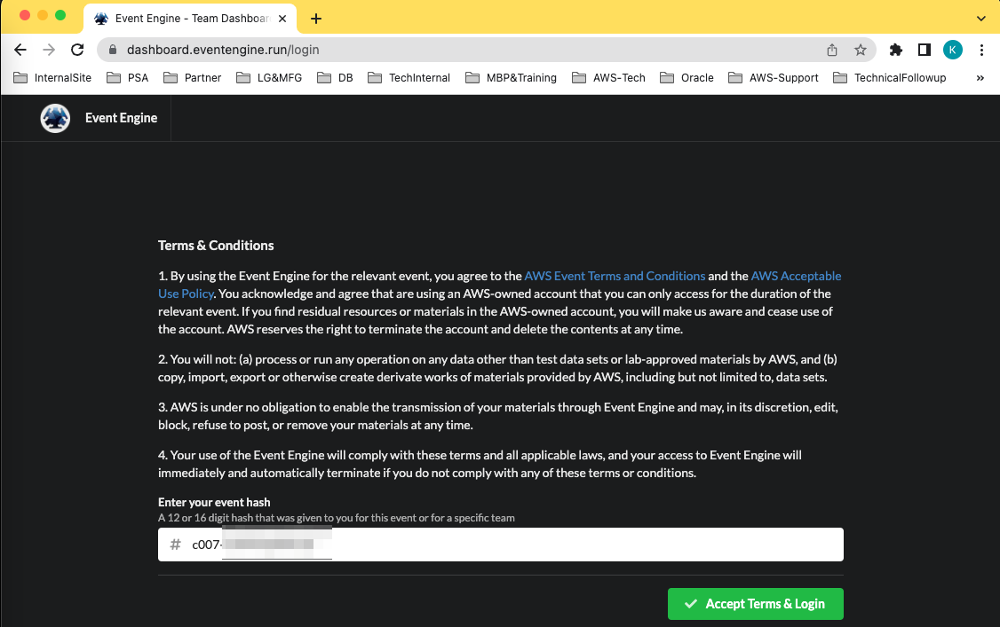

3. `Email One-Time Password(OTP)` 를 Click하고 Email 주소를 입력 합니다.

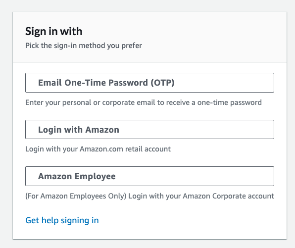

4. Email 을 입력하고 `Send Passcode` 를 Click합니다.

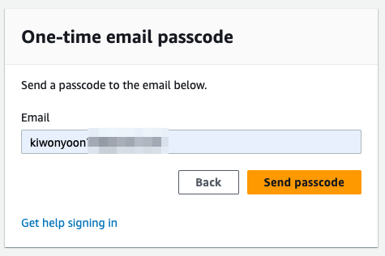

5. Email 로 전송된 Passcode를 확인하고 `One-time email passcode` 에 입력하고  `Sign in` Click합니다.

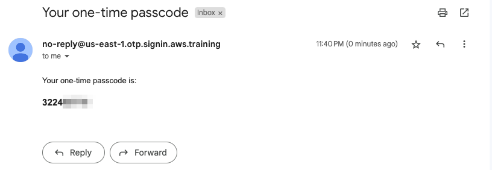

---

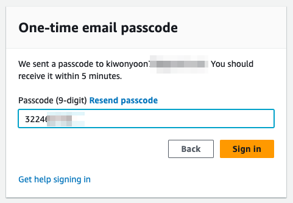

---

6. SSH Key를 Download 합니다. `SSH Key` 를  Click 후 `Download Key`를 Click하여 SSH pem key를 개인 Laptop에 저장합니다.

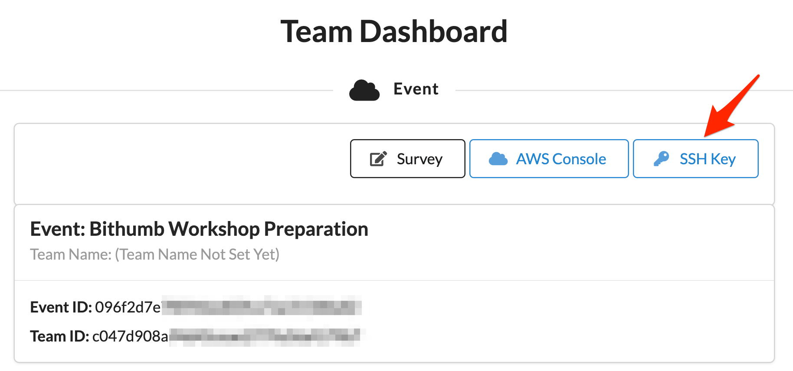

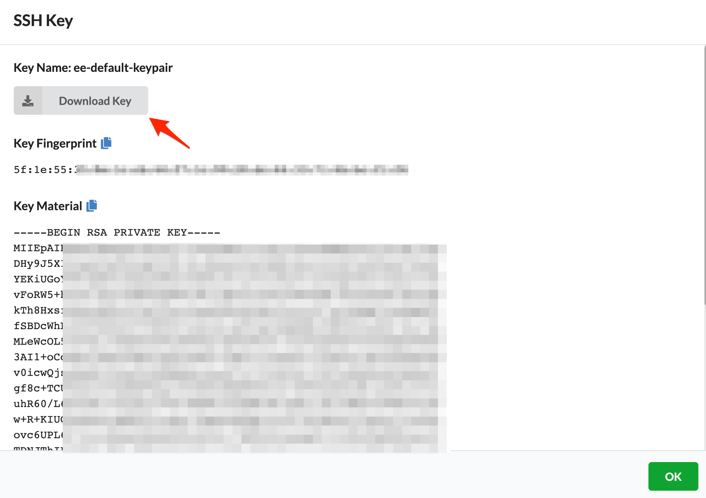

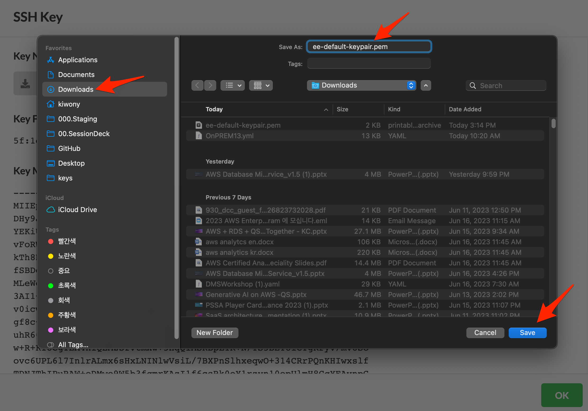

---

7. `AWS Console` Click합니다.

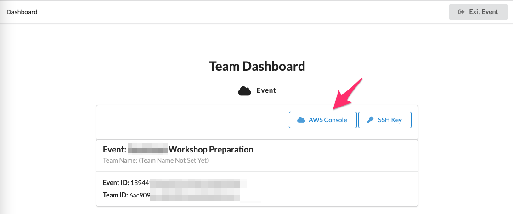

---

8. `Open Console` Click 합니다.

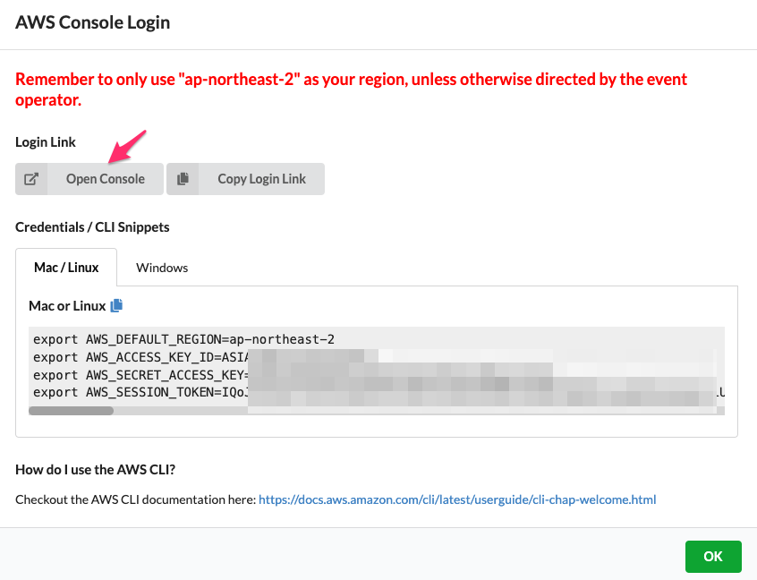

---

9. Console 화면이 한글로 표시 될 경우 Console 화면 중앙 상단의 톱니바퀴(설정)을 Click합니다.(영어로 표시 될 경우 다음 실습 환경 생성으로 넘어갑니다.)

   **더 많은 사용자 설정** 을 Click합니다.

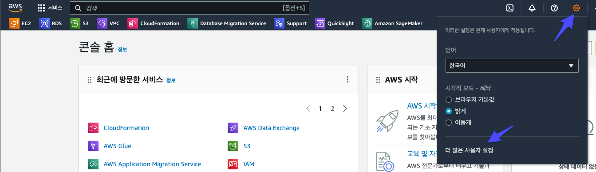

---

10. **현지화 및 기본 리전**에서 **편집**을 Click합니다.

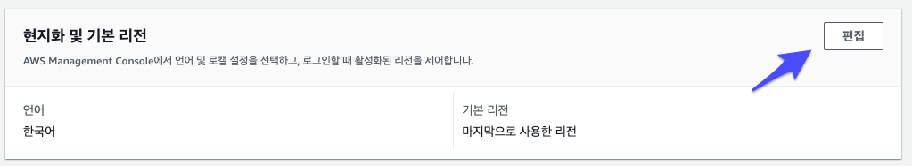

---

11. 언어 = English(US), 기본 리전=아시아 태평양(서울) ap-northeast-2를 선택 후 저장합니다.

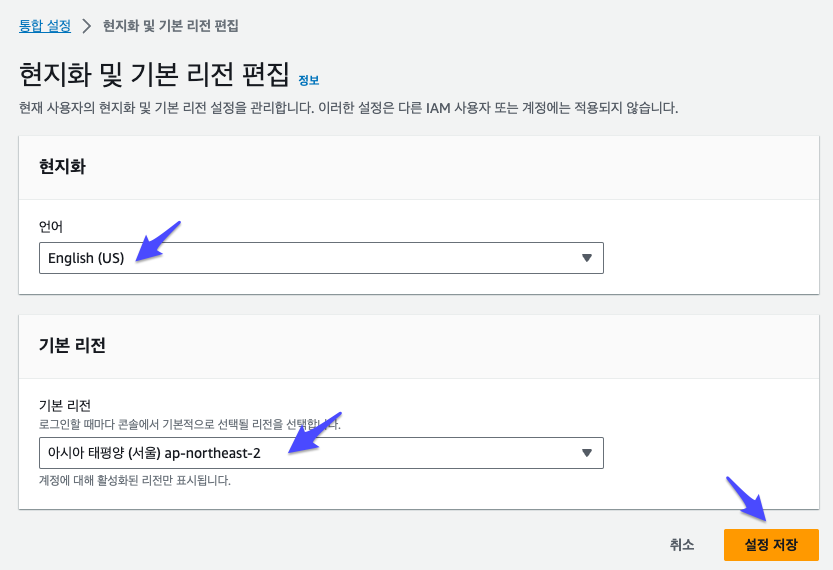

---

### [<다음> 실습 환경 생성](./02.md)

