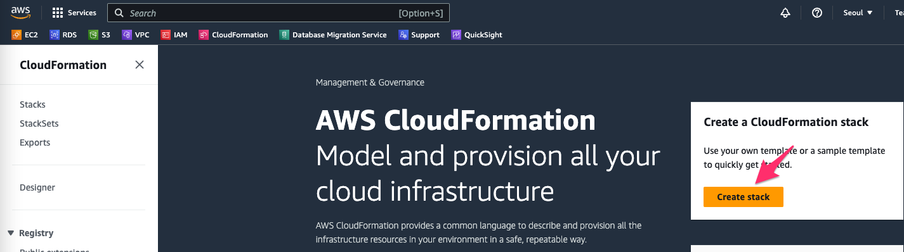
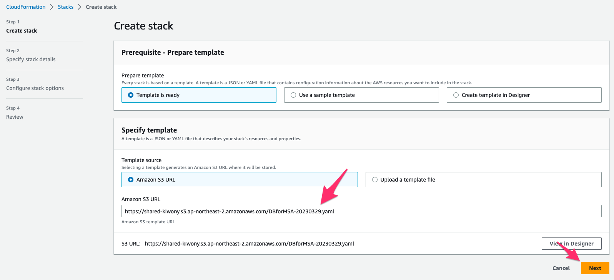
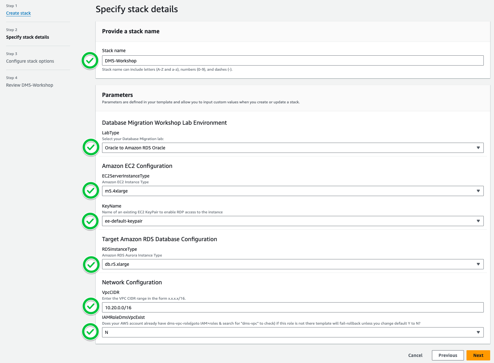
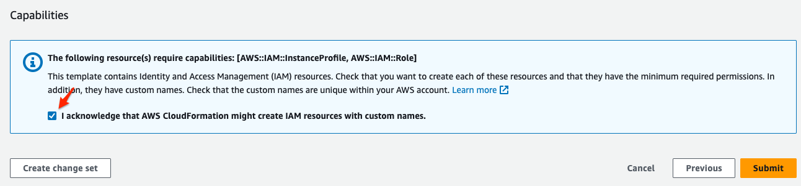
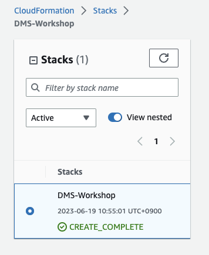
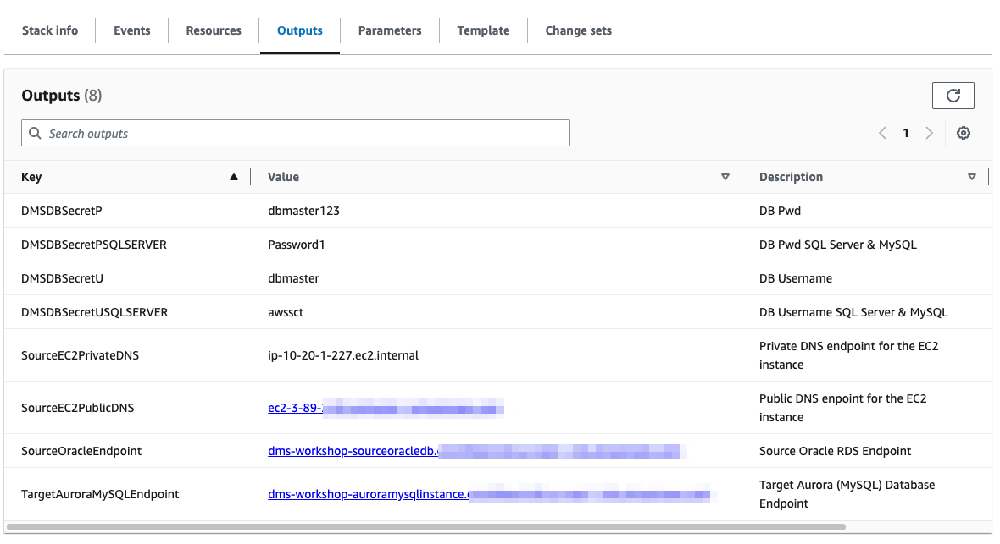
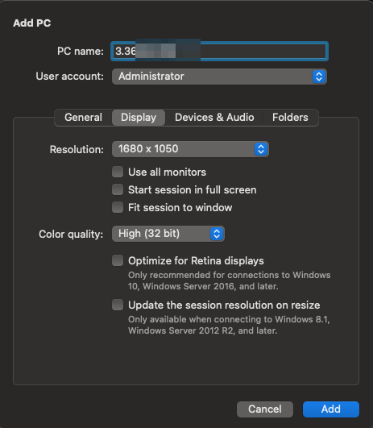

# 실습 환경 생성

CloudFormation은 Infra as Code service로 여러분의 Production/Test 환경을 Code로 Define해두고, Code를 통해 Immutable Infra를 생성 할 수 있게 해줍니다. 미리 정의되어 있는 yaml file을 통해 오늘 실습 환경을 생성하게 됩니다.


Workshop Yaml 파일을 사용하여 실습 환경용 1) VPC를 비롯한 Network Resource, 2) Source MySQL이 설치된 EC2, 3) Target Aurora Postgres 등이 자동으로 생성되게 됩니다.

---


1. [여기 ](https://ap-northeast-2.console.aws.amazon.com/cloudformation/home?region=ap-northeast-2/) 를 새 창(새 탭)으로 띄워서 CloudFormation으로 이동합니다.

---

2. "Create stack"을 클릭합니다.




---

3. Amazon S3 URL 부분에 `https://shared-kiwony.s3.ap-northeast-2.amazonaws.com/DMSWorkshop.yaml` 를 입력합니다. 입력 후 "Next"를 Click 합니다.



---


4. 다음과 같이 입력 하고 "Next"를 클릭 합니다.

```
Stack name : DMS-Workshop

LabType : Oracle to Amazon RDS Oracle
EC2ServerInstanceType : m5.4xlarge
KeyName : ee-default-keypair
RDSInstanceType : db.r5.xlarge
VpcCIDR : 10.20.0.0/16
IAMRoleDmsVpcExist : N

```



---

5. "Configure stack options" Page에서 "Next"를 Click

---

6. Review Page에서 `**I acknowledge that AWS CloudFormation might create IAM resources with custom names.**`을 Check하고,  `Submit` Click합니다.



---

7. CloudFormation이 CREATE_IN_PROGRESS로 바뀌는 것을 확인하고 CREATE_COMPLETE 가 될때까지 기다립니다. (약 15분 소요 - Coffee Break)



---

8. Outputs Tab을 Click하여 `Windows Server, 사용자 정보, Source, Target Endpoint`를 확인하고 메모장에 저장합니다.




---

10. Windows의 경우  `mstsc.exe`  , MAC의 경우  `Remote Desktop` 을 사용하여, 8번 스텝에서 확인한 `SourceEC2PublicDNS` 를 이용하여 Bastion Host에 접속합니다.

```
계정 : Administrator 
비밀번호 : Octank#1234
```





---


[<다음> Target Aurora MySQL 권한 설정](./03.md)
