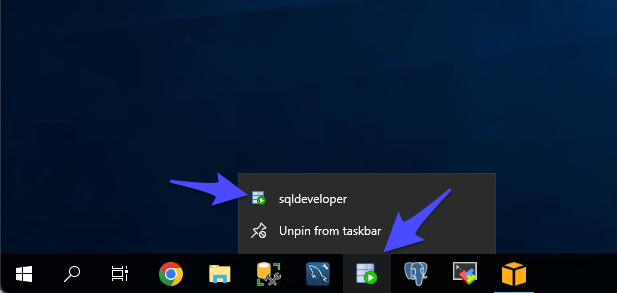
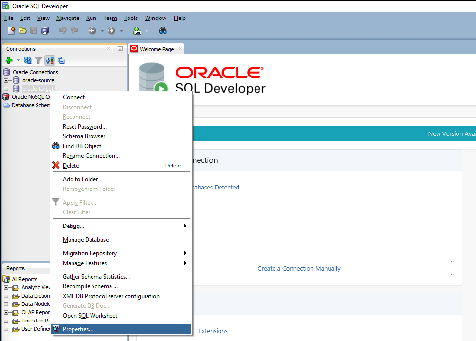
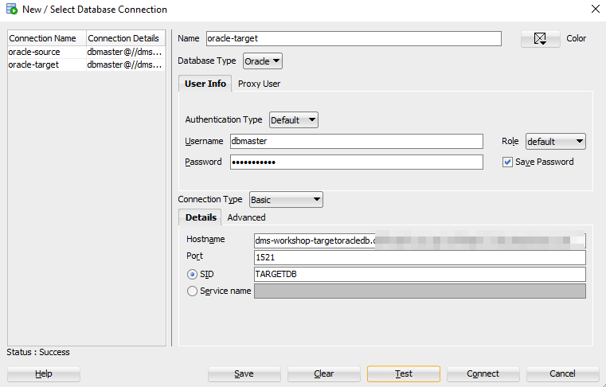
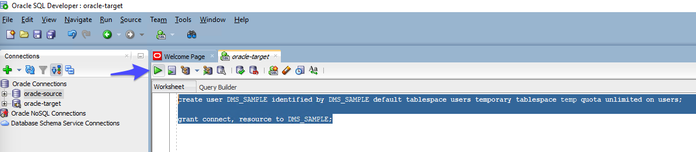
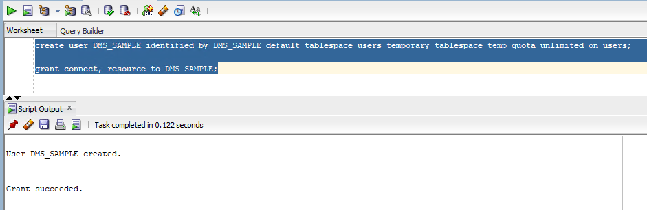

# Target Oracle 이관 사전 작업 수행

###  Target RDS Oracle에서 User 생성 및 권한을 부여합니다.

---

1. `SQL Developer` 를 실행합니다.




---

2. `oracle-target` 을 선택 후 마우스 우측 버튼을 Click하고, `Properties` 를 Click합니다.




---

3. 다음과 같이 입력 후 `Save` 를 Click 합니다.

   입력 후 `Test` 를 Click 하고 `Status : Success` 를 확인합니다.

   `Connect` 를 Click합니다. 잠시 기다리면 SQL Worksheet가 뜹니다.

```
Name : oracle-target

User Info
Username : dbmaster
Role : default
Password : dbmaster123
Save Password : Check

Hostname : 실습 환경생성 Step 8에서 저장해둔 TargetOracleEndpoint 주소를 입력
Port : 1521
SID : TARGETDB
```




---

4. 다음의 문장을 통해 `DMS_SAMPLE` User를 생성하고, 권한을 부여합니다. 

   다음 문장들을 붙여 넣기 후, 모두 선택 후, 초록색 실행 버튼을 Click합니다.

```
create user DMS_SAMPLE identified by DMS_SAMPLE default tablespace users temporary tablespace temp quota unlimited on users;

grant connect, resource to DMS_SAMPLE;
```






---


[<다음> Schema Converstion Tool을 이용한 Schema 이관](./05.md)


