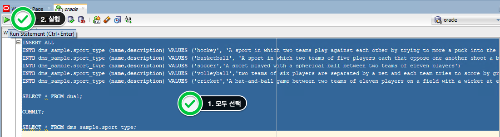
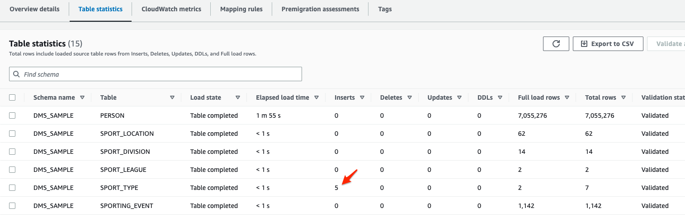
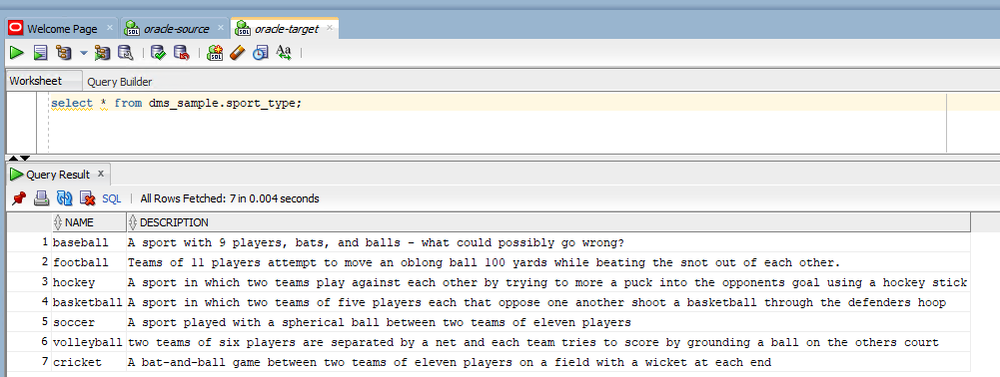
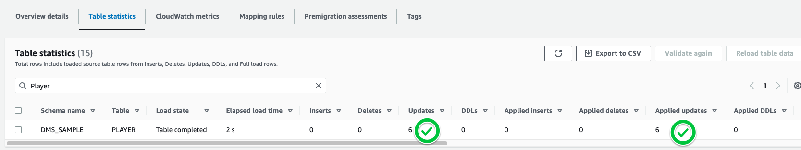
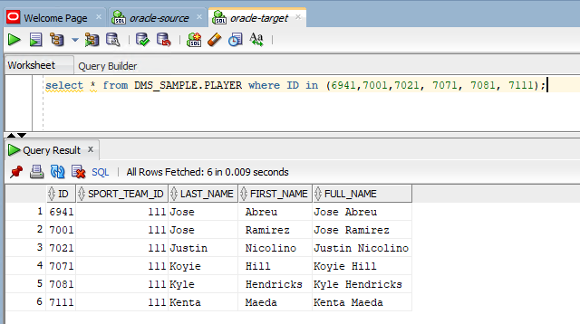
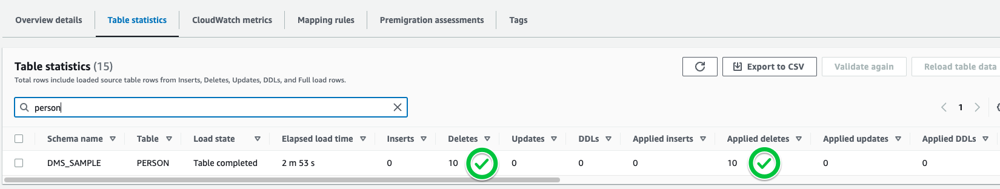
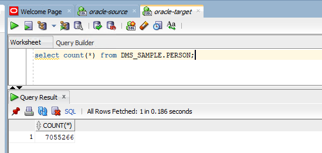
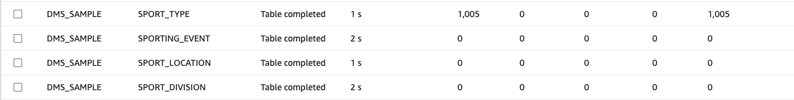
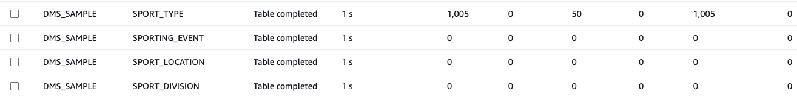

# 변경 데이터 CDC 기능 확인

###  Source Oracle의 DML이 Tart RDS Oracle로 잘 반영되는지 확인합니다.


---

1. Source DB인 Oracle - `SQL Developer` 를 사용하여 다음의 INSERT 문장을 실행합니다. **oracle-source** Tab에서 수행해야 합니다.

```
INSERT ALL

INTO dms_sample.sport_type (name,description) VALUES ('hockey', 'A sport in which two teams play against each other by trying to more a puck into the opponents goal using a hockey stick')

INTO dms_sample.sport_type (name,description) VALUES ('basketball', 'A sport in which two teams of five players each that oppose one another shoot a basketball through the defenders hoop')

INTO dms_sample.sport_type (name,description) VALUES ('soccer','A sport played with a spherical ball between two teams of eleven players')

INTO dms_sample.sport_type (name,description) VALUES ('volleyball','two teams of six players are separated by a net and each team tries to score by grounding a ball on the others court')

INTO dms_sample.sport_type (name,description) VALUES ('cricket','A bat-and-ball game between two teams of eleven players on a field with a wicket at each end')

SELECT * FROM dual; 

COMMIT;

SELECT * FROM dms_sample.sport_type; 

```




---

2. `DMS Console의 Table Statistics` 에 Insert DML이 Capture되었는지 확인 합니다.





---

3. Target DB인 Oracle - `SQL Developer` 를 사용하여 다음의 Select 문장을 실행합니다. **oracle-target** Tab에서 수행해야 합니다.

```
select * from dms_sample.sport_type;
```





---

4. 선수들이 팀을 옮겼습니다. `Player` Table을 Update해봅니다. 다음 Update DML을 `SQL Developer` **oracle-source**에서 수행합니다.

DMS Console에서 Update Capture를 확인 합니다. 

```
update PLAYER set SPORT_TEAM_ID=111 where ID in (6941, 7001, 7021, 7071, 7081, 7111);
commit;
```





---

5. Target DB인 Oracle - `SQL Developer` 를 사용하여 다음의 Select 문장을 실행합니다. **oracle-target** Tab에서 수행해야 합니다.

```
select * from DMS_SAMPLE.PLAYER where ID in (6941,7001,7021, 7071, 7081, 7111);
```





---

6. 이번엔 사용자 정보를 삭제해보겠습니다. 아래의 Delete DML을 `SQL Developer` **oracle-source**에서 실행합니다.

```
delete from person where id between 101 and  110;
commit;
```


---

7. DMS Console에서 Delete Capture를 확인합니다.




---

8. Target DB인 Oracle - `SQL Developer` 를 사용하여 다음의 Select 문장을 실행합니다. **oracle-target** Tab에서 수행해야 합니다.

```
select count(*) from DMS_SAMPLE.PERSON;
```


기존 Data건수 7055276건에서 10건이 삭제 반영되어, 7055266건임을 확인합니다.




---

9. 원하시는 DML을 수행하셔서 잘 반영되는지 확인합니다.


---

10. 이번엔 대량 Data Insert를 해보겠습니다. 아래 Query를 SQL Devloper **oracle-source**에 입력 후 실행합니다.

```
DECLARE
   v_commit_interval NUMBER := 100;
BEGIN
   FOR i IN 1..1000 LOOP
      INSERT INTO sport_type(Name, DESCRIPTION)
      VALUES (
         DBMS_RANDOM.STRING('U', 5), -- Random uppercase string of length 5 for Name
         DBMS_RANDOM.STRING('A', 50)  -- Random alphanumeric string of length 50 for DESCRIPTION
      );

      -- Commit after every 100 rows
      IF MOD(i, v_commit_interval) = 0 THEN
         COMMIT;
      END IF;
   END LOOP;

   -- Commit any remaining rows
   COMMIT;
END;
/

```


---

11. DMS Console에서 아래 처럼 정상적으로 1000개의 새로운  Row가 Insert 되었는지 확인합니다.




---

12. 이번엔 대량 Update를 수행해보겠습니다. 아래 DML을 SQL Developer **source-oracle**에 입력 후 실행합니다.

```
DECLARE
   TYPE id_table_type IS TABLE OF sport_type.Name%TYPE INDEX BY PLS_INTEGER;
   v_rows_to_update NUMBER := 50;
   v_ids id_table_type;

   CURSOR c_random_rows IS
      SELECT Name
      FROM sport_type
      ORDER BY DBMS_RANDOM.VALUE;
BEGIN
   OPEN c_random_rows;
   FETCH c_random_rows BULK COLLECT INTO v_ids LIMIT v_rows_to_update;
   CLOSE c_random_rows;

   FOR i IN 1..v_ids.COUNT LOOP
      UPDATE sport_type
      SET DESCRIPTION = DBMS_RANDOM.STRING('A', 50)
      WHERE Name = v_ids(i);
   END LOOP;

   COMMIT;
END;
/

```


---

13. DMS Console에서 아래 처럼 정상적으로 50개의 새로운  Row가 Update 되었는지 확인합니다.



---


## 이제 여러분은 Database Migration Service와  Schema Conversion Tool을 이용하여 Oracle Data를 Target RDS Oracle로 이관하였습니다. DMS를 활용하면, 이외에도 다양한 작업들을 하실 수 있습니다. 


