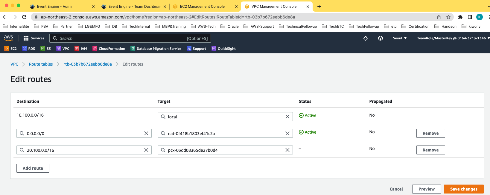

## Cross Account DMS

----

Source 

- Account A
- VPC-OnPREM : 10.100.0.0/16


Target

- Account B
- VPC-Target : 20.100.0.0/16

---

### VPC Peering

Peering Request from Account-A-OnPrem to Account-B-Target


#### Account B - Accept


---

### Edit DNS Settings

#### 


---

### Route Table

#### Account A





#### Account B


---


### Now Ping is working

```
ec2-user@ip-10-100-1-101:/home/ec2-user> ping 20.100.1.101
PING 20.100.1.101 (20.100.1.101) 56(84) bytes of data.
64 bytes from 20.100.1.101: icmp_seq=101 ttl=64 time=0.311 ms
64 bytes from 20.100.1.101: icmp_seq=102 ttl=64 time=0.287 ms

```


---

## Create RI in Account B(Target)


---

## Create Endpoint


---


---

## Create DMS Task


---

이상 Cross Account VPC Peering으로 Account A의 Data를 DMS로 Account B로 이관하는 방법을 알아봤습니다. :)