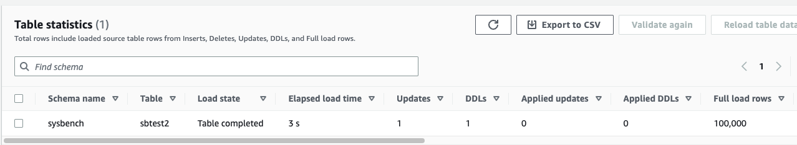

### 1. HandleSourceTableTruncated을 true에서 false로 변경 

```
DML은 정상 반영
Task에서 "Drop tables on target" 설정 시 시작하면서 Target Table Drop 후 재생성 됨
truncate DDL은 Target으로 전송 및 반영 되지 않음


```


### 2. HandleSourceTableDropped을 true에서 false 로 변경

```
DML은 정상 반영
Task에서 "Drop tables on target" 설정 시 시작하면서 Target Table Drop 후 재생성 됨(최초 Drop table에는 영향 없음 확인)
DROP DDL은 Target으로 전송 및 반영 되지 않음


```


### 3. HandleSourceTableTruncated, HandleSourceTableDropped를 default인 true로 테스트

```
Truncate - 
DDLs에서 Source쪽 DDL은 Capture되고 실제 Target에 DDL이 반영되어 모든 rows가 trunc되었지만 DMS 통계에서 Applied DDLs는 표시 안됨.

Drop Table -
DDLs에서 Capture도 되지 않고, Target에도 반영되지 않고, Target에는 Table이 그대로 존재함

2023-03-18T15:16:54 [SOURCE_CAPTURE  ]I:  Failed to get table definition for 'sysbench'.'sbtest2', checking if metadata connection dropped by server  (odbc_util.c:4997)
2023-03-18T15:16:54 [SOURCE_CAPTURE  ]W:  Cannot drop table 'sbtest2'. DROP TABLE is not currently supported  (mysql_endpoint_capture.c:1823)

https://docs.aws.amazon.com/dms/latest/userguide/CHAP_Source.MySQL.html#CHAP_Source.MySQL.Limitations
MySQL Engine은 20230319 기준
For CDC, CREATE TABLE, ADD COLUMN, and DROP COLUMN changing the column data type, and renaming a column are supported. However, DROP TABLE, RENAME TABLE, and updates made to other attributes, such as column default value, column nullability, character set and so on, are not supported.

```




---


#### - Test Scenario 1 -  task json

```
{
    "Logging": {
        "EnableLogging": true,
        "EnableLogContext": false,
        "LogComponents": [
            {
                "Severity": "LOGGER_SEVERITY_DEFAULT",
                "Id": "TRANSFORMATION"
            },
            {
                "Severity": "LOGGER_SEVERITY_DEFAULT",
                "Id": "SOURCE_UNLOAD"
            },
            {
                "Severity": "LOGGER_SEVERITY_DEFAULT",
                "Id": "IO"
            },
            {
                "Severity": "LOGGER_SEVERITY_DEFAULT",
                "Id": "TARGET_LOAD"
            },
            {
                "Severity": "LOGGER_SEVERITY_DEFAULT",
                "Id": "PERFORMANCE"
            },
            {
                "Severity": "LOGGER_SEVERITY_DEFAULT",
                "Id": "SOURCE_CAPTURE"
            },
            {
                "Severity": "LOGGER_SEVERITY_DEFAULT",
                "Id": "SORTER"
            },
            {
                "Severity": "LOGGER_SEVERITY_DEFAULT",
                "Id": "REST_SERVER"
            },
            {
                "Severity": "LOGGER_SEVERITY_DEFAULT",
                "Id": "VALIDATOR_EXT"
            },
            {
                "Severity": "LOGGER_SEVERITY_DEFAULT",
                "Id": "TARGET_APPLY"
            },
            {
                "Severity": "LOGGER_SEVERITY_DEFAULT",
                "Id": "TASK_MANAGER"
            },
            {
                "Severity": "LOGGER_SEVERITY_DEFAULT",
                "Id": "TABLES_MANAGER"
            },
            {
                "Severity": "LOGGER_SEVERITY_DEFAULT",
                "Id": "METADATA_MANAGER"
            },
            {
                "Severity": "LOGGER_SEVERITY_DEFAULT",
                "Id": "FILE_FACTORY"
            },
            {
                "Severity": "LOGGER_SEVERITY_DEFAULT",
                "Id": "COMMON"
            },
            {
                "Severity": "LOGGER_SEVERITY_DEFAULT",
                "Id": "ADDONS"
            },
            {
                "Severity": "LOGGER_SEVERITY_DEFAULT",
                "Id": "DATA_STRUCTURE"
            },
            {
                "Severity": "LOGGER_SEVERITY_DEFAULT",
                "Id": "COMMUNICATION"
            },
            {
                "Severity": "LOGGER_SEVERITY_DEFAULT",
                "Id": "FILE_TRANSFER"
            }
        ]
    },
    "StreamBufferSettings": {
        "StreamBufferCount": 3,
        "CtrlStreamBufferSizeInMB": 5,
        "StreamBufferSizeInMB": 8
    },
    "ErrorBehavior": {
        "FailOnNoTablesCaptured": true,
        "ApplyErrorUpdatePolicy": "LOG_ERROR",
        "FailOnTransactionConsistencyBreached": false,
        "RecoverableErrorThrottlingMax": 1800,
        "DataErrorEscalationPolicy": "SUSPEND_TABLE",
        "ApplyErrorEscalationCount": 0,
        "RecoverableErrorStopRetryAfterThrottlingMax": true,
        "RecoverableErrorThrottling": true,
        "ApplyErrorFailOnTruncationDdl": false,
        "DataTruncationErrorPolicy": "LOG_ERROR",
        "ApplyErrorInsertPolicy": "LOG_ERROR",
        "EventErrorPolicy": "IGNORE",
        "ApplyErrorEscalationPolicy": "LOG_ERROR",
        "RecoverableErrorCount": -1,
        "DataErrorEscalationCount": 0,
        "TableErrorEscalationPolicy": "STOP_TASK",
        "RecoverableErrorInterval": 5,
        "ApplyErrorDeletePolicy": "IGNORE_RECORD",
        "TableErrorEscalationCount": 0,
        "FullLoadIgnoreConflicts": true,
        "DataErrorPolicy": "LOG_ERROR",
        "TableErrorPolicy": "SUSPEND_TABLE"
    },
    "ValidationSettings": {
        "ValidationPartialLobSize": 0,
        "PartitionSize": 10000,
        "RecordFailureDelayLimitInMinutes": 0,
        "SkipLobColumns": false,
        "FailureMaxCount": 10000,
        "HandleCollationDiff": false,
        "ValidationQueryCdcDelaySeconds": 0,
        "ValidationMode": "ROW_LEVEL",
        "TableFailureMaxCount": 1000,
        "RecordFailureDelayInMinutes": 5,
        "MaxKeyColumnSize": 8096,
        "EnableValidation": true,
        "ThreadCount": 5,
        "RecordSuspendDelayInMinutes": 30,
        "ValidationOnly": false
    },
    "TTSettings": {
        "TTS3Settings": null,
        "TTRecordSettings": null,
        "EnableTT": false
    },
    "FullLoadSettings": {
        "CommitRate": 10000,
        "StopTaskCachedChangesApplied": false,
        "StopTaskCachedChangesNotApplied": false,
        "MaxFullLoadSubTasks": 8,
        "TransactionConsistencyTimeout": 600,
        "CreatePkAfterFullLoad": false,
        "TargetTablePrepMode": "DROP_AND_CREATE"
    },
    "TargetMetadata": {
        "ParallelApplyBufferSize": 0,
        "ParallelApplyQueuesPerThread": 0,
        "ParallelApplyThreads": 0,
        "TargetSchema": "",
        "InlineLobMaxSize": 0,
        "ParallelLoadQueuesPerThread": 0,
        "SupportLobs": true,
        "LobChunkSize": 0,
        "TaskRecoveryTableEnabled": false,
        "ParallelLoadThreads": 0,
        "LobMaxSize": 32,
        "BatchApplyEnabled": false,
        "FullLobMode": false,
        "LimitedSizeLobMode": true,
        "LoadMaxFileSize": 0,
        "ParallelLoadBufferSize": 0
    },
    "BeforeImageSettings": null,
    "ControlTablesSettings": {
        "historyTimeslotInMinutes": 5,
        "HistoryTimeslotInMinutes": 5,
        "StatusTableEnabled": false,
        "SuspendedTablesTableEnabled": false,
        "HistoryTableEnabled": false,
        "ControlSchema": "",
        "FullLoadExceptionTableEnabled": false
    },
    "LoopbackPreventionSettings": null,
    "CharacterSetSettings": null,
    "FailTaskWhenCleanTaskResourceFailed": false,
    "ChangeProcessingTuning": {
        "StatementCacheSize": 50,
        "CommitTimeout": 1,
        "BatchApplyPreserveTransaction": true,
        "BatchApplyTimeoutMin": 1,
        "BatchSplitSize": 0,
        "BatchApplyTimeoutMax": 30,
        "MinTransactionSize": 1000,
        "MemoryKeepTime": 60,
        "BatchApplyMemoryLimit": 500,
        "MemoryLimitTotal": 1024
    },
    "ChangeProcessingDdlHandlingPolicy": {
        "HandleSourceTableDropped": true,
        "HandleSourceTableTruncated": false,
        "HandleSourceTableAltered": true
    },
    "PostProcessingRules": null
}
```


#### Test Scenario 1 -  mapping json

```
{
    "rules": [
        {
            "rule-type": "transformation",
            "rule-id": "150544956",
            "rule-name": "150544956",
            "rule-target": "schema",
            "object-locator": {
                "schema-name": "%"
            },
            "rule-action": "rename",
            "value": "sysbench2",
            "old-value": null
        },
        {
            "rule-type": "selection",
            "rule-id": "150521525",
            "rule-name": "150521525",
            "object-locator": {
                "schema-name": "sysbench",
                "table-name": "sbtest1"
            },
            "rule-action": "include",
            "filters": []
        }
    ]
}
```


#### - Test Scenario 2 -  task json

```
{
    "Logging": {
        "EnableLogging": true,
        "EnableLogContext": false,
        "LogComponents": [
            {
                "Severity": "LOGGER_SEVERITY_DEFAULT",
                "Id": "TRANSFORMATION"
            },
            {
                "Severity": "LOGGER_SEVERITY_DEFAULT",
                "Id": "SOURCE_UNLOAD"
            },
            {
                "Severity": "LOGGER_SEVERITY_DEFAULT",
                "Id": "IO"
            },
            {
                "Severity": "LOGGER_SEVERITY_DEFAULT",
                "Id": "TARGET_LOAD"
            },
            {
                "Severity": "LOGGER_SEVERITY_DEFAULT",
                "Id": "PERFORMANCE"
            },
            {
                "Severity": "LOGGER_SEVERITY_DEFAULT",
                "Id": "SOURCE_CAPTURE"
            },
            {
                "Severity": "LOGGER_SEVERITY_DEFAULT",
                "Id": "SORTER"
            },
            {
                "Severity": "LOGGER_SEVERITY_DEFAULT",
                "Id": "REST_SERVER"
            },
            {
                "Severity": "LOGGER_SEVERITY_DEFAULT",
                "Id": "VALIDATOR_EXT"
            },
            {
                "Severity": "LOGGER_SEVERITY_DEFAULT",
                "Id": "TARGET_APPLY"
            },
            {
                "Severity": "LOGGER_SEVERITY_DEFAULT",
                "Id": "TASK_MANAGER"
            },
            {
                "Severity": "LOGGER_SEVERITY_DEFAULT",
                "Id": "TABLES_MANAGER"
            },
            {
                "Severity": "LOGGER_SEVERITY_DEFAULT",
                "Id": "METADATA_MANAGER"
            },
            {
                "Severity": "LOGGER_SEVERITY_DEFAULT",
                "Id": "FILE_FACTORY"
            },
            {
                "Severity": "LOGGER_SEVERITY_DEFAULT",
                "Id": "COMMON"
            },
            {
                "Severity": "LOGGER_SEVERITY_DEFAULT",
                "Id": "ADDONS"
            },
            {
                "Severity": "LOGGER_SEVERITY_DEFAULT",
                "Id": "DATA_STRUCTURE"
            },
            {
                "Severity": "LOGGER_SEVERITY_DEFAULT",
                "Id": "COMMUNICATION"
            },
            {
                "Severity": "LOGGER_SEVERITY_DEFAULT",
                "Id": "FILE_TRANSFER"
            }
        ]
    },
    "StreamBufferSettings": {
        "StreamBufferCount": 3,
        "CtrlStreamBufferSizeInMB": 5,
        "StreamBufferSizeInMB": 8
    },
    "ErrorBehavior": {
        "FailOnNoTablesCaptured": true,
        "ApplyErrorUpdatePolicy": "LOG_ERROR",
        "FailOnTransactionConsistencyBreached": false,
        "RecoverableErrorThrottlingMax": 1800,
        "DataErrorEscalationPolicy": "SUSPEND_TABLE",
        "ApplyErrorEscalationCount": 0,
        "RecoverableErrorStopRetryAfterThrottlingMax": true,
        "RecoverableErrorThrottling": true,
        "ApplyErrorFailOnTruncationDdl": false,
        "DataTruncationErrorPolicy": "LOG_ERROR",
        "ApplyErrorInsertPolicy": "LOG_ERROR",
        "EventErrorPolicy": "IGNORE",
        "ApplyErrorEscalationPolicy": "LOG_ERROR",
        "RecoverableErrorCount": -1,
        "DataErrorEscalationCount": 0,
        "TableErrorEscalationPolicy": "STOP_TASK",
        "RecoverableErrorInterval": 5,
        "ApplyErrorDeletePolicy": "IGNORE_RECORD",
        "TableErrorEscalationCount": 0,
        "FullLoadIgnoreConflicts": true,
        "DataErrorPolicy": "LOG_ERROR",
        "TableErrorPolicy": "SUSPEND_TABLE"
    },
    "ValidationSettings": {
        "ValidationPartialLobSize": 0,
        "PartitionSize": 10000,
        "RecordFailureDelayLimitInMinutes": 0,
        "SkipLobColumns": false,
        "FailureMaxCount": 10000,
        "HandleCollationDiff": false,
        "ValidationQueryCdcDelaySeconds": 0,
        "ValidationMode": "ROW_LEVEL",
        "TableFailureMaxCount": 1000,
        "RecordFailureDelayInMinutes": 5,
        "MaxKeyColumnSize": 8096,
        "EnableValidation": true,
        "ThreadCount": 5,
        "RecordSuspendDelayInMinutes": 30,
        "ValidationOnly": false
    },
    "TTSettings": {
        "TTS3Settings": null,
        "TTRecordSettings": null,
        "EnableTT": false
    },
    "FullLoadSettings": {
        "CommitRate": 10000,
        "StopTaskCachedChangesApplied": false,
        "StopTaskCachedChangesNotApplied": false,
        "MaxFullLoadSubTasks": 8,
        "TransactionConsistencyTimeout": 600,
        "CreatePkAfterFullLoad": false,
        "TargetTablePrepMode": "DROP_AND_CREATE"
    },
    "TargetMetadata": {
        "ParallelApplyBufferSize": 0,
        "ParallelApplyQueuesPerThread": 0,
        "ParallelApplyThreads": 0,
        "TargetSchema": "",
        "InlineLobMaxSize": 0,
        "ParallelLoadQueuesPerThread": 0,
        "SupportLobs": true,
        "LobChunkSize": 0,
        "TaskRecoveryTableEnabled": false,
        "ParallelLoadThreads": 0,
        "LobMaxSize": 32,
        "BatchApplyEnabled": false,
        "FullLobMode": false,
        "LimitedSizeLobMode": true,
        "LoadMaxFileSize": 0,
        "ParallelLoadBufferSize": 0
    },
    "BeforeImageSettings": null,
    "ControlTablesSettings": {
        "historyTimeslotInMinutes": 5,
        "HistoryTimeslotInMinutes": 5,
        "StatusTableEnabled": false,
        "SuspendedTablesTableEnabled": false,
        "HistoryTableEnabled": false,
        "ControlSchema": "",
        "FullLoadExceptionTableEnabled": false
    },
    "LoopbackPreventionSettings": null,
    "CharacterSetSettings": null,
    "FailTaskWhenCleanTaskResourceFailed": false,
    "ChangeProcessingTuning": {
        "StatementCacheSize": 50,
        "CommitTimeout": 1,
        "BatchApplyPreserveTransaction": true,
        "BatchApplyTimeoutMin": 1,
        "BatchSplitSize": 0,
        "BatchApplyTimeoutMax": 30,
        "MinTransactionSize": 1000,
        "MemoryKeepTime": 60,
        "BatchApplyMemoryLimit": 500,
        "MemoryLimitTotal": 1024
    },
    "ChangeProcessingDdlHandlingPolicy": {
        "HandleSourceTableDropped": false,
        "HandleSourceTableTruncated": true,
        "HandleSourceTableAltered": true
    },
    "PostProcessingRules": null
}
```


#### - Test Scenario 2 -  task json

```
{
    "Logging": {
        "EnableLogging": true,
        "EnableLogContext": false,
        "LogComponents": [
            {
                "Severity": "LOGGER_SEVERITY_DEFAULT",
                "Id": "TRANSFORMATION"
            },
            {
                "Severity": "LOGGER_SEVERITY_DEFAULT",
                "Id": "SOURCE_UNLOAD"
            },
            {
                "Severity": "LOGGER_SEVERITY_DEFAULT",
                "Id": "IO"
            },
            {
                "Severity": "LOGGER_SEVERITY_DEFAULT",
                "Id": "TARGET_LOAD"
            },
            {
                "Severity": "LOGGER_SEVERITY_DEFAULT",
                "Id": "PERFORMANCE"
            },
            {
                "Severity": "LOGGER_SEVERITY_DEFAULT",
                "Id": "SOURCE_CAPTURE"
            },
            {
                "Severity": "LOGGER_SEVERITY_DEFAULT",
                "Id": "SORTER"
            },
            {
                "Severity": "LOGGER_SEVERITY_DEFAULT",
                "Id": "REST_SERVER"
            },
            {
                "Severity": "LOGGER_SEVERITY_DEFAULT",
                "Id": "VALIDATOR_EXT"
            },
            {
                "Severity": "LOGGER_SEVERITY_DEFAULT",
                "Id": "TARGET_APPLY"
            },
            {
                "Severity": "LOGGER_SEVERITY_DEFAULT",
                "Id": "TASK_MANAGER"
            },
            {
                "Severity": "LOGGER_SEVERITY_DEFAULT",
                "Id": "TABLES_MANAGER"
            },
            {
                "Severity": "LOGGER_SEVERITY_DEFAULT",
                "Id": "METADATA_MANAGER"
            },
            {
                "Severity": "LOGGER_SEVERITY_DEFAULT",
                "Id": "FILE_FACTORY"
            },
            {
                "Severity": "LOGGER_SEVERITY_DEFAULT",
                "Id": "COMMON"
            },
            {
                "Severity": "LOGGER_SEVERITY_DEFAULT",
                "Id": "ADDONS"
            },
            {
                "Severity": "LOGGER_SEVERITY_DEFAULT",
                "Id": "DATA_STRUCTURE"
            },
            {
                "Severity": "LOGGER_SEVERITY_DEFAULT",
                "Id": "COMMUNICATION"
            },
            {
                "Severity": "LOGGER_SEVERITY_DEFAULT",
                "Id": "FILE_TRANSFER"
            }
        ]
    },
    "StreamBufferSettings": {
        "StreamBufferCount": 3,
        "CtrlStreamBufferSizeInMB": 5,
        "StreamBufferSizeInMB": 8
    },
    "ErrorBehavior": {
        "FailOnNoTablesCaptured": true,
        "ApplyErrorUpdatePolicy": "LOG_ERROR",
        "FailOnTransactionConsistencyBreached": false,
        "RecoverableErrorThrottlingMax": 1800,
        "DataErrorEscalationPolicy": "SUSPEND_TABLE",
        "ApplyErrorEscalationCount": 0,
        "RecoverableErrorStopRetryAfterThrottlingMax": true,
        "RecoverableErrorThrottling": true,
        "ApplyErrorFailOnTruncationDdl": false,
        "DataTruncationErrorPolicy": "LOG_ERROR",
        "ApplyErrorInsertPolicy": "LOG_ERROR",
        "EventErrorPolicy": "IGNORE",
        "ApplyErrorEscalationPolicy": "LOG_ERROR",
        "RecoverableErrorCount": -1,
        "DataErrorEscalationCount": 0,
        "TableErrorEscalationPolicy": "STOP_TASK",
        "RecoverableErrorInterval": 5,
        "ApplyErrorDeletePolicy": "IGNORE_RECORD",
        "TableErrorEscalationCount": 0,
        "FullLoadIgnoreConflicts": true,
        "DataErrorPolicy": "LOG_ERROR",
        "TableErrorPolicy": "SUSPEND_TABLE"
    },
    "ValidationSettings": {
        "ValidationPartialLobSize": 0,
        "PartitionSize": 10000,
        "RecordFailureDelayLimitInMinutes": 0,
        "SkipLobColumns": false,
        "FailureMaxCount": 10000,
        "HandleCollationDiff": false,
        "ValidationQueryCdcDelaySeconds": 0,
        "ValidationMode": "ROW_LEVEL",
        "TableFailureMaxCount": 1000,
        "RecordFailureDelayInMinutes": 5,
        "MaxKeyColumnSize": 8096,
        "EnableValidation": true,
        "ThreadCount": 5,
        "RecordSuspendDelayInMinutes": 30,
        "ValidationOnly": false
    },
    "TTSettings": {
        "TTS3Settings": null,
        "TTRecordSettings": null,
        "EnableTT": false
    },
    "FullLoadSettings": {
        "CommitRate": 10000,
        "StopTaskCachedChangesApplied": false,
        "StopTaskCachedChangesNotApplied": false,
        "MaxFullLoadSubTasks": 8,
        "TransactionConsistencyTimeout": 600,
        "CreatePkAfterFullLoad": false,
        "TargetTablePrepMode": "DROP_AND_CREATE"
    },
    "TargetMetadata": {
        "ParallelApplyBufferSize": 0,
        "ParallelApplyQueuesPerThread": 0,
        "ParallelApplyThreads": 0,
        "TargetSchema": "",
        "InlineLobMaxSize": 0,
        "ParallelLoadQueuesPerThread": 0,
        "SupportLobs": true,
        "LobChunkSize": 0,
        "TaskRecoveryTableEnabled": false,
        "ParallelLoadThreads": 0,
        "LobMaxSize": 32,
        "BatchApplyEnabled": false,
        "FullLobMode": false,
        "LimitedSizeLobMode": true,
        "LoadMaxFileSize": 0,
        "ParallelLoadBufferSize": 0
    },
    "BeforeImageSettings": null,
    "ControlTablesSettings": {
        "historyTimeslotInMinutes": 5,
        "HistoryTimeslotInMinutes": 5,
        "StatusTableEnabled": false,
        "SuspendedTablesTableEnabled": false,
        "HistoryTableEnabled": false,
        "ControlSchema": "",
        "FullLoadExceptionTableEnabled": false
    },
    "LoopbackPreventionSettings": null,
    "CharacterSetSettings": null,
    "FailTaskWhenCleanTaskResourceFailed": false,
    "ChangeProcessingTuning": {
        "StatementCacheSize": 50,
        "CommitTimeout": 1,
        "BatchApplyPreserveTransaction": true,
        "BatchApplyTimeoutMin": 1,
        "BatchSplitSize": 0,
        "BatchApplyTimeoutMax": 30,
        "MinTransactionSize": 1000,
        "MemoryKeepTime": 60,
        "BatchApplyMemoryLimit": 500,
        "MemoryLimitTotal": 1024
    },
    "ChangeProcessingDdlHandlingPolicy": {
        "HandleSourceTableDropped": true,
        "HandleSourceTableTruncated": true,
        "HandleSourceTableAltered": true
    },
    "PostProcessingRules": null
}
```

