# Case 1 : 

| Replication Instance | Aurora Instance | Parallel Load | Elapsed Time |
| -------------------- | --------------- | ------------- | ------------ |
| xlarge               | xlarge          | 8             | 2hr 9m       |
| xlarge               | 2xlarge         | 8             | 1hr 24m      |
| xlarge               | 4xlarge         | 8             | 1hr 24m      |
| xlarge               | 8xlarge         | 8             | 1hr 22m      |

<kbd> 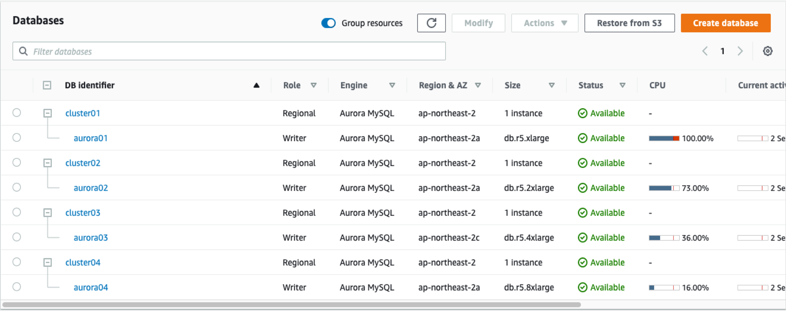 </kbd>

<kbd> 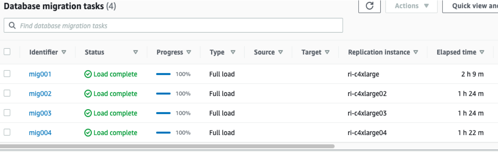 </kbd>

<kbd> 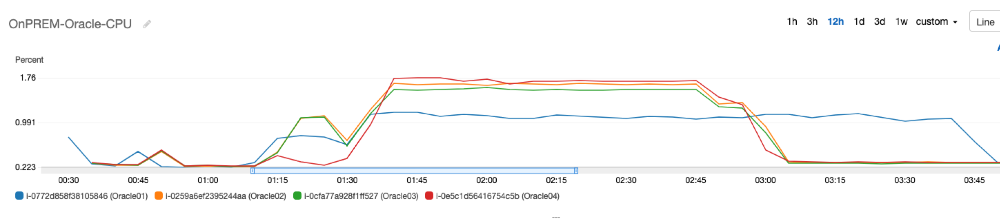 </kbd>

<kbd> 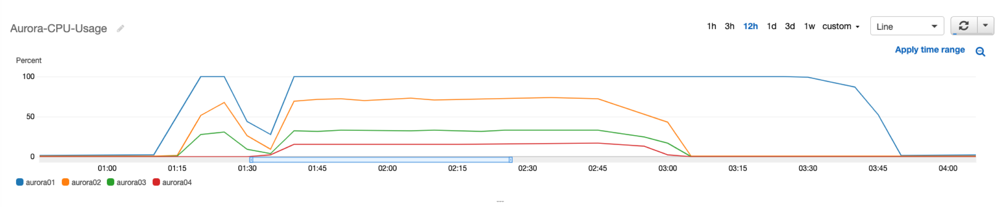 </kbd>

<kbd> 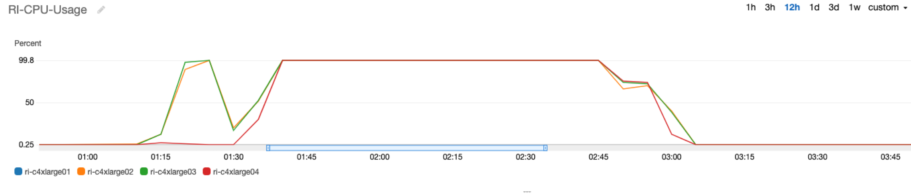 </kbd>

<kbd> 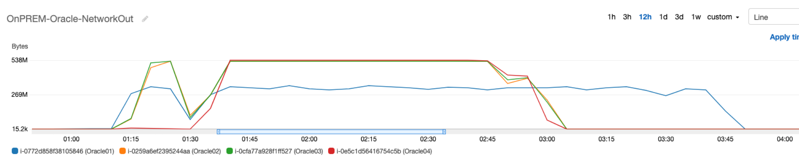 </kbd>

# Case 2 : 

| Replication Instance | Aurora Instance | Parallel Load | Elapsed Time |
| -------------------- | --------------- | ------------- | ------------ |
| 2xlarge              | xlarge          | 8             | 2hr 11m      |
| 2xlarge              | 2xlarge         | 8             | 1hr 2m       |
| 2xlarge              | 4xlarge         | 8             | 47m          |
| 2xlarge              | 8xlarge         | 8             | 48m          |

<kbd> 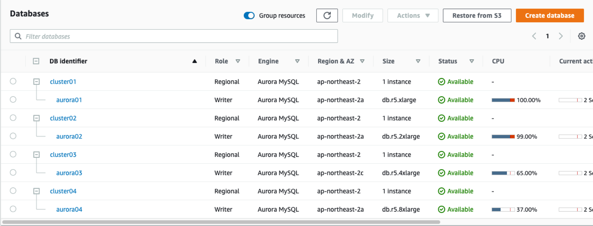 </kbd>

<kbd> 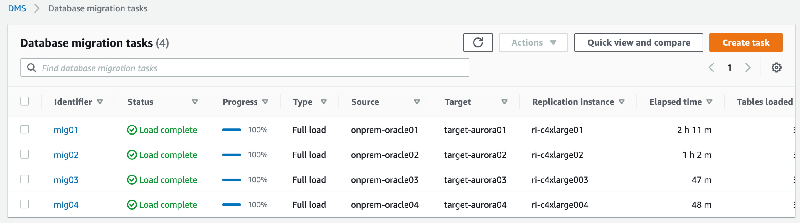 </kbd>

<kbd> 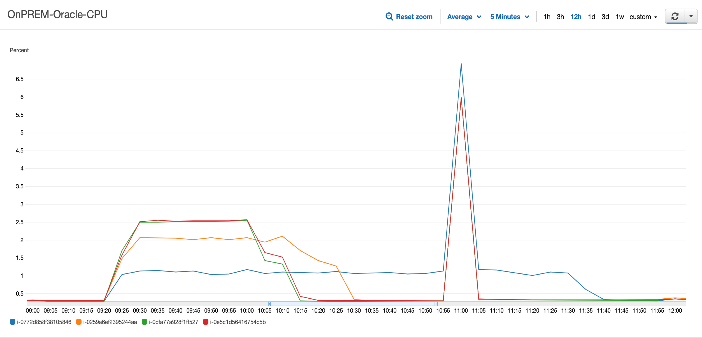 </kbd>

<kbd> 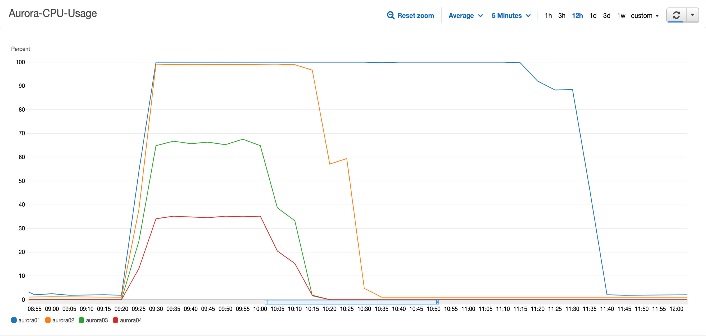 </kbd>

<kbd> 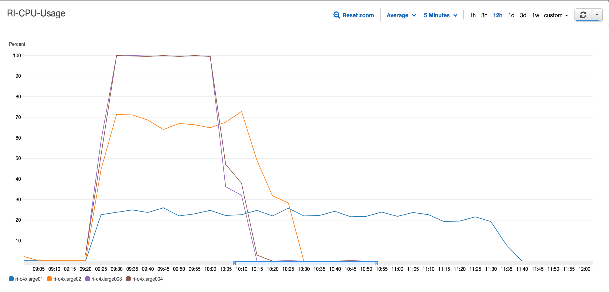 </kbd>

<kbd> 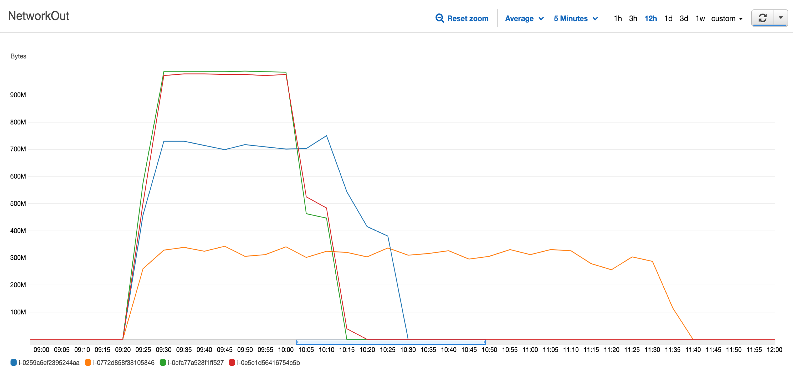 </kbd>

# Case 3 : 

| Replication Instance | Aurora Instance | Parallel Load | Elapsed Time |
| -------------------- | --------------- | ------------- | ------------ |
| 4xlarge              | xlarge          | 8             | 2hr 11m      |
| 4xlarge              | 2xlarge         | 8             | 1hr 1m       |
| 4xlarge              | 4xlarge         | 8             | 37m          |
| 4xlarge              | 8xlarge         | 8             | 35m          |

<kbd> 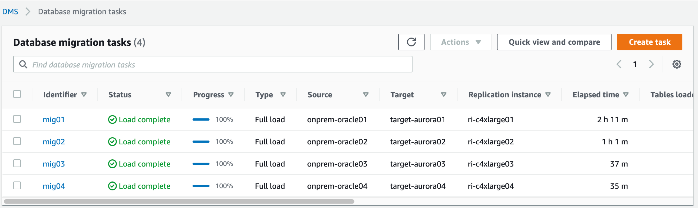 </kbd>

<kbd> 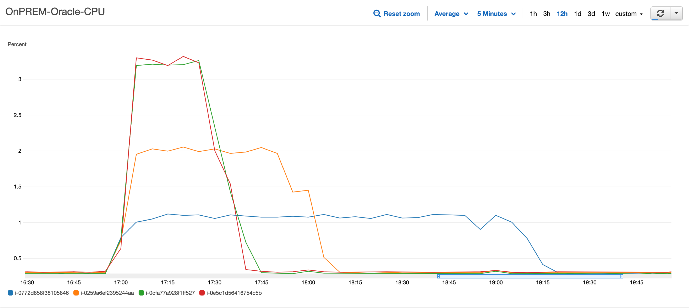 </kbd>

<kbd> 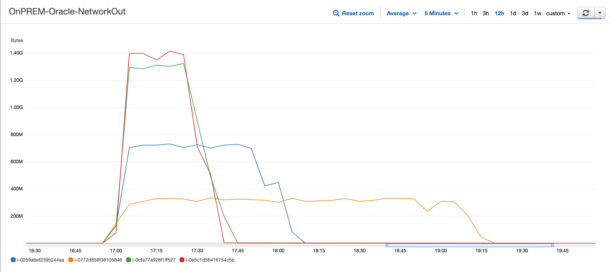 </kbd>

<kbd> 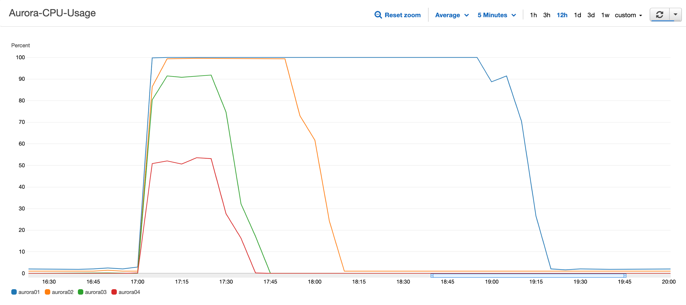 </kbd>

<kbd> 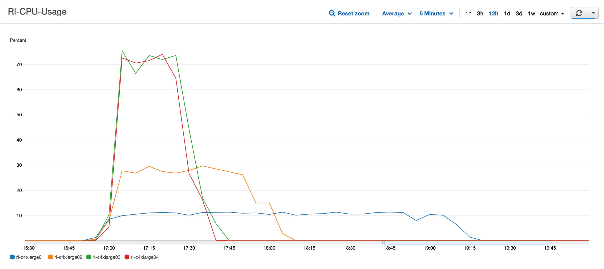 </kbd>

# Case 4 : 

| Replication Instance | Aurora Instance | Parallel Load | Elapsed Time |
| -------------------- | --------------- | ------------- | ------------ |
| 8xlarge              | xlarge          | 8             | 2hr 8m       |
| 8xlarge              | 2xlarge         | 8             | 1hr 1m       |
| 8xlarge              | 4xlarge         | 8             | 37m          |
| 8xlarge              | 8xlarge         | 8             | 35m          |

<kbd> 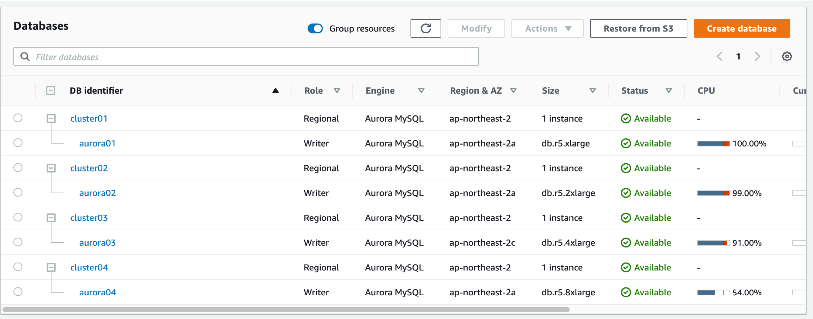 </kbd>

<kbd> 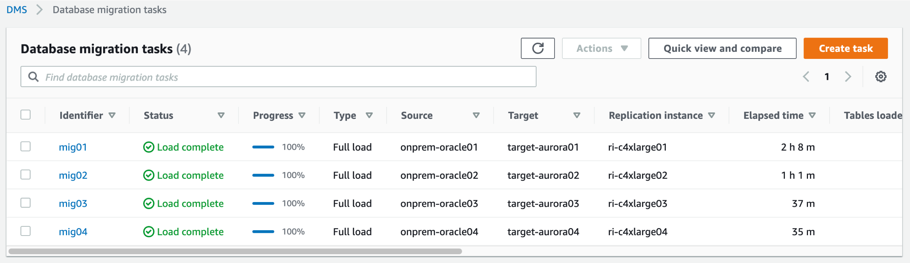 </kbd>

<kbd> 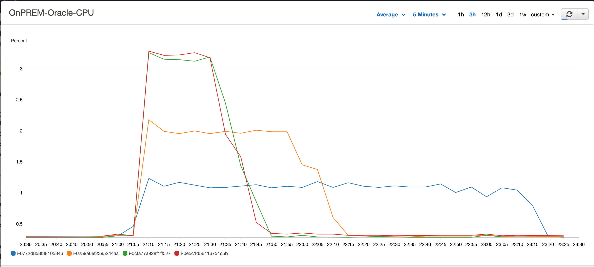 </kbd>

<kbd> 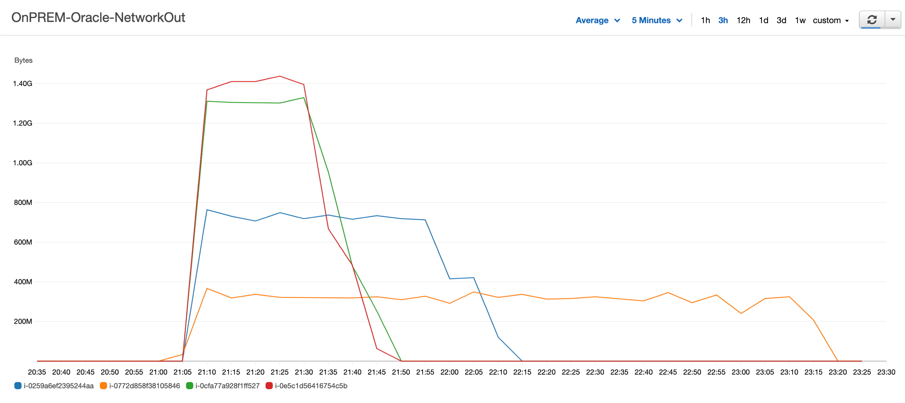 </kbd>

<kbd> 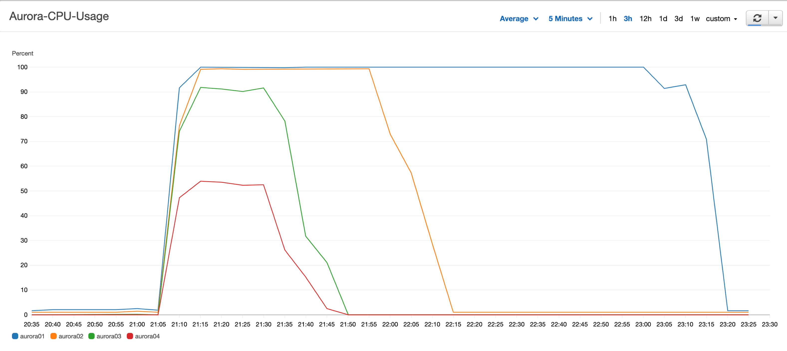 </kbd>

<kbd> 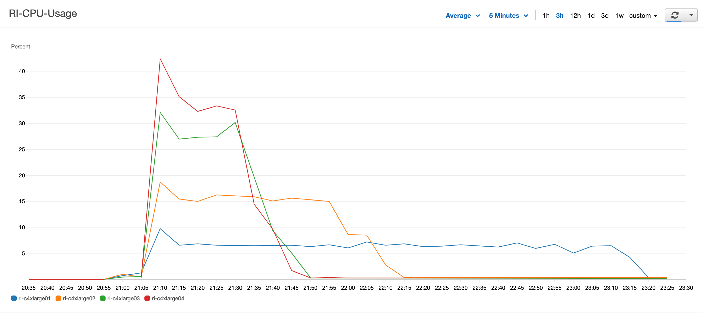 </kbd>

<kbd>  </kbd>

<kbd>  </kbd>

<kbd>  </kbd>

<kbd>  </kbd>