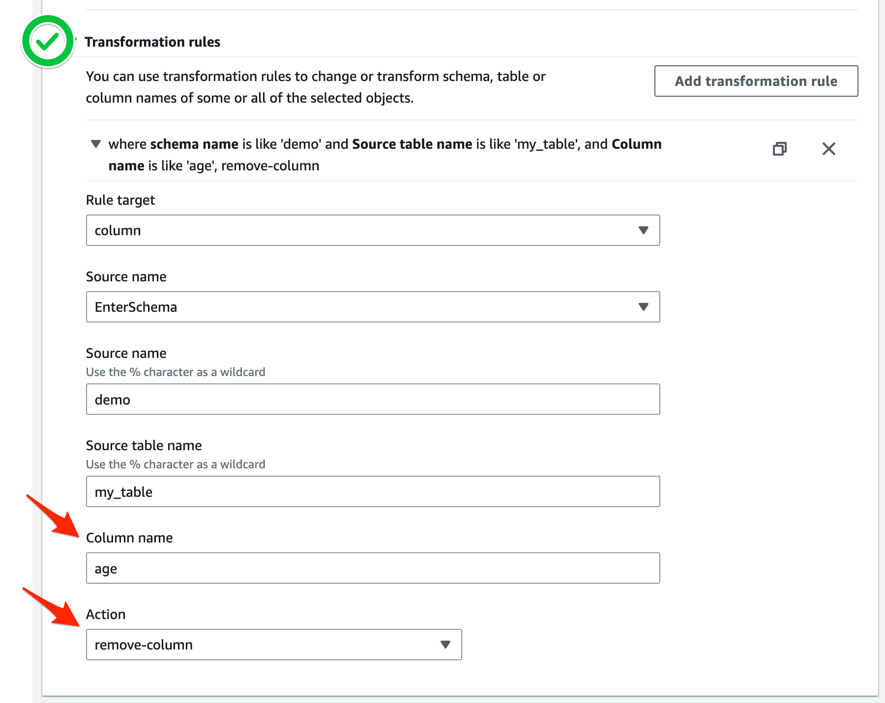

# AWS DMS에서 불필요한 Column을 제외하고 이관 하는 방법 


1. 원본 DB Table 구조

```
mysql> desc my_table;
+--------------+--------------+------+-----+---------+----------------+
| Field        | Type         | Null | Key | Default | Extra          |
+--------------+--------------+------+-----+---------+----------------+
| id           | int(11)      | NO   | PRI | NULL    | auto_increment |
| name         | varchar(50)  | NO   |     | NULL    |                |
| age          | int(11)      | NO   |     | NULL    |                |
| email        | varchar(100) | NO   |     | NULL    |                |
| created_date | date         | NO   |     | NULL    |                |
+--------------+--------------+------+-----+---------+----------------+
5 rows in set (0.00 sec)

mysql> select * from my_table limit 1;
+----+----------+-----+----------------------+--------------+
| id | name     | age | email                | created_date |
+----+----------+-----+----------------------+--------------+
|  1 | John Doe |  30 | john.doe@example.com | 2022-04-01   |
+----+----------+-----+----------------------+--------------+
1 row in set (0.01 sec)


```


2. `age` column을 제외하고 이관 하겠습니다. `Transformation rules` 를 활용합니다.

### Console UI



### JSON Mapping Table

```
{
  "rules": [
    {
      "rule-type": "transformation",
      "rule-id": "582754739",
      "rule-name": "582754739",
      "rule-target": "column",
      "object-locator": {
        "schema-name": "demo",
        "table-name": "my_table",
        "column-name": "age"
      },
      "rule-action": "remove-column",
      "value": null,
      "old-value": null
    },
    {
      "rule-type": "selection",
      "rule-id": "582743439",
      "rule-name": "582743439",
      "object-locator": {
        "schema-name": "demo",
        "table-name": "my_table"
      },
      "rule-action": "include",
      "filters": []
    }
  ]
}
```


3. 결과 확인

```

mysql> desc my_table;
+--------------+--------------+------+-----+---------+-------+
| Field        | Type         | Null | Key | Default | Extra |
+--------------+--------------+------+-----+---------+-------+
| id           | int(11)      | NO   | PRI | NULL    |       |
| name         | varchar(50)  | NO   |     | NULL    |       |
| email        | varchar(100) | NO   |     | NULL    |       |
| created_date | date         | NO   |     | NULL    |       |
+--------------+--------------+------+-----+---------+-------+
4 rows in set (0.00 sec)

mysql> select * from my_table limit 1;
+----+----------+----------------------+--------------+
| id | name     | email                | created_date |
+----+----------+----------------------+--------------+
|  1 | John Doe | john.doe@example.com | 2022-04-01   |
+----+----------+----------------------+--------------+
1 row in set (0.00 sec)

```


