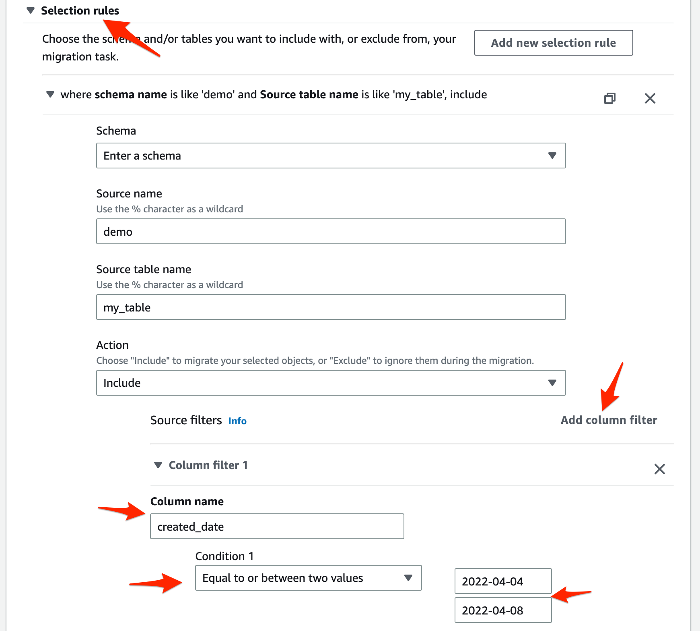
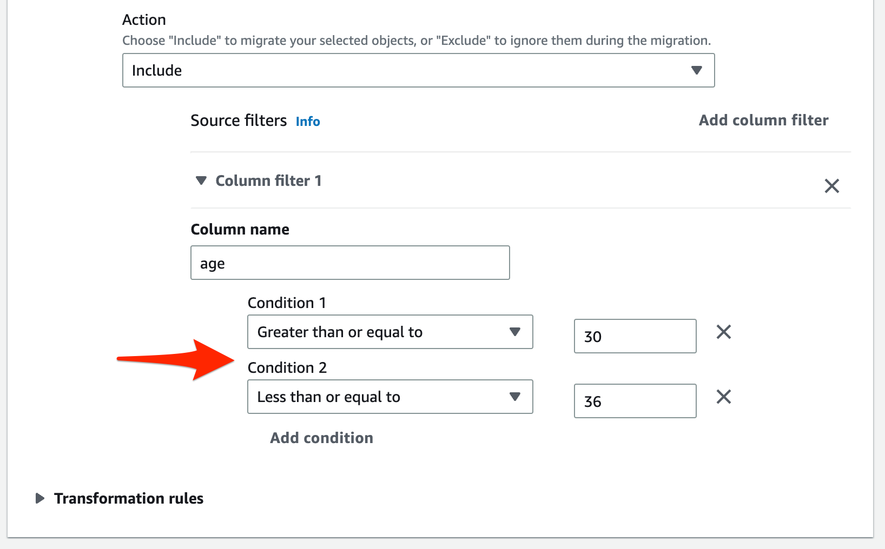
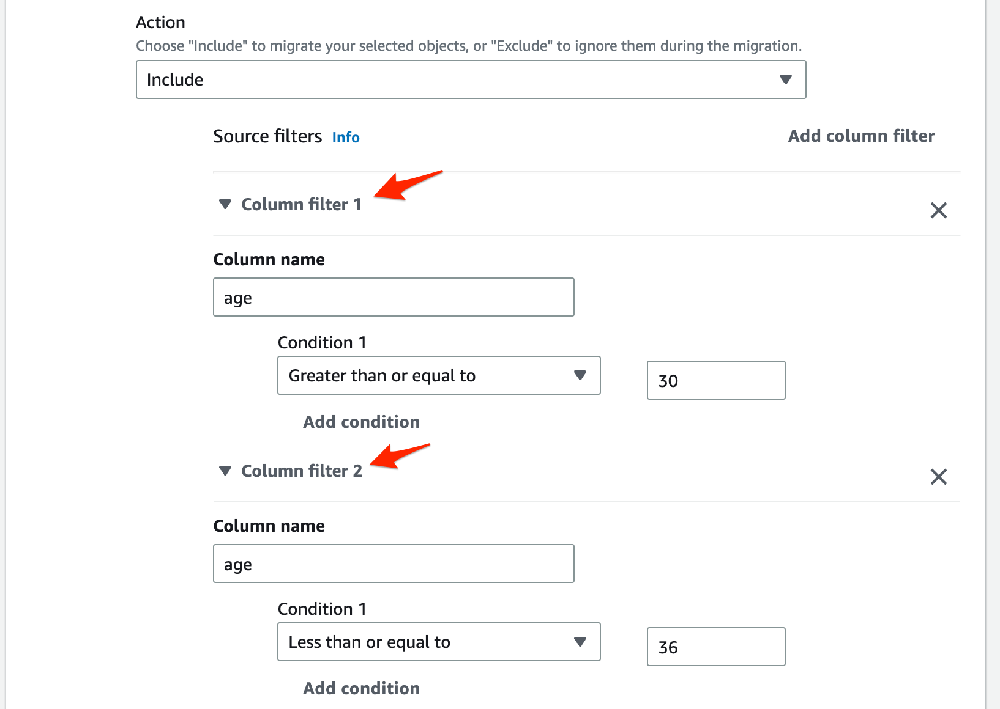
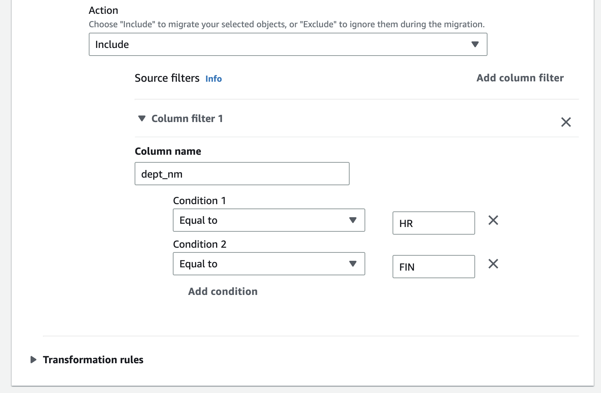

# AWS DMS에서 특정 Column만 Filtering하기


## 특정 날짜 구간 Data 이관


1. 원본 Table 구조 확인

```
mysql> desc my_table;
+--------------+--------------+------+-----+---------+----------------+
| Field        | Type         | Null | Key | Default | Extra          |
+--------------+--------------+------+-----+---------+----------------+
| id           | int(11)      | NO   | PRI | NULL    | auto_increment |
| name         | varchar(50)  | NO   |     | NULL    |                |
| age          | int(11)      | NO   |     | NULL    |                |
| email        | varchar(100) | NO   |     | NULL    |                |
| created_date | date         | NO   |     | NULL    |                |
+--------------+--------------+------+-----+---------+----------------+
5 rows in set (0.00 sec)

mysql> select * from my_table limit 1;
+----+----------+-----+----------------------+--------------+
| id | name     | age | email                | created_date |
+----+----------+-----+----------------------+--------------+
|  1 | John Doe |  30 | john.doe@example.com | 2022-04-01   |
+----+----------+-----+----------------------+--------------+
1 row in set (0.01 sec)
```

---


2. `created_date` 를 이용하여 필요한 Rows만 이관 하겠습니다. `Add column filter` 를 활용합니다.

### Console UI



### JSON Mapping Table

```
{
  "rules": [
    {
      "rule-type": "selection",
      "rule-id": "583149592",
      "rule-name": "583149592",
      "object-locator": {
        "schema-name": "demo",
        "table-name": "my_table"
      },
      "rule-action": "include",
      "filters": [
        {
          "filter-type": "source",
          "column-name": "created_date",
          "filter-conditions": [
            {
              "filter-operator": "between",
              "start-value": "2022-04-04",
              "end-value": "2022-04-08"
            }
          ]
        }
      ]
    }
  ]
}
```

---


3. 결과 확인

```
#### Source DB
mysql> select count(*) from my_table;
+----------+
| count(*) |
+----------+
|       14 |
+----------+
1 row in set (0.00 sec)


#### Target DB
mysql>  select count(*) from my_table;
+----------+
| count(*) |
+----------+
|        5 |
+----------+
1 row in set (0.03 sec)

mysql> select * from my_table;
+----+--------------+-----+--------------------------+--------------+
| id | name         | age | email                    | created_date |
+----+--------------+-----+--------------------------+--------------+
|  4 | Alice Smith  |  32 | alice.smith@example.com  | 2022-04-04   |
|  5 | Sarah Lee    |  27 | sarah.lee@example.com    | 2022-04-05   |
|  6 | James Kim    |  40 | james.kim@example.com    | 2022-04-06   |
|  7 | Michelle Lee |  24 | michelle.lee@example.com | 2022-04-07   |
|  8 | Daniel Park  |  33 | daniel.park@example.com  | 2022-04-08   |
+----+--------------+-----+--------------------------+--------------+
5 rows in set (0.00 sec)

```

---


## And / Or Condition - 1


```
DMS는 기본적으로 Condition and를 제공하지 않고 각각의 Condition을 인식함.
따라서 아래와 같이 Filter를 2개 쓰거나 해도 동작하지 않음. 

Between Two Values를 선택해서 해야함. 
```





```
{
  "rules": [
    {
      "rule-type": "selection",
      "rule-id": "584558437",
      "rule-name": "584558437",
      "object-locator": {
        "schema-name": "demo",
        "table-name": "my_table"
      },
      "rule-action": "include",
      "filters": [
        {
          "filter-type": "source",
          "column-name": "age",
          "filter-conditions": [
            {
              "filter-operator": "gte",
              "value": "30"
            },
            {
              "filter-operator": "ste",
              "value": "36"
            }
          ]
        }
      ]
    }
  ]
}
```


```
mysql> select count(*) from my_table;
+----------+
| count(*) |
+----------+
|       14 |
+----------+
1 row in set (0.00 sec)

mysql> select * from my_table;
+----+--------------+-----+--------------------------+--------------+
| id | name         | age | email                    | created_date |
+----+--------------+-----+--------------------------+--------------+
|  1 | John Doe     |  30 | john.doe@example.com     | 2022-04-01   |
|  2 | Jane Doe     |  28 | jane.doe@example.com     | 2022-04-02   |
|  3 | Bob Smith    |  35 | bob.smith@example.com    | 2022-04-03   |
|  4 | Alice Smith  |  32 | alice.smith@example.com  | 2022-04-04   |
|  5 | Sarah Lee    |  27 | sarah.lee@example.com    | 2022-04-05   |
|  6 | James Kim    |  40 | james.kim@example.com    | 2022-04-06   |
|  7 | Michelle Lee |  24 | michelle.lee@example.com | 2022-04-07   |
|  8 | Daniel Park  |  33 | daniel.park@example.com  | 2022-04-08   |
|  9 | Emily Kim    |  29 | emily.kim@example.com    | 2022-04-09   |
| 10 | Kevin Lee    |  31 | kevin.lee@example.com    | 2022-04-10   |
| 11 | Grace Park   |  36 | grace.park@example.com   | 2022-04-11   |
| 12 | Brian Kim    |  28 | brian.kim@example.com    | 2022-04-12   |
| 13 | Maggie Lee   |  42 | maggie.lee@example.com   | 2022-04-13   |
| 14 | David Park   |  25 | david.park@example.com   | 2022-04-14   |
+----+--------------+-----+--------------------------+--------------+
14 rows in set (0.02 sec)

```

---


## And / Or Condition - 2





```
{
  "rules": [
    {
      "rule-type": "selection",
      "rule-id": "584558437",
      "rule-name": "584558437",
      "object-locator": {
        "schema-name": "demo",
        "table-name": "my_table"
      },
      "rule-action": "include",
      "filters": [
        {
          "filter-type": "source",
          "column-name": "age",
          "filter-conditions": [
            {
              "filter-operator": "gte",
              "value": "30"
            }
          ]
        },
        {
          "filter-type": "source",
          "column-name": "age",
          "filter-conditions": [
            {
              "filter-operator": "ste",
              "value": "36"
            }
          ]
        }
      ]
    }
  ]
}
```


```
mysql>  select count(*) from my_table;
+----------+
| count(*) |
+----------+
|       14 |
+----------+
1 row in set (0.00 sec)

mysql> select * from my_table;
+----+--------------+-----+--------------------------+--------------+
| id | name         | age | email                    | created_date |
+----+--------------+-----+--------------------------+--------------+
|  1 | John Doe     |  30 | john.doe@example.com     | 2022-04-01   |
|  2 | Jane Doe     |  28 | jane.doe@example.com     | 2022-04-02   |
|  3 | Bob Smith    |  35 | bob.smith@example.com    | 2022-04-03   |
|  4 | Alice Smith  |  32 | alice.smith@example.com  | 2022-04-04   |
|  5 | Sarah Lee    |  27 | sarah.lee@example.com    | 2022-04-05   |
|  6 | James Kim    |  40 | james.kim@example.com    | 2022-04-06   |
|  7 | Michelle Lee |  24 | michelle.lee@example.com | 2022-04-07   |
|  8 | Daniel Park  |  33 | daniel.park@example.com  | 2022-04-08   |
|  9 | Emily Kim    |  29 | emily.kim@example.com    | 2022-04-09   |
| 10 | Kevin Lee    |  31 | kevin.lee@example.com    | 2022-04-10   |
| 11 | Grace Park   |  36 | grace.park@example.com   | 2022-04-11   |
| 12 | Brian Kim    |  28 | brian.kim@example.com    | 2022-04-12   |
| 13 | Maggie Lee   |  42 | maggie.lee@example.com   | 2022-04-13   |
| 14 | David Park   |  25 | david.park@example.com   | 2022-04-14   |
+----+--------------+-----+--------------------------+--------------+
14 rows in set (0.00 sec)

```

---


## 특정 String Filter

### Console UI



### JSON

```
{
    "rules": [
        {
            "rule-type": "selection",
            "rule-id": "586612153",
            "rule-name": "586612153",
            "object-locator": {
                "schema-name": "demo",
                "table-name": "my_table"
            },
            "rule-action": "include",
            "filters": [
                {
                    "filter-type": "source",
                    "column-name": "dept_nm",
                    "filter-conditions": [
                        {
                            "filter-operator": "eq",
                            "value": "HR"
                        },
                        {
                            "filter-operator": "eq",
                            "value": "FIN"
                        }
                    ]
                }
            ]
        }
    ]
}
```


```
mysql> select count(*) from my_table;
+----------+
| count(*) |
+----------+
|        7 |
+----------+
1 row in set (0.01 sec)

mysql>  select * from my_table;
+----+--------------+-----+--------------------------+--------------+---------+
| id | name         | age | email                    | created_date | dept_nm |
+----+--------------+-----+--------------------------+--------------+---------+
|  3 | Bob Smith    |  35 | bob.smith@example.com    | 2022-04-03   | HR      |
|  5 | Sarah Lee    |  27 | sarah.lee@example.com    | 2022-04-05   | HR      |
|  6 | James Kim    |  40 | james.kim@example.com    | 2022-04-06   | HR      |
|  7 | Michelle Lee |  24 | michelle.lee@example.com | 2022-04-07   | HR      |
| 10 | Kevin Lee    |  31 | kevin.lee@example.com    | 2022-04-10   | FIN     |
| 11 | Grace Park   |  36 | grace.park@example.com   | 2022-04-11   | FIN     |
| 13 | Maggie Lee   |  42 | maggie.lee@example.com   | 2022-04-13   | FIN     |
+----+--------------+-----+--------------------------+--------------+---------+
7 rows in set (0.00 sec)

```


