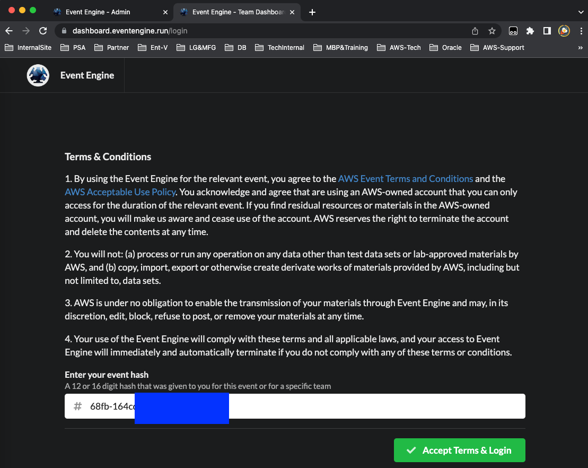
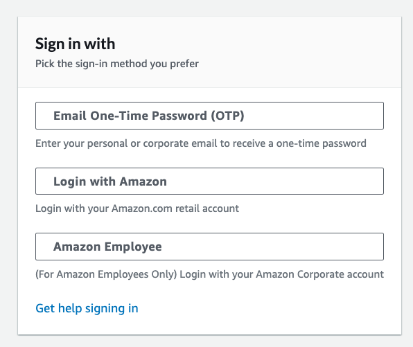
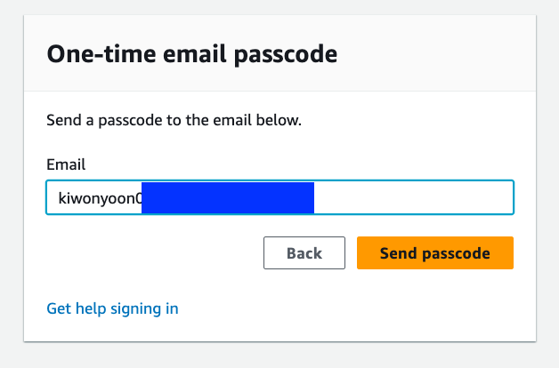
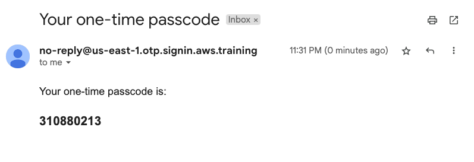
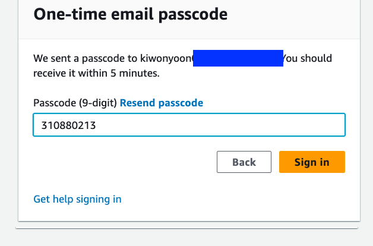
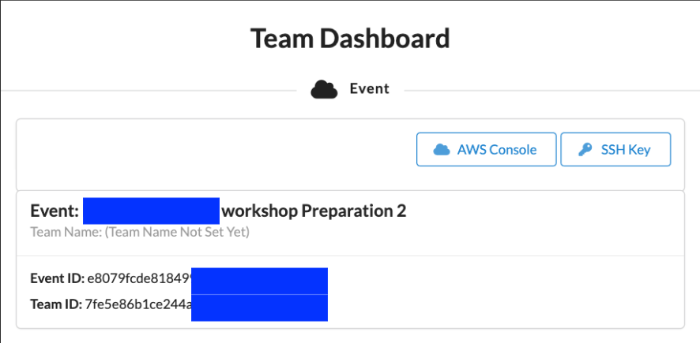
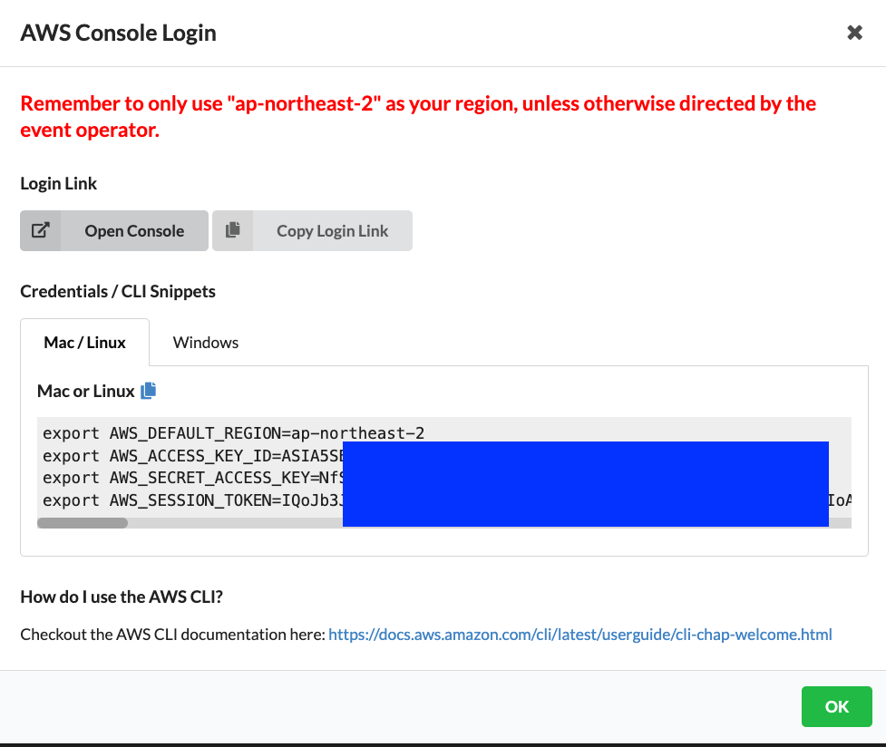
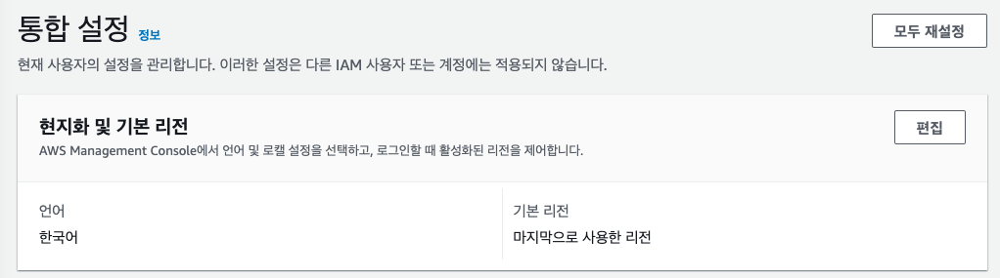
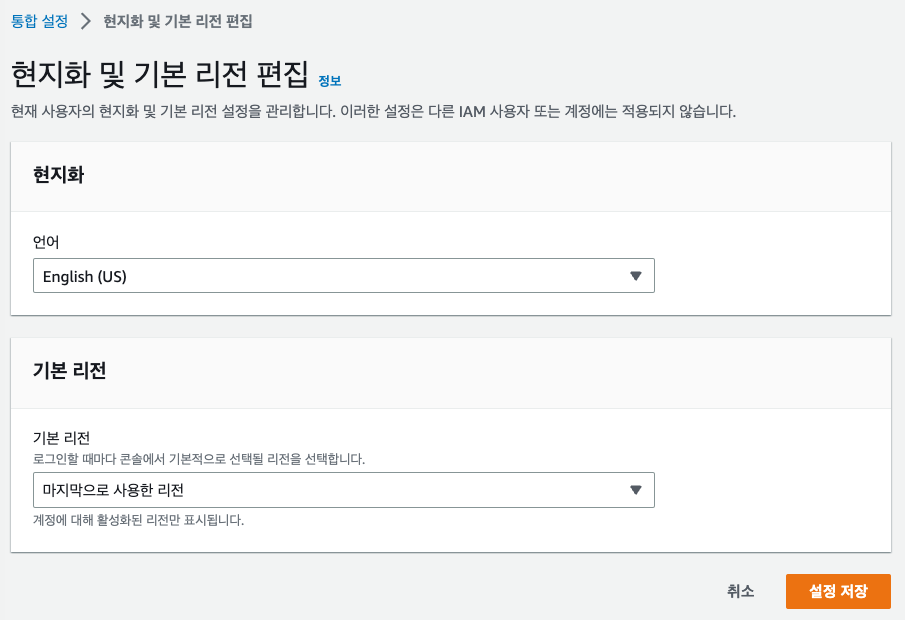

1. `https://dashboard.eventengine.run/` 로 이동합니다.

2. 제공 받은 Team Hash Code를 입력하고 `Accept Terms&Login` 를 Click 합니다.

3. `Email One-Time Password(OTP)` 를 Click하고 Email 주소를 입력 합니다.

4. Email 을 입력하고 `Send Passcode` 를 Click합니다.

5. Email 로 전송된 Passcode를 확인하고 `One-time email passcode` 에 입력하고  `Sign in` Click합니다.

---

---

6. `AWS Console` Click합니다.

---

7. `Open Console` Click 합니다.

---

8. Console 화면이 한글로 표시 될 경우 Console 화면 좌측 하단의 `언어` 를 Click 합니다.

---

9. `현지화 및 기본 리전`  의 `편집` 을 Click합니다.

---

10. `언어` 를  `English(US)` 로 변경 후 `설정 저장` 을 Click 합니다.

[<다음> 실습 환경 생성](./02.md)
