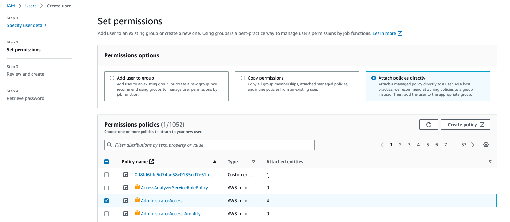
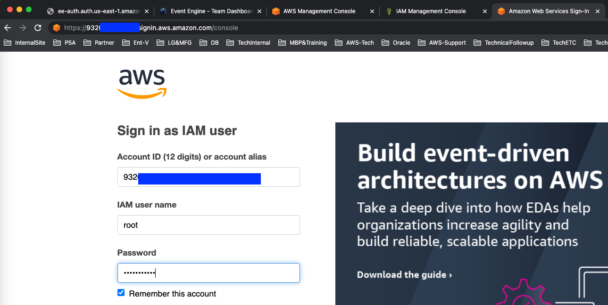

1. `https://dashboard.eventengine.run/` 로 이동합니다.


2. 제공 받은 Team Hash Code를 입력하고 `Accept Terms&Login` 를 Click 합니다.


3. `Email One-Time Password(OTP)` 를 Click하고 Email 주소를 입력 합니다.


4. Email 을 입력하고 `Send Passcode` 를 Click합니다.


5. Email 로 전송된 Passcode를 확인하고 `One-time email passcode` 에 입력하고  `Sign in` Click합니다.


---


---


6. `AWS Console` Click합니다.


---

7. `Open Console` Click 합니다.


---

8. Console 화면이 한글로 표시 될 경우 Console 화면 좌측 하단의 `언어` 를 Click 합니다.

---

9. `현지화 및 기본 리전`  의 `편집` 을 Click합니다.


---


10. `언어` 를  `English(US)` 로 변경 후 `설정 저장` 을 Click 합니다.


---

11. [여기 ](https://us-east-1.console.aws.amazon.com/iamv2/home?region=ap-northeast-2#/users/create) 를 새 창(새 탭)으로 띄워서 IAM - `Create User` 메뉴로 이동합니다. 다음과 같이 정보를 입력 후 `Next`를 Click합니다.

```
User details
User name : root
Provide user access to the AWS Management Console - optional : Check

Console password
Custom password : Octank#1234

Users must create a new password at next sign-in (recommended) : Uncheck
```


---

12. `Set Permissions` Page에서 `Permissions options` 중 `Attach policies directly` 를 선택합니다.

`Permission policies` 에서 `AdministratorAccess` 앞의 CheckBox를 Check하고 `Next`를 Click합니다.



---

13. `Review and create` Page 에서 `Create User` 를 Click합니다.


---

14. `Console sign-in URL` 앞의 Copy 버튼을 Click해서 Console URL을 복사하고, 메모장에 저장합니다.


---

15. Console 우측 상단의 `TeamRole/MasterKey @` 을 click 후 `Sign Out`을 눌러서 현재 계정에서 LogOut합니다.


---

16. Browser 주소 창에 Step-14에서 복사한 Console URL을 입력하고 `Sign in` 을 Click합니다..




---

[<다음> 실습 환경 생성](./02.md)


