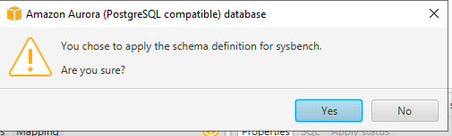

1. Bastion Server에서 `AWS Schema Conversion Tool` 을 실행합니다. (최초 실행시 20초 정도 필요)


---

2. `Check For Update` 경고 창이 뜨면 `Not Now` 를 Click 합니다.

---

3. `File` => `New Project` 선택 합니다.

---

4. Source Engine 에 `MySQL` 을 선택하고 Target Engine에 `Amazon Aurora(PostgreSQL compatible)` 을 선택하고  `OK` 를 Click 합니다.


---

5. 메뉴 중에 `Connect to MySQL` 을 Click 하고 다음처럼 입력합니다.  

```
Server Name : 10.100.1.101
Server Port : 3306
User name : dms_user
Password : Octank#1234

Store Password : Check
```


---

6. `Test Connection` 을 Click 합니다. `Accept the risk and continue` 를 Click합니다. 

   아래처럼 `Connection successful` 을 확인합니다. 


---

7. `Ok` 를 2번 Click 하면 위에서 본 보안 경고창에서 `Accept the risk and continue` 를 Click합니다. 


---

8. MySQL 서버에 접속하여 아래 화면처럼 나오는 것을 확인합니다.


---

9. Schemas에 `sysbench` 만 Check하고 나머지는 Uncheck 합니다.


---

10. [여기 ](https://ap-northeast-2.console.aws.amazon.com/rds/home?region=ap-northeast-2#databases:) 를 새 창(새 탭)으로 띄워서 RDS Console로 이동합니다. `Regional cluster` 에 해당하는 DB Identifier를 Click합니다.


---

11. `Endpoints` 부분에서 Type이 `Writer instance` 인 Endpoint 주소를 복사해서 메모장에 저장합니다.


---

12. Schema Coversion Tool로 돌아와 `Connect to Amazon Aurora(PostgreSQL Compatible)` 을 Click 합니다.


---

13. 아래와 같이 입력하고 `Test Connection` Click합니다. 

    보안 경고 창이 나오면 `Accept the risk and continue` 를 Click합니다. 

    `Connection successful` 을 확인합니다.

```
Server Name : Step 11에서 복사한 Writer instance의 endpoint를 입력
Server Port : 5432
Database : sysbench
Username : dbmaster
Password : dbmaster123

Store Password : check
```


---

14. `OK` 를 Click하여 Target - Aurora PostgresDB에 접속합니다.

보안 경고 창이 나오면 `Accept the risk and continue` 를 Click합니다. 


---

15. `MySQL` - `sysbench` Schema에 마우스 커서를 두고 마우스 우측 버튼을 클릭하여 `Create report` 를 Click합니다.

    sysbench DB를 MySQL to Aurora PostgreSDB 이관에 대한 Assessment Report를 제공합니다.


---

16. 1개의 Schema와 15개의 Table, Index, Constraints 가 모두 SCT를 통해저 자동으로 이관 될 수 있다고 Assessment Report가 분석 결과를 보여줍니다. 


---

17. `Action Item` Tab을 Click하여 원래 화면으로 돌아갑니다.

    `Convert Schema` 를 선택하여 Schema Convert를 진행합니다.


---

18. Target DB에 이미 같은 Schema가 있을 수 있다는 경고창이 뜹니다. `Yes`를 Click합니다.


---

19. Target Amazon Aurora Postgres쪽에 `sysbench` Schema가 로딩되었습니다. (실제 Schema 생성 및 이관은 아직 되지 않은 상태입니다.)


---

20. Target Amazon Aurora Postgres에서 `sysbench` 를 선택 후 마우스 우측 버튼을 클릭하고 `Apply to database`를 선택하여 Schema 생성 및 이관을 실제 수행합니다.

    정말 Schema 이관을 할 것인지 경고창이 뜨면 `Yes`를 선택합니다.


---



---

21. Target Amazon Postgres - `sysbench` Schema를 expand해보면 Table sbtest1 ~ sbtest15까지 Table Schema가 생성 된 것을 확인 할 수 있습니다.


---

[<다음> Database Migration Service(DMS)를 사용하여 실제 Data 이관 수행](./04.md)
