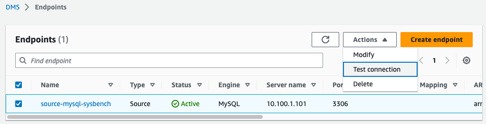

1. [여기 ](https://ap-northeast-2.console.aws.amazon.com/dms/v2/home?region=ap-northeast-2#replicationInstances) 를 새 창(새 탭)으로 띄워서 Database Migration Service(DMS) Console로 이동합니다.

---

2. `Create replication instance` 를 Click 하고 다음과 같이 정보를 입력합니다. 

   모두 입력 후 맨 아래  `Create repliation Instance` 를 Click합니다.

   Event Engine 사용시 `The IAM Role arn:aws:iam::932090694037:role/dms-vpc-role is not configured properly.` 에러가 발생합니다. 이럴 경우 10초를 기다렸다가 다시 `Create replication Instance`를 Click합니다.

```
Settings 
Name : RI-Mysql-To-Postgres
Description : RI-Mysql-To-Postgres

Instance configuration
Instance Class : dms.t3.medium (Default)
Engine Version : 3.4.6
Multi AZ : Dev or test workload (Single-AZ)

Storage
Allocated storage(GiB) : 50 (Default)

Connectivity and security
Network type - IPv4
Virtual private cloud (VPC) : OnPREM  <=== Default가 아닙니다.
public accessible : Uncheck
```


---

3. Replication Instance의 Status가 `Available` 이 될때까지 기다립니다.(10분 정도 소요)

---

4. [여기 ](https://ap-northeast-2.console.aws.amazon.com/dms/v2/home?region=ap-northeast-2#endpointList) 를 새 창(새 탭)으로 띄워서 Database Migration Service(DMS) Console로 이동합니다.

---

5. MySQL Source Endpoint를 생성합니다. `Create endpoint` 를 Click하고 다음과 같이 입력 후 맨 아래 `Create endpoint` 를 Click 합니다.

```
Endpoint type : Source endpoint

Endpoint configuration
Endpoint identifier : source-mysql-sysbench
Source engine : MySQL

Access to endpoint database : Provide access information manually
Server name : 10.100.1.101
Port : 3306
User name : dms_user
Password : Octank#1234

```


---

6. 방금 생성한 `source-mysql-sysbench` 앞의 CheckBox를 Check하고 `Action` => `Test connection` Click



---

7. `Run test`를 Click 합니다. Status가 `Successful` 인지 확인 합니다. `Back` button을 Click합니다.


---

8. Aurora Postgres Target Endpoint를 생성합니다. `Create endpoint` 를 Click하고 다음과 같이 입력 후 맨 아래 `Create endpoint` 를 Click 합니다.

```
Endpoint type : Target endpoint
%%% Source endpoint아래의 Box에 Check를 하면 `RDS Instance` 창이 보입니다.
RDS Instance : mysqltopostgres-xxxxxxxxxxxxxx 

Endpoint configuration
Endpoint identifier : 자동 입력 됨
Source engine : 자동 입력 됨(Amazon AUrora PostgreSQL)

Access to endpoint database : Provide access information manually
Server name : 자동 입력 됨
Port : 5432(자동 입력 됨)
User name : dbmaster(자동 입력 됨)
Password : dbmaster123
Database name : sysbench (자동 입력 됨)

```


---

9. 방금 생성한 `mysqltopostgres2-aurorapostgresqlinstance` 앞의 CheckBox를 Check하고 `Action` => `Test connection` Click


---

10. `Run test`를 Click 합니다. Status가 `Successful` 인지 확인 합니다. `Back` button을 Click합니다.


---

11. [여기 ](https://ap-northeast-2.console.aws.amazon.com/dms/v2/home?region=ap-northeast-2#tasks) 를 새 창(새 탭)으로 띄워서 DMS - TASK로 이동합니다. `Create task`를 입력 후 다음과 같이 입력 후 맨 아래 `Create Task`를 Click합니다.

#### Task configuration

```
Task identifier : MySQL-To-Postgres-sysbench
Replication instance : ri-myslq-to-postgres
Source database endpoint : source-mysql-sysbench
Target database endpoint : mysqltopostgres-aurorapostgressqlinstance
Migration type : Migrate existing data and replicate ongoing changes
```

#### Task settings

```
Editing mode : Wizard
Custom CDC stop mode for source transactions : Disable custom CDC stop mode
Target table preparation mode : Do nothing <= 중요!!!! 이미 SCT에서 Schema를 이관 했기 때문!!!
Stop task after full load completes : Don't stop
Include LOB columns in replication : Limited LOB mode
Maximum LOB size (KB) : 32
Turn on validation : Check
Turn on CloudWatch logs : Check

나머지 값들은 Default 유지
```

#### **Table mappings** 에서 JSON editor를 선택 후 다음을 입력

```
{
  "rules": [
    {
      "rule-type": "transformation",
      "rule-id": "114414124",
      "rule-name": "114414124",
      "rule-target": "schema",
      "object-locator": {
        "schema-name": "sysbench"
      },
      "rule-action": "rename",
      "value": "sysbench",
      "old-value": null
    },
    {
      "rule-type": "selection",
      "rule-id": "114392211",
      "rule-name": "114392211",
      "object-locator": {
        "schema-name": "sysbench",
        "table-name": "sbtest%"
      },
      "rule-action": "include",
      "filters": []
    }
  ]
}
```


---

12. `mysql-to-postgres-sysbench` 의 Status 가 `Starting`으로 바뀌면 Identifier를 Click하여 Detail 정보를 확인합니다.


---

13. `Table statistics` Tab을 Click하여 Migration 상황을 모니터링 합니다.

    `Full load rows`가 Table마다 100,000 건씩 Migration 된 것을 확인합니다.


---

14. 실제로 데이터가 Target Aurora Postgre로 Migration되었는지 확인합니다.

    Bastion 서버에서 `pgAdmin` 을 실행합니다.


---

15. `Unlock saved password` 경고 창이 뜨면 `Octank#1234` 를 입력 후 `OK` 를 Click합니다.


---

16. `Servers`를 Click 후 마우스 우측 버튼 Click 후, `Register` => `Server..` 를 Click합니다.


---

17. General - Name에 `Target-Aurora-Postgres` 라고 입력 합니다.


---

18. `Connection` Tab으로 이동 후 아래처럼 입력 후 `Save` 를 Click합니다.

```
Host name/address : 03.md에서 복사한 Writer Instance Endpoint를 입력
Port : 5432
Maintanence database : postgres
Username : dbmaster
Password : dbmaster123
Save Password : Enable
```


---

19. `Target-Aurora-postgres` => `Databases` => `sysbench` 를 선택 후 마우스 우측 버튼을 누르고 `Query tool` 을 click합니다.


---

20. Query 창에서 아래와 같이 SQL을 입력 후 `Execute` 를 Click합니다. sbtest1, sbtest15 Table 모두 100,000 rows씩 정상적으로 Migration 된 것을 확인합니다.

```
select count(*) from sysbench.sbtest1
union all
select count(*) from sysbench.sbtest15;
```


---

[<다음> Database Migration Service(DMS)를 활용한 CDC 기능](./05.md)


