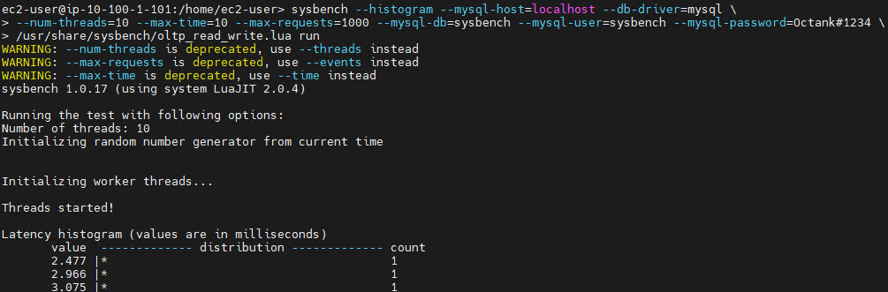

1. Bastion Server에서 MobaXterm을 사용하여 OracleServer에 접속 합니다.


---

2. MobaXterm에서 다음의  Command를 실행합니다.

```
sysbench --histogram --mysql-host=localhost --db-driver=mysql \
--num-threads=10 --max-time=10 --max-requests=1000 --mysql-db=sysbench --mysql-user=sysbench --mysql-password=Octank#1234 \
/usr/share/sysbench/oltp_read_write.lua run
```




---

3. DMS Console에서 `Table statistics` 를 확인하면 Inserts / Deletes / Updates Transaction이 Capture되어 DB에 반영되는 것을 확인 할 수 있습니다.


---

4. 대량 Transaction을 가정하고 다음 command를 실행 후 DMS console에서 `Table statistics` 를 확인합니다.

```
sysbench --histogram --mysql-host=localhost --db-driver=mysql \
--num-threads=100 --max-time=100 --max-requests=1000000 --mysql-db=sysbench --mysql-user=sysbench --mysql-password=Octank#1234 \
/usr/share/sysbench/oltp_read_write.lua run
```


---


수고하였습니다.


