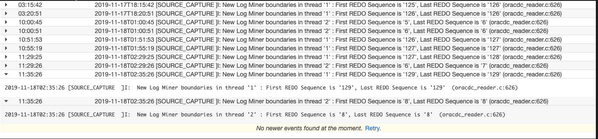

**archivelog, minimum supplemental log**

```
archive log list;
ALTER DATABASE ADD SUPPLEMENTAL LOG DATA;

SELECT supplemental_log_data_min FROM v$database;
```

```
create user dms_user identified by <PASSWORD> default tablespace users temporary tablespace temp quota unlimited on users;
grant connect, resource to dms_user;
grant EXECUTE ON DBMS_LOGMNR to dms_user;
GRANT SELECT ANY TRANSACTION to dms_user;
GRANT SELECT on V_$ARCHIVED_LOG to dms_user;
GRANT SELECT on V_$LOG to dms_user;
GRANT SELECT on V_$LOGFILE to dms_user;
GRANT SELECT on V_$DATABASE to dms_user;
GRANT SELECT on V_$THREAD to dms_user;
GRANT SELECT on V_$PARAMETER to dms_user;
GRANT SELECT on V_$NLS_PARAMETERS to dms_user;
GRANT SELECT on V_$TIMEZONE_NAMES to dms_user;
GRANT SELECT on V_$TRANSACTION to dms_user;
GRANT SELECT on ALL_INDEXES to dms_user;
GRANT SELECT on ALL_OBJECTS to dms_user;
GRANT SELECT on DBA_OBJECTS to dms_user;
GRANT SELECT on ALL_TABLES to dms_user;
GRANT SELECT on ALL_USERS to dms_user;
GRANT SELECT on ALL_CATALOG to dms_user;
GRANT SELECT on ALL_CONSTRAINTS to dms_user;
GRANT SELECT on ALL_CONS_COLUMNS to dms_user;
GRANT SELECT on ALL_TAB_COLS to dms_user;
GRANT SELECT on ALL_IND_COLUMNS to dms_user;
GRANT SELECT on ALL_LOG_GROUPS to dms_user;
GRANT SELECT on SYS.DBA_REGISTRY to dms_user;
GRANT SELECT on SYS.OBJ$ to dms_user;
GRANT SELECT on DBA_TABLESPACES to dms_user;
GRANT SELECT on ALL_TAB_PARTITIONS to dms_user;
GRANT SELECT on ALL_ENCRYPTED_COLUMNS to dms_user;
GRANT SELECT on V_$LOGMNR_LOGS to dms_user;
GRANT SELECT on V_$LOGMNR_CONTENTS to dms_user;
GRANT SELECT on ALL_VIEWS to dms_user;
GRANT SELECT ANY TABLE to dms_user;
GRANT ALTER ANY TABLE to dms_user;
GRANT create any directory to dms_user;
GRANT SELECT on GV_$ARCHIVED_LOG to dms_user;
GRANT SELECT on GV_$LOG to dms_user;
GRANT SELECT on GV_$LOGFILE to dms_user;
GRANT SELECT on GV_$DATABASE to dms_user;
GRANT SELECT on GV_$THREAD to dms_user;
GRANT SELECT on GV_$PARAMETER to dms_user;
GRANT SELECT on GV_$NLS_PARAMETERS to dms_user;
GRANT SELECT on GV_$TIMEZONE_NAMES to dms_user;
GRANT SELECT on GV_$TRANSACTION to dms_user;
GRANT SELECT on GV_$LOGMNR_LOGS to dms_user;
GRANT SELECT on GV_$LOGMNR_CONTENTS to dms_user;
GRANT CREATE SESSION to dms_user;
GRANT SELECT ON v_$transportable_platform to dms_user;
GRANT EXECUTE ON DBMS_FILE_TRANSFER to dms_user;
GRANT CREATE ANY DIRECTORY to dms_user;

특정 Schema의 Table에 대한 Select만을 주고 싶으면 아래 결과를 Spool후 실행

select 'grant select on '||owner||'.'||table_name||' to dms_user;' from dba_tables where owner='OSHOP';
```

**archive_log_dest가 ASM이 아닌 File System일 경우 아래 조치 필요**

```
NFS Mount Point /oracle_shares생성 (양쪽 Node 수행)
RAC 양쪽 Node에서 해당directory mount후 oracle user에게 읽고 쓰도록 권한 변경
Ex) chwon oracle:oinstall /oracle_sahres (양쪽 Node 수행)
dms_user를 이용하여 bfile_dir Oracle directory를 생성 후 아래 command를 수행(한쪽 노드에서만 수행하면 됨.)
sqlplus dms_user/<PASSWORD>
create directory bfile_dir as '/oracle_shares';
exit;

Sys User로 접속 후 dms_user에게 아래 권한 할당
GRANT READ, WRITE ON DIRECTORY bfile_dir TO dms_user;
GRANT SELECT ON DBA_FILE_GROUPS to DMS_user;
GRANT EXECUTE ON SYS.DBMS_FILE_GROUP to DMS_user;
EXECUTE DBMS_FILE_GROUP.GRANT_SYSTEM_PRIVILEGE (DBMS_FILE_GROUP.MANAGE_ANY_FILE_GROUP, 'dms_user', FALSE);
```

**Table별 Supplemental Log**

```

select 'ALTER TABLE '||owner||'.'||table_name||' ADD SUPPLEMENTAL LOG DATA (PRIMARY KEY) COLUMNS;' from dba_tables where owner='OSHOP';

ALTER TABLE OSHOP.EMP ADD SUPPLEMENTAL LOG DATA (PRIMARY KEY) COLUMNS;
ALTER TABLE OSHOP.DUMMY ADD SUPPLEMENTAL LOG DATA (ALL) COLUMNS;

```

**binary mode**

```
useLogMinerReader=N;useBfile=Y;

```

**CloudWatch Log에서 Thread 1,2에서 모두 REDO 읽는지 확인**

<kbd>  </kbd>
