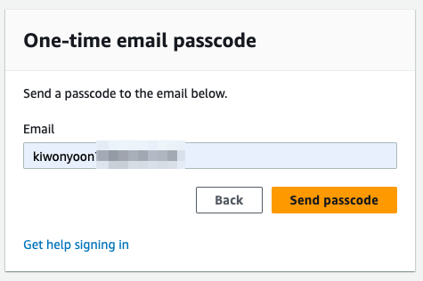
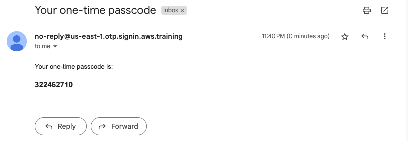
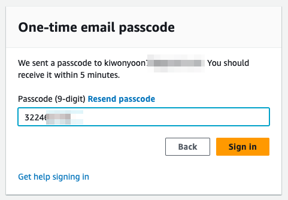
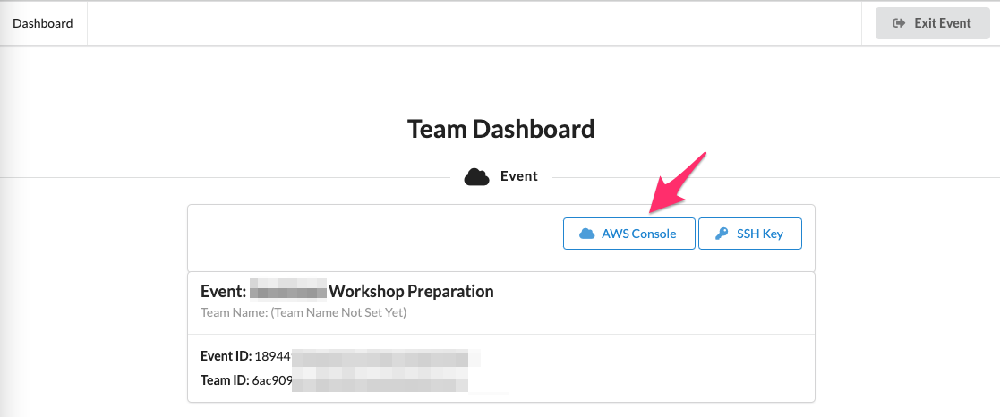
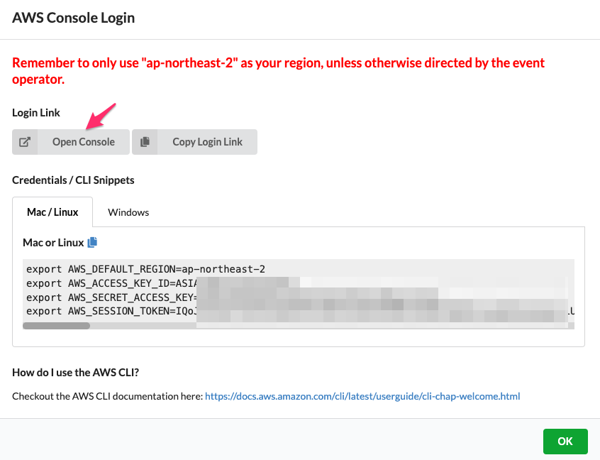
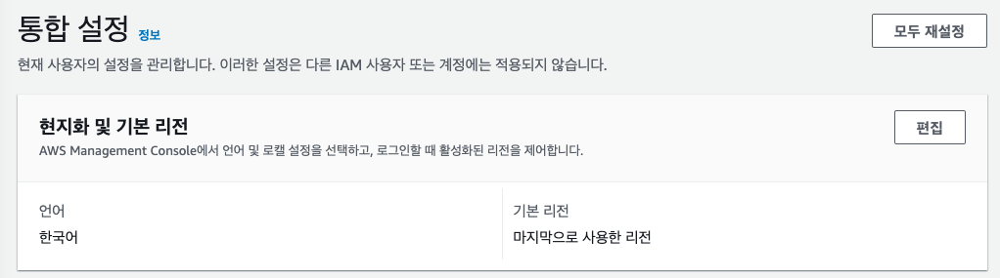
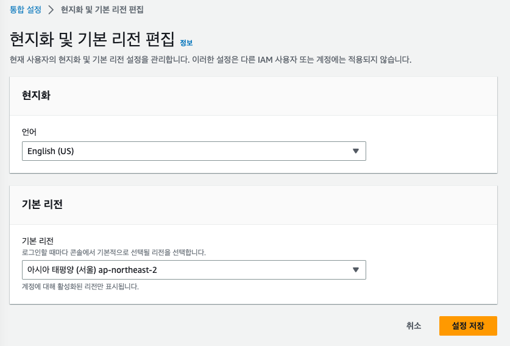
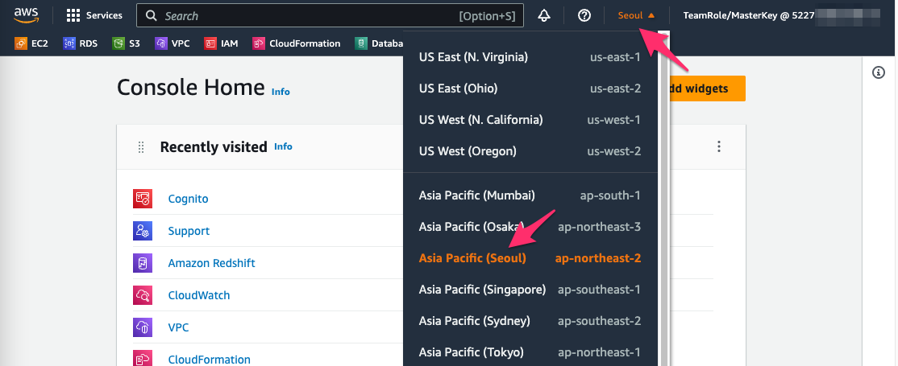

# Workshop 소개

이 워크샵에서는 BLOB Data를 포함한 Aurora MySQL DB를 다른 Aurora MySQL DB로 이관하는 작업을 수행합니다.

# 실습 환경 접속

1. `https://dashboard.eventengine.run/` 로 이동합니다.

2. 제공 받은 Team Hash Code를 입력하고 `Accept Terms&Login` 를 Click 합니다.

3. `Email One-Time Password(OTP)` 를 Click하고 Email 주소를 입력 합니다.

4. Email 을 입력하고 `Send Passcode` 를 Click합니다.

5. Email 로 전송된 Passcode를 확인하고 `One-time email passcode` 에 입력하고  `Sign in` Click합니다.

---

6. `AWS Console` Click합니다.

---

7. `Open Console` Click 합니다.

---

8. Console 화면이 한글로 표시 될 경우 Console 화면 좌측 하단의 `언어` 를 Click 합니다.

9. `현지화 및 기본 리전`  의 `편집` 을 Click합니다.

10. `언어` 를  `English(US)` 로 변경하고 `기본 리전` 을  `아시아 태평양(서울) ap-northeast-2`로 변경 후  `설정 저장` 을 Click 합니다.

10-1. 화면 우측 상단에 `Region`이 `N.Virginia` 로 되어 있을 경우 Click하여 `Asia Pacific (Seoul) ap-northeast-2` 을 선택하여 Region을 `Seoul` 로 변경 합니다.

---

[<다음> 실습 환경 생성](./02.md)