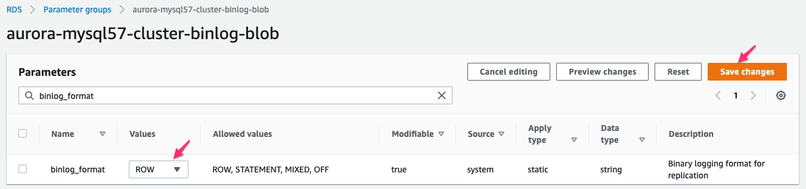

1. [여기 ](https://ap-northeast-2.console.aws.amazon.com/rds/home?region=ap-northeast-2#parameter-groups:) 를 새 창(새 탭)으로 띄워서 `RDS Console` 로 이동합니다.

   

---

2. `Create parameter group` Click합니다.


---

3. 다음처럼 입력 후 `Create` Click 합니다.

```
Parameter group family : aurora-mysql5.7
Type : DB Cluster Parameter Group
Group Name : aurora-mysql57-cluster-binlog-blob
Description : aurora-mysql57-cluster-binlog-blob
```


---

4. 방금 생성한 `aurora-mysql57-cluster-binlog-blob` 을 선택 후 `Parameter group actions` => `Edit` Click합니다.


---

5. 다음의 Parameter를 찾아서 아래의 표처럼 수정합니다. 변경 시 마다 `Save changes` 를 꼭  Click합니다.

```
binlog_format : ROW
binlog_row_image : FULL
binlog_checksum : NONE
max_allowed_packet : 1073741824

```




---

6. [여기 ](https://ap-northeast-2.console.aws.amazon.com/rds/home?region=ap-northeast-2#databases:) 를 새 창(새 탭)으로 띄워서 `RDS Console-Databases` 로 이동합니다.


---

7. `blob-migration-source` 을 선택 후 `Modify` Click합니다. 


---

8. `Additional configuration` => `Database options` => `DB cluster parameter group` 에서 Step-3에서 생성한 Parameter Group `aurora-mysql57-cluster-binlog-blob`을 선택 합니다.

   화면 맨 아래로 이동하여 `Contitue` Click 합니다.


---

9. `Schedule modifications` 에서 `Apply Immeidiately `를 선택 후 `Modify cluster` 를 Click합니다.


---

10. DB Instance에 Parameter 반영을 위해서 `blob-migration-rdsdbinstancesource-XXXXXXXXXXXX` 를 선택 후 `Actions` => `Reboot` 합니다. 

    잠시 기다리면 `Writer Instance`의 Status가 `Rebooting` => `Available`로 변경됩니다.


---


---

[<다음> DMS를 이용한 Data이관](./04.md)


