1. [여기 ](https://ap-northeast-2.console.aws.amazon.com/dms/v2/home?region=ap-northeast-2#replicationInstances) 를 새 창(새 탭)으로 띄워서 `DMS-ReplicaionInstance Console` 로 이동합니다.


---

2. `Create replication Instance` Click합니다.


---

3. 다음과 같이 정보를 입력 후 `Create replication Instance` 를 Click합니다. 

   `The IAM Role arn:aws:iam::522744647007:role/dms-vpc-role is not configured properly.` Error 발생 시 10초 정도 있다가 다시 `Create replication Instance`를 Click합니다.

```
Settings
Name : RI-BLOB-Migration
Description : RI-BLOB-Migration

Instance configuration
Instance class : Default
Engine Version : Default (3.4.7)
Muti AZ : DEV or test workload(Single-AZ)

Storage
Allocated storage (GiB) : 50

Connectivity and security
Virtual private cloud (VPC) for IPv4 : BLOB-Migration
Public accessible : Uncheck
```

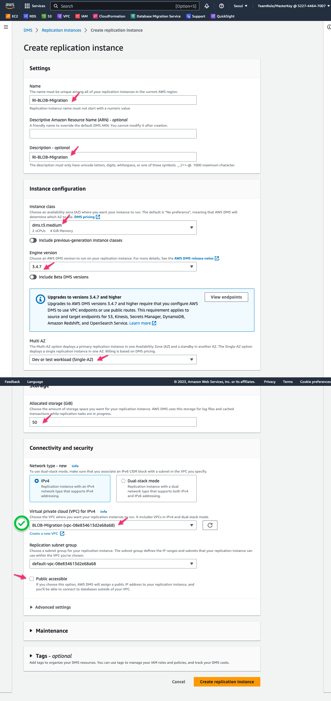

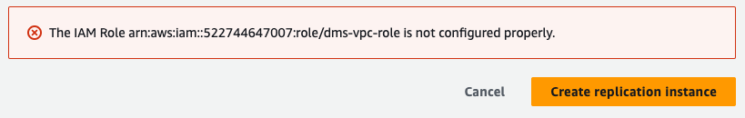


---

4. Replication Instance가 만들어지는 동안 `Source Endpoint`와 `Target Endpoint`를 만들어 보겠습니다.


---

5. [여기 ](https://ap-northeast-2.console.aws.amazon.com/dms/v2/home?region=ap-northeast-2#endpointList) 를 새 창(새 탭)으로 띄워서 `DMS-EndPoint Console` 로 이동합니다.


---

6. 먼저 `Source Endpoint` 를 생성하겠습니다. `Create endpoint` Click 후 다음과 같이 정보를 입력합니다.

   모두 입력 후 `Create endpoint` Click합니다.

```
Endpoint type : Source endpoint
Select RDS DB instance : Check
RDS Instance : blob-migratoin-rdsinstancesource-xxxxxxxxxxxxxx (SourceDB)

Endpoint configuration
Endpoint identifier : blob-migration-rdsdbinstancesource-SOURCE
Source engine : Amazon Aurora MySQL

Access to endpoint database : Provide access information manually
server Name, Port, User name 모두 자동 입력 값 사용
Password : Octank#1234

```

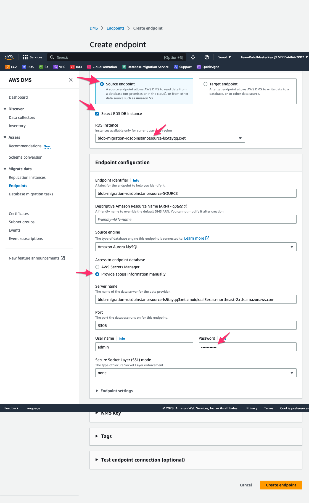


---

7. 다음으로  `Target Endpoint` 를 생성하겠습니다. `Create endpoint` Click 후 다음과 같이 정보를 입력합니다.

   모두 입력 후 `Create endpoint` Click합니다.

```
Endpoint type : Target endpoint
Select RDS DB instance : Check
RDS Instance : blob-migratoin-rdsinstancetarget-xxxxxxxxxxxxxx (TargetDB)

Endpoint configuration
Endpoint identifier : blob-migration-rdsdbinstancetarget-Target
Source engine : Amazon Aurora MySQL

Access to endpoint database : Provide access information manually
server Name, Port, User name 모두 자동 입력 값 사용
Password : Octank#1234


```

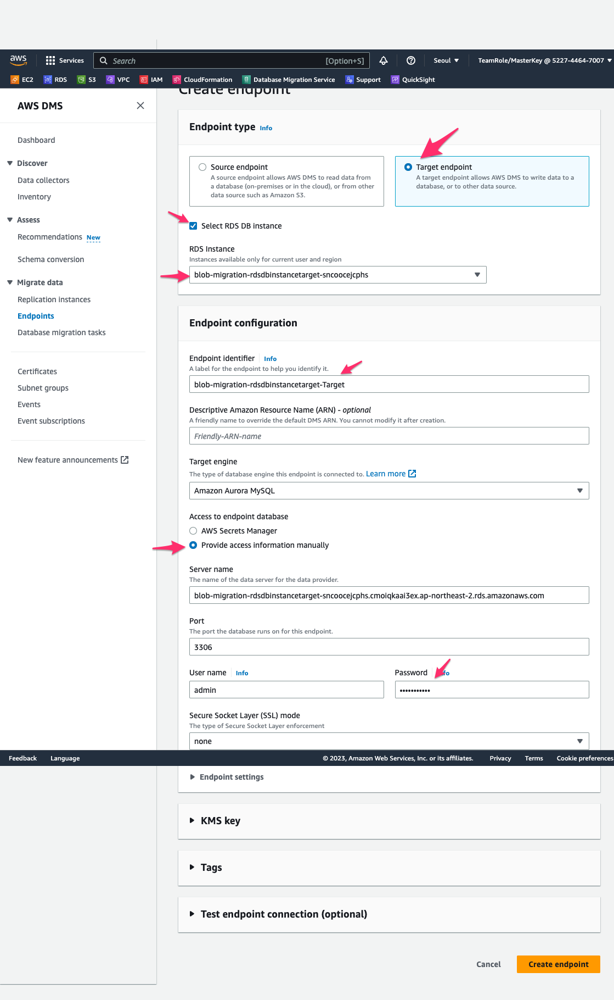


---

8. [여기 ](https://ap-northeast-2.console.aws.amazon.com/dms/v2/home?region=ap-northeast-2#replicationInstances) 를 새 창(새 탭)으로 띄워서 `DMS-ReplicaionInstance Console` 로 이동하여 RI가 생성되었는지 확인 합니다.

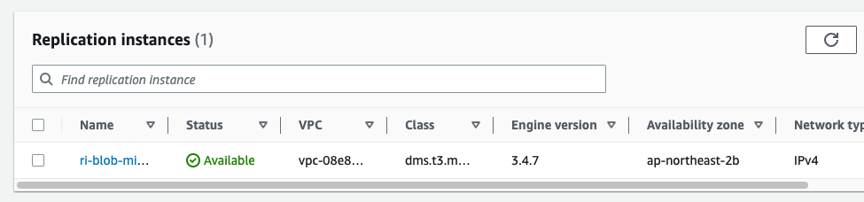


---


9. [여기 ](https://ap-northeast-2.console.aws.amazon.com/dms/v2/home?region=ap-northeast-2#endpointList) 를 새 창(새 탭)으로 띄워서 `DMS-EndPoint Console` 로 이동합니다.

   `Source DB`를 선택 후 `Actions` => `Test Connection`을 수행합니다.

   `Run test`를 Click합니다.

   `Status`가 `Successful` 인지 확인합니다.

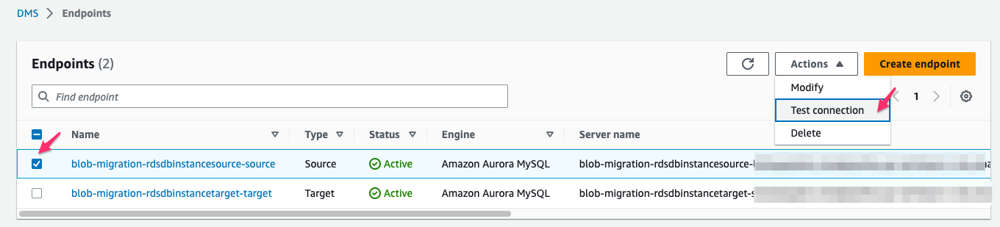

---

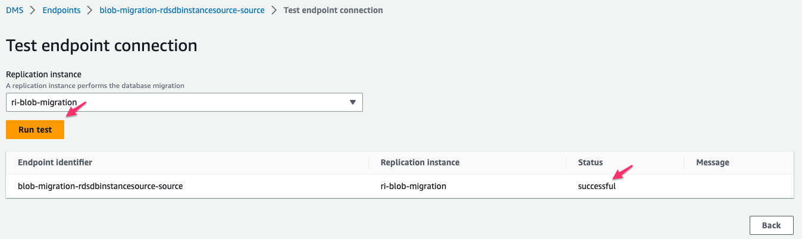


---

10. [여기 ](https://ap-northeast-2.console.aws.amazon.com/dms/v2/home?region=ap-northeast-2#endpointList) 를 새 창(새 탭)으로 띄워서 `DMS-EndPoint Console` 로 이동합니다.

    `Target DB`를 선택 후 `Actions` => `Test Connection`을 수행합니다.

    `Run test`를 Click합니다.

    `Status`가 `Successful` 인지 확인합니다.

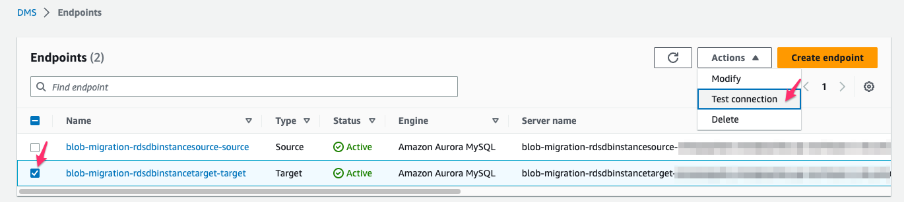

---

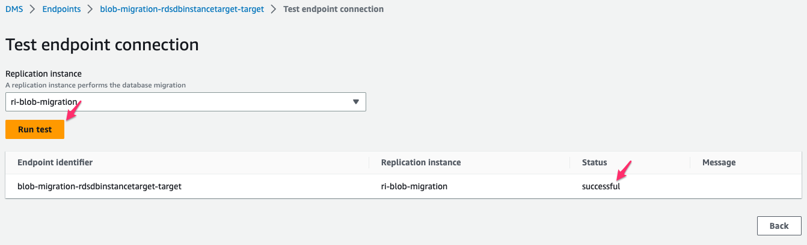


---

11. [여기 ](https://ap-northeast-2.console.aws.amazon.com/dms/v2/home?region=ap-northeast-2#tasks) 를 새 창(새 탭)으로 띄워서 `DMS-Tasks Console` 로 이동합니다.

    `Create task`를 Click 후 다음처럼 정보를 입력 후  `Create task`를 Click합니다.

```
Task configuration
Task identifier : BLOB-Migration
Replication instance : ri-blob-migration

Source database endpoint : blob-migration-rdsinstancesource-source
Target database endpoint : blob-migration-rdsinstancetarget-target
Migration type : Migrate existing data and replicate ongoing changes

Task settings
Target table preparation mode : Drop tables on target
Stop task after full load completes : Don't stop
Include LOB columns in replication : Full LOB mode
LOB chunk size (kb) : 64

Turn on : Check (Vaildation)
Turn on cloudWatch Logs : Check

Table mappings 
JSON editor 선택 후 다음 값 입력

{
  "rules": [
    {
      "rule-type": "selection",
      "rule-id": "046839017",
      "rule-name": "046839017",
      "object-locator": {
        "schema-name": "demo",
        "table-name": "gallery"
      },
      "rule-action": "include",
      "filters": []
    }
  ]
}


```

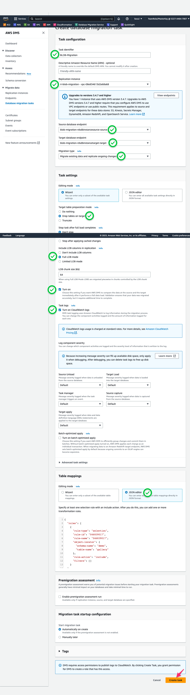


---

12. Task의 상태가 `Starting`이 되면 `blob-migration` 을 Click하여 상세 정보를 확인합니다.

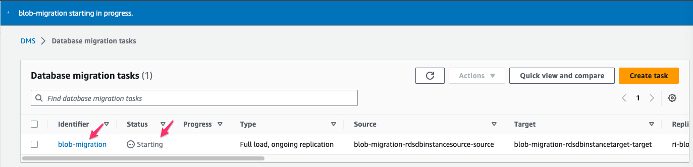


---

13. `Table statistics` 를 Click하면 Data Migration 상태를 확인 할 수 있습니다.

    358건의 Data가 잘 넘어간 것을 확인 할 수 있습니다. 

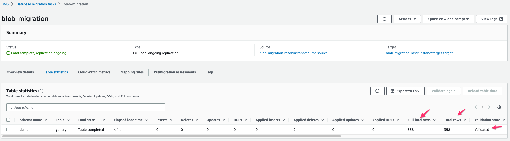


---

14. 실제 Target DB에 데이터가 이관되었는지 확인하겠습니다.

    `Remote Desktop`으로 접속 후 `MySQL Workbench`에서 `Target-DB` 창에 접속 합니다.
    
    다음의 두 Query를 수행하여 정상적으로 이관되었는지 확인합니다.

```
select * from gallery order by 1 limit 10;

select count(*) from gallery;
```

---

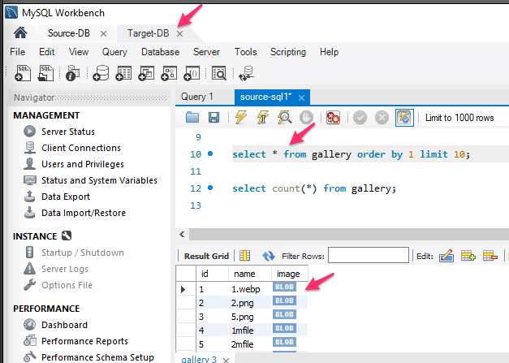

---

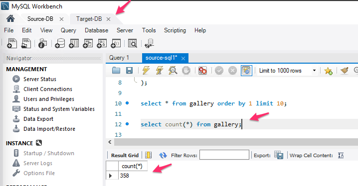


---

15. Source DB에서 신규 Data를 입력 하고 Target에 CDC로 반영이 잘 되는지 확인합니다.

    `Source-DB` Session에서 아래 SQL을 실행합니다.

```
insert into gallery(name, image) select name, image from gallery where id<5;
commit;
select count(*) from gallery;
```

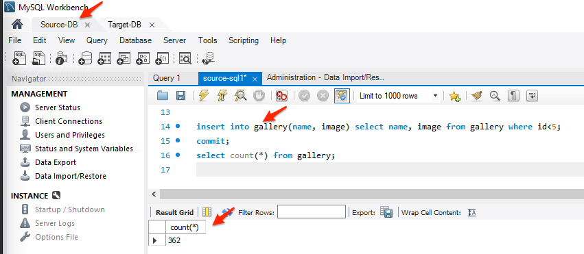


---

16. `Target-DB` 에서도  CDC로 잘 반영되었는지 확인합니다.

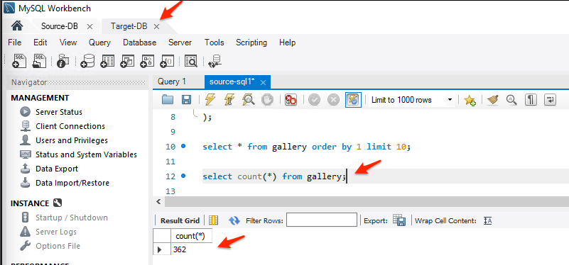


---

17. DMS Console에서도 신규 Insert 4건을 확인합니다.

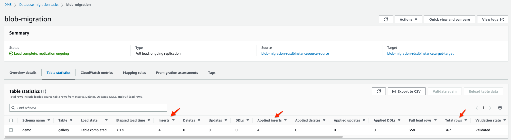


---


