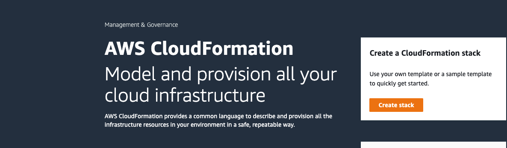
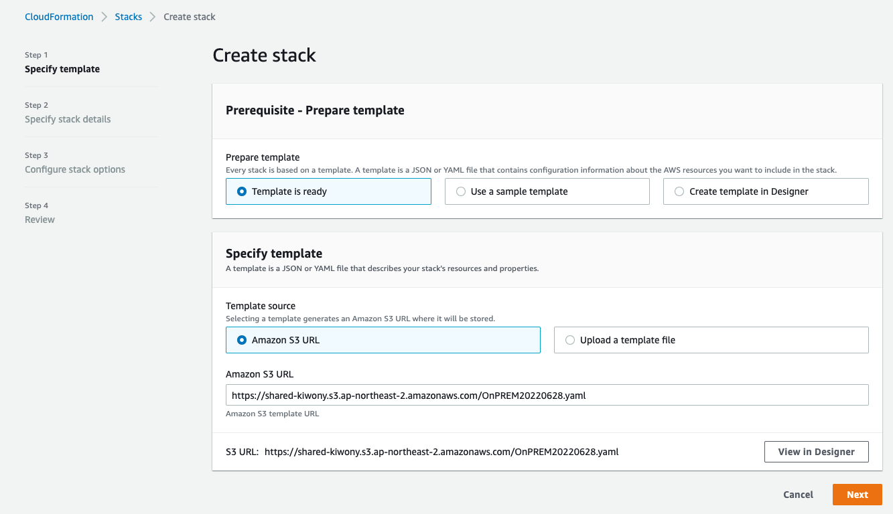
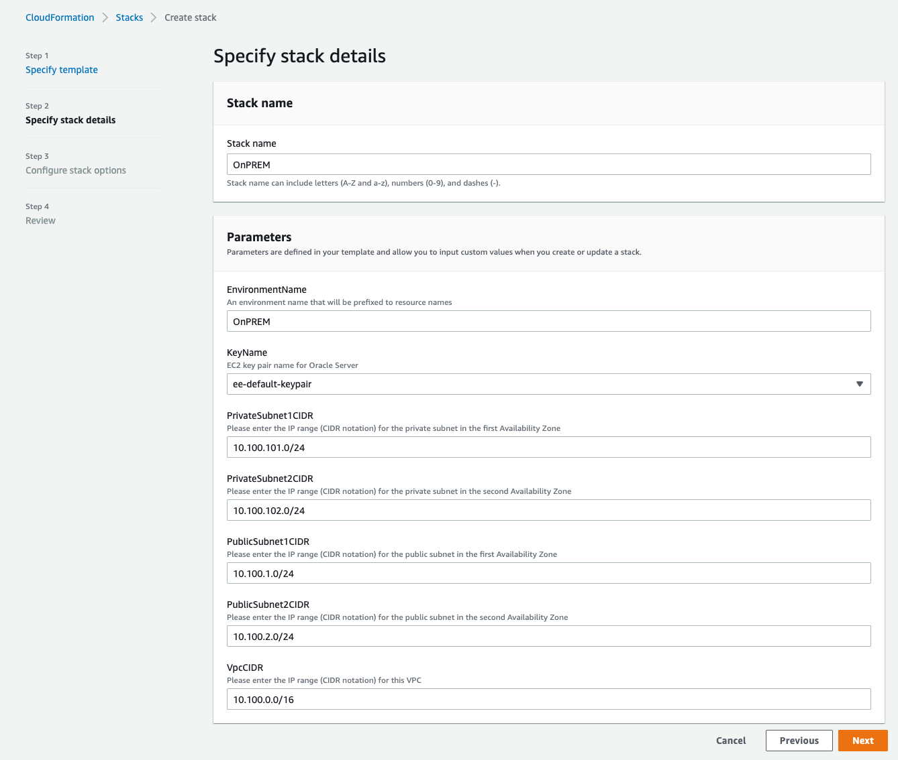
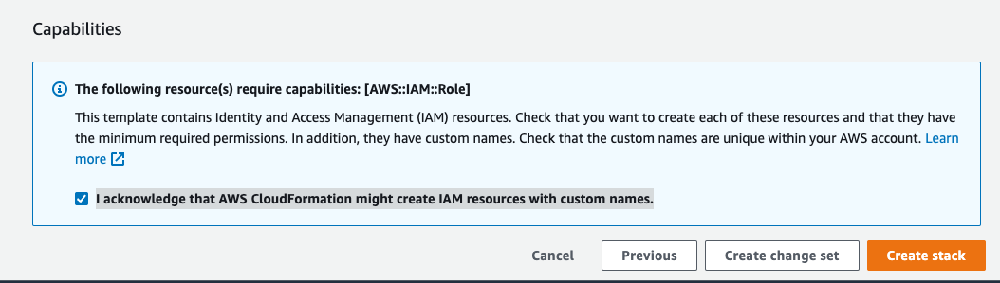
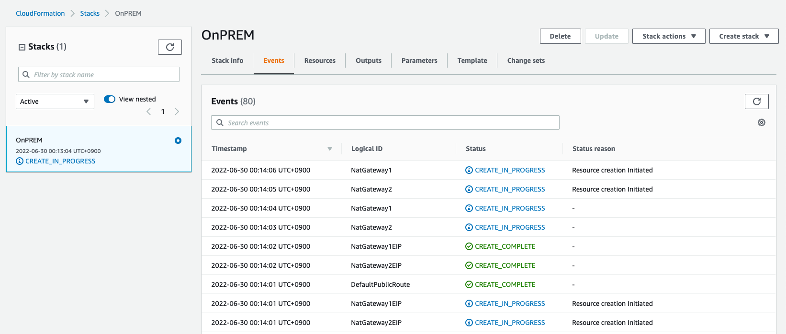

## 실습 환경 생성

---

1. [여기 ](https://console.aws.amazon.com/cloudformation/) 를 새 창(새 탭)으로 띄워서 CloudFormation으로 이동합니다.

---

2. **Create Stack** Click



---

3. **Amazon S3 URL**에 아래 주소를 입력후 Next Click

`https://shared-kiwony.s3.ap-northeast-2.amazonaws.com/OnPREM7.yml`



---

4. 다음처럼 입력 후 Next Click (나머지 값들은 Default 사용)

```
Stack name : OnPREM
KeyName : ee-default-keypair
```



---

5. **Configure stack options** 에서 변경 없이 Next Click

---

6. 화면 맨 아래  **acknowledge that AWS CloudFormation might create IAM resources with custom names.** 체크 후 **Create stack** Click




---

7. **Events** Tab 을 Click하여 실습 환경 생성을 모니터링 합니다.(약 3~5분 정도 소요)



---

8. Stack Status가 **CREATE_COMPLETE** 가 되면 모든 Resource 생성이 완료 된 것입니다.

---

9. **Ouputs** Tab을 Click하여 다음의 두 값을 메모장에 적어둡니다. 

```
IPOraclePrivateIP	: 10.100.101.107	(Oracle 서버의 내부 IP)
IPWindowsPublicIP : 3.36.50.193		(Bastion Host의 Internet IP)
```


---

[<다음>Workshop02-BastionHost접속으로 이동 ](./02.md) 


