## Oracle Database Data를 Amazon S3로 Migratoin

---

#### Workshop Architecture Diagram

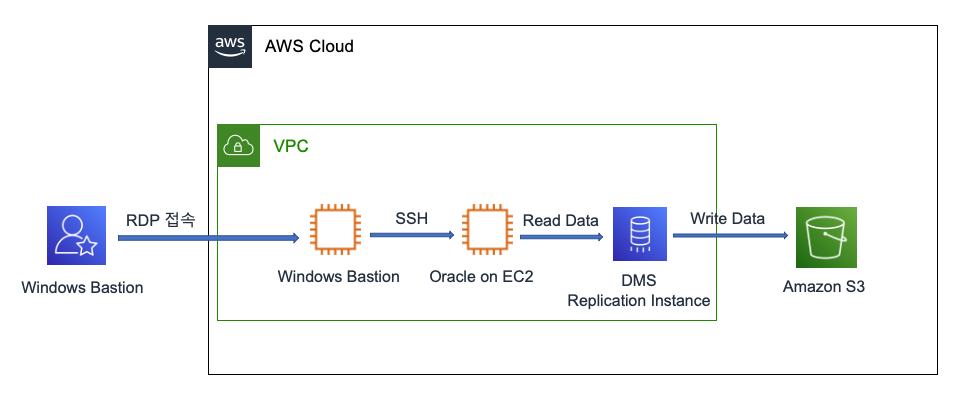

**Workshop은 다음의 과정으로 진행 됩니다.**

```
1. 실습 참여자는 RDP를 사용하여 Bastion(Windows Server)에 접속
2. Windows Server에서 Source-Oracle Server로 SSH를 사용하여 Pre-requirement 작업 등 수행
3. Target S3 Bucket을 생성
4. Database Migration Service(DMS) Replication Instance를 생성
5. DMS Source Endpoint(Oracle Server) 생성
6. DMS Target Endpoint(S3 Bucket) 생성
7. DMS Task를 통해 Oracle의 특정 User Table을 S3로 Migration 수행
```

---

1. [여기 ](https://ap-northeast-2.console.aws.amazon.com/ec2/v2/home?region=ap-northeast-2#Instances:instanceState=running) 를 새 창(새 탭)으로 띄워서 EC2-Running-Instance 창으로 이동합니다. 
2. Oracle, Windows Instance가 모두 정상적으로 Running인지 확인합니다.

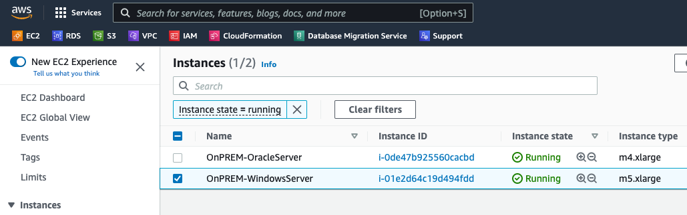


---

3. 각자 PC에서 RDP Client를 실행합니다.(MAC : Remote Desktop, Windows인 경우 mstsc.exe)

---

4. 아까 Cloudfomration Outputs Tab에서 적어둔 **IPWindowsPublicIP**를 이용하여 Bastion Host에 접속합니다. 접속시 ID/Password는 다음과 같습니다.

```
Administrator // Octank#1234
```

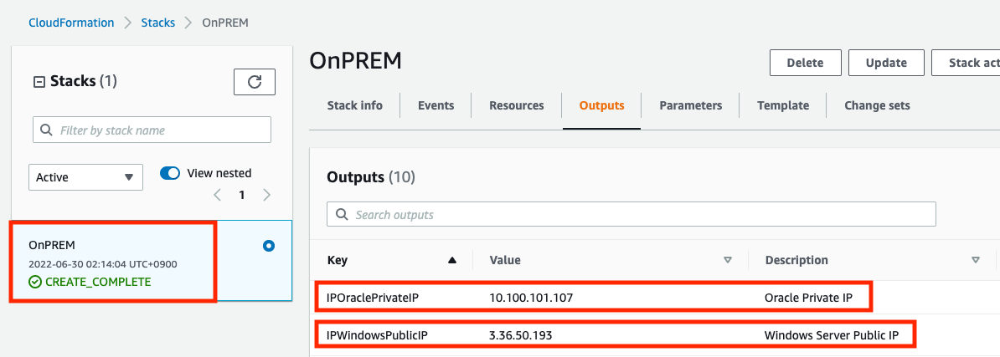

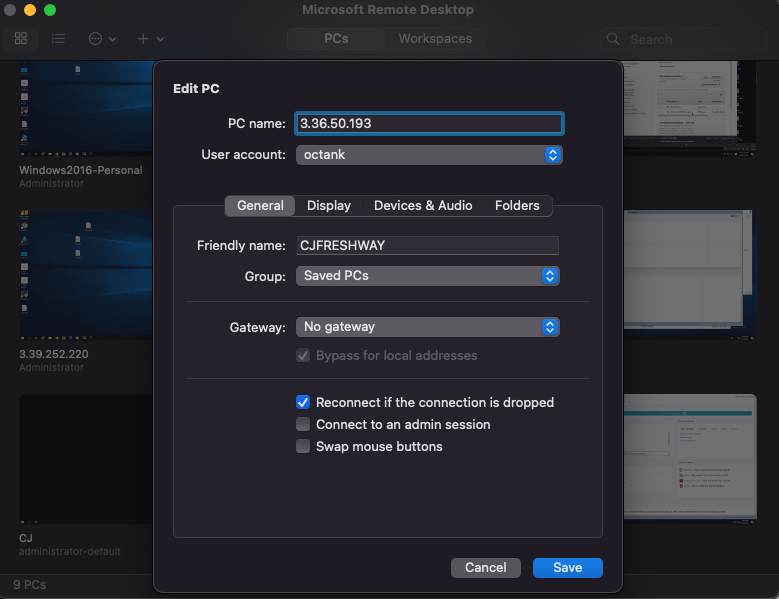

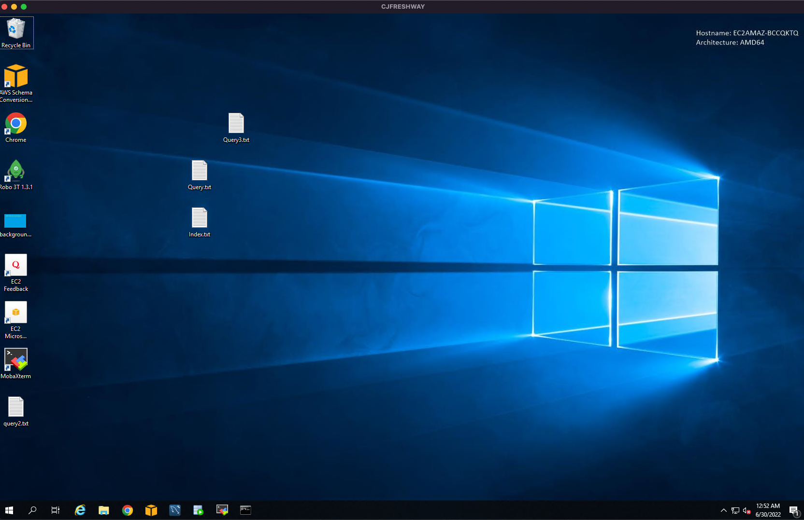

---

5. **Source Oracle**에서 사전 작업을 하기 위해 **SQL Developer**를 실행합니다.

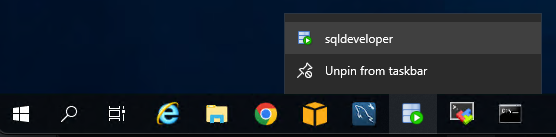

---

6. **SQL Developer**에서 **oracle**을 Click하고 마우스 우측 버튼을 Click => Properties Click

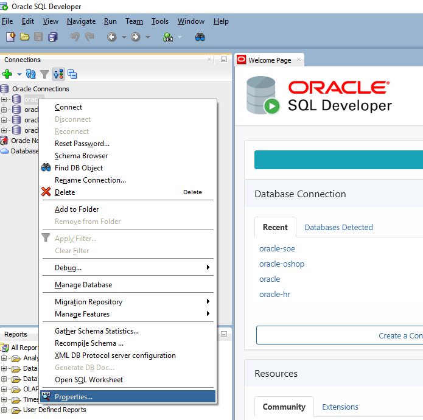

---

7. IP를 IPOraclePrivateIP로 변경하고 Save Click. 
8. Test Click 후 Status: Success 확인
9. Connect Click 하여 SQL Worksheet(editor) 접속

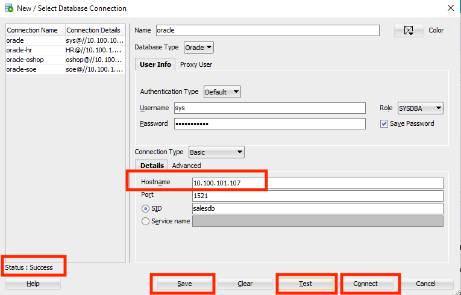

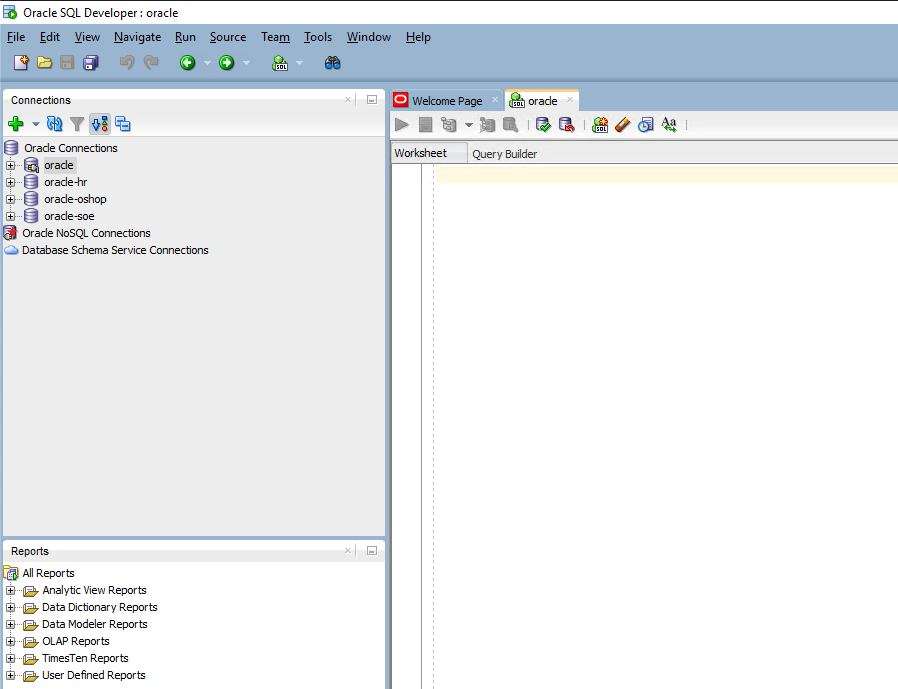

---


10. 바탕화면의 **Query.txt**를 Double click하여 메모장으로 열고 모두 복사 합니다.

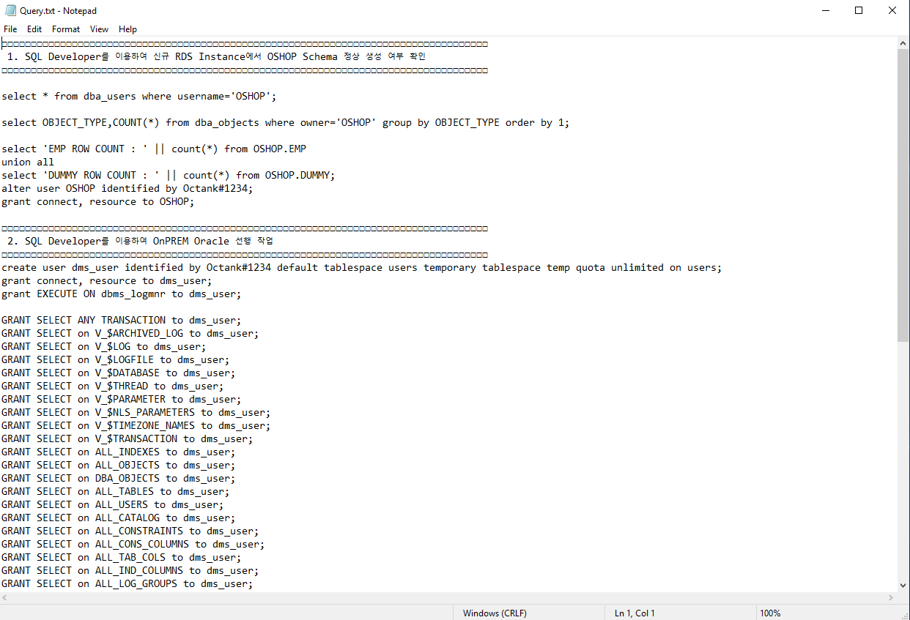

---

11. SQL Developer의 SQL Editor에 붙여 넣습니다.

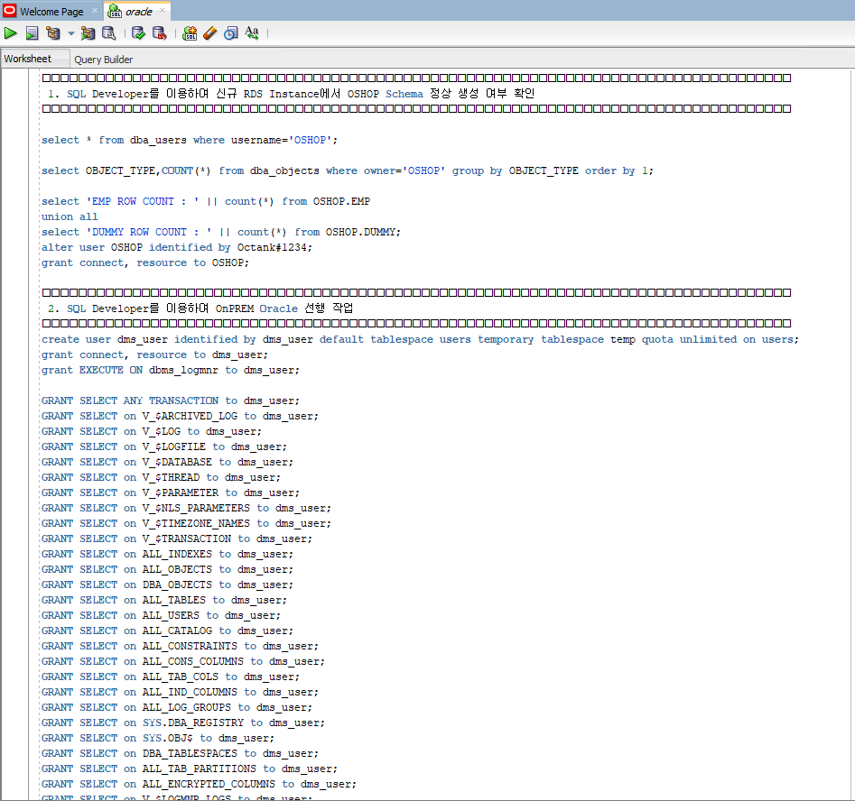

---

12. `create user dms_user identified by dms_user default tablespace users temporary tablespace temp quota unlimited on users;` 부터 `ALTER DATABASE ADD SUPPLEMENTAL LOG DATA;` 까지 모두 선택 후 **Run Statement** 를 Click

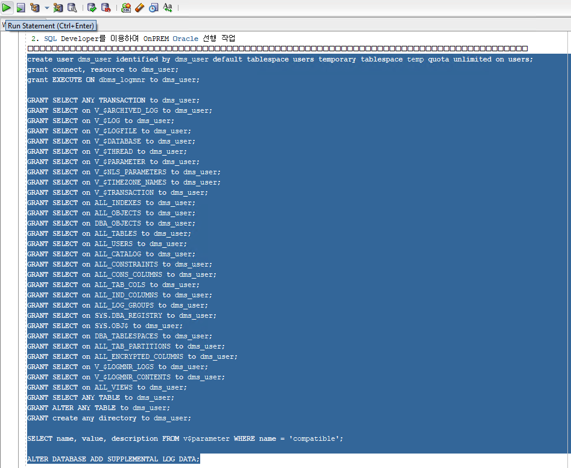

---

12-1. 다음의 Query를 SQL worksheet에 넣고 실행합니다.

```
grant create MATERIALIZED view to oshop;
```

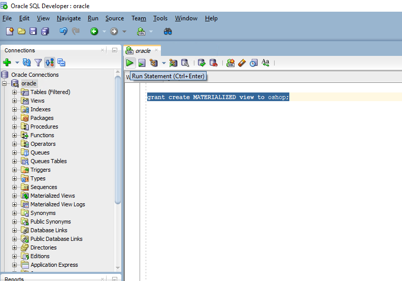

---

13. **SQL Developer**에서 **oracle-oshop**을  Click하고 마우스 우측 버튼을 Click하고 위의 6~9 과정을 반복하여 Oracle Server IP를 변경/저장 하고 SQL Worksheet(editor) 접속

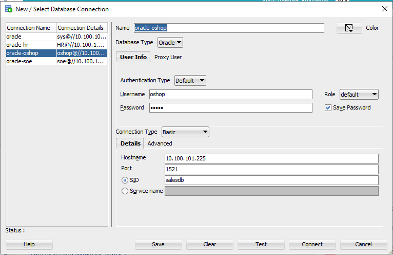

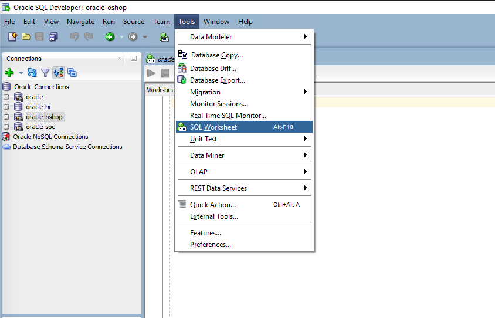

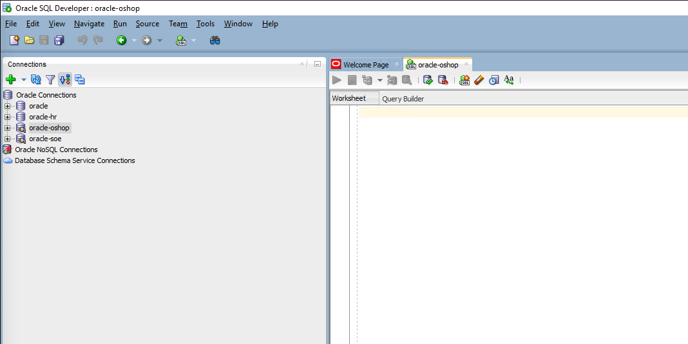

---

14. 다음의 Query를 **oracle-oshop** Editor창에 넣고 실행

```
create MATERIALIZED view emp_dept_view
build immediate
refresh on demand
as
select d.deptno, d.dname, e.empno, e.ename, e.job, e.mgr, e.hiredate, e.sal, e.comm 
from emp e, dept d where e.deptno=d.deptno;

```

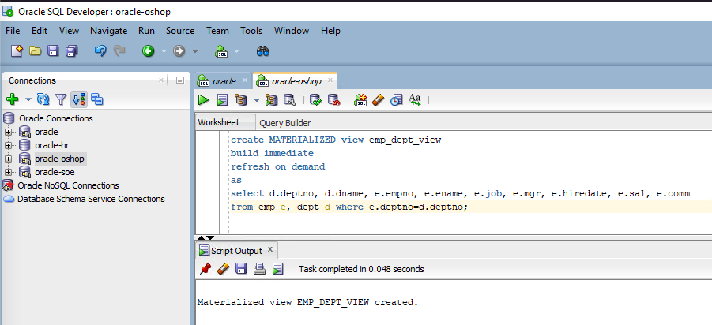

---

[<다음>Workshop03-S3Bucket 생성 및 IAM Role 생성으로 이동 ](./03.md) 


