## DMS 활용

---

### A. materialize view를 활용한 Join Data 이관

---

#### DMS Task 생성

---

1. 메뉴 좌측 "Database Migration tasks" Click

------

2. **Create Task** Click

---

3. 다음의 정보대로 **Task Configuration**를 구성하고 **Create Task** Click

```
Task identifier	: oracle-oshop-mview-to-s3
Replication instance :	DMSReplication
Source database endpoint :	source-oracle
Target database endpoint	: target-S3
Migration type :	Migrate existing data

# Task settings
CDC stop mode	: Don’t use custom CDC stop mode
Target table preparation mode	: Do nothing
Include LOB columns in replication	: Limited LOB mode
Max LOB size (KB)	: 32
Enable validation	: Unchecked
Enable CloudWatch logs	: Checked

# Table mappings
Editing mode : JSON editor 선택 후 아래 JSON으로 변경

{
  "rules": [
    {
      "rule-type": "selection",
      "rule-id": "526223095",
      "rule-name": "526223095",
      "object-locator": {
        "schema-name": "OSHOP",
        "table-name": "EMP_DEPT_VIEW"
      },
      "rule-action": "include",
      "filters": []
    }
  ]
}
```

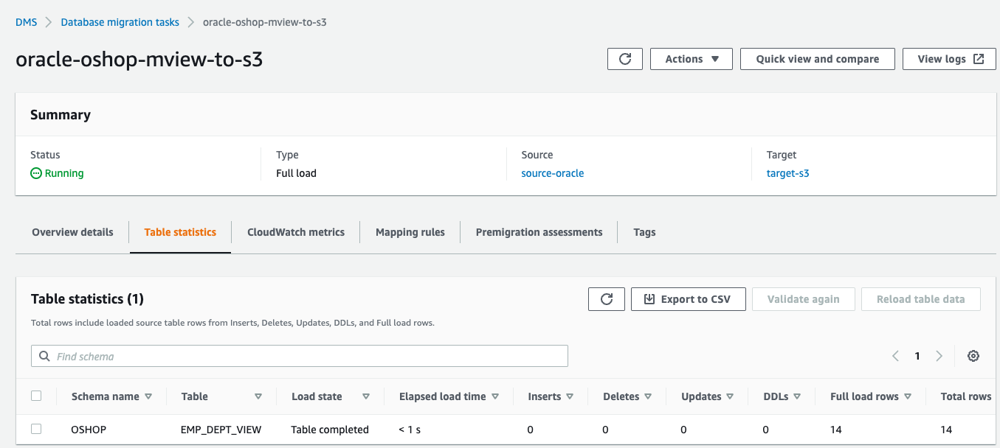

---

4. S3 파일 생성 확인 및 S3 Select로 Data 확인

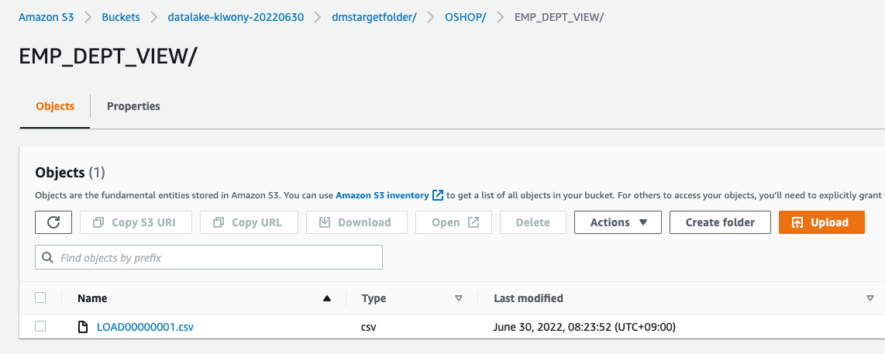

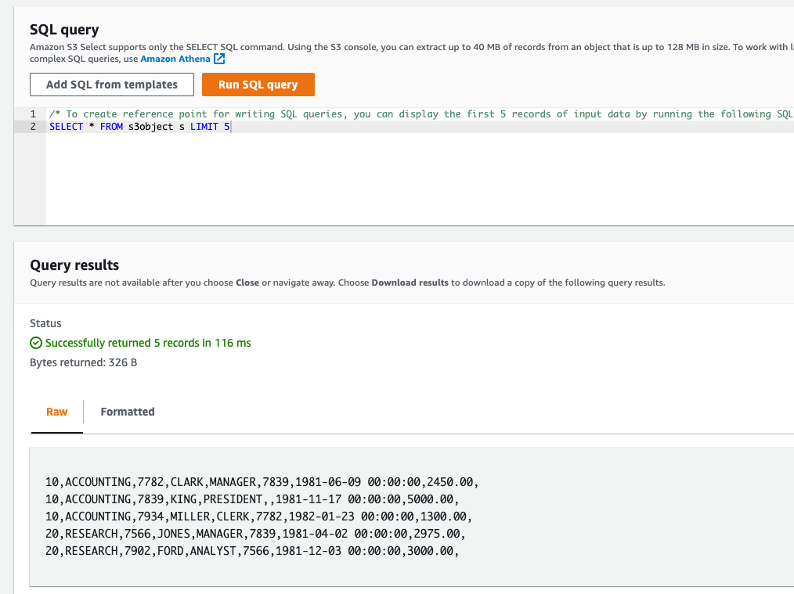

---

### B. Parquet 형식으로 Data 이관

---

1. 좌측 메뉴 "Endpoints" Click

------

2. **Create Endpoints** Click

------

3. 다음의 정보대로 Target Endpoint를 구성하고

   **Run Test** 를 Click하여 **RI(Replication Instance)** 와 접속 여부를 확인

   접속이 successful이 되면 **Create endpoint** Click

```
Endpoint Type	: Target endpoint
Endpoint Identifier :	target-s3-oshop-parquet
Source Engine	: Amazon S3
Service access role ARN : < ARN of the DMS-LAB-Role > (앞의 IAM에서 복사한 IAM Role ARN사용)
Bucket name	: < Name of Your S3 Bucket > (앞서 생성한 Bucket 이름 사용)
Bucket folder	: oshop-parquet (Bucket아래에 생성했던 Folder 이름 사용)

# Endpoint settings
Wizard 선택
Use endpoint connection attributes : Check
Extra connection attributes : dataFormat=parquet;parquetVersion=PARQUET_2_0;
```

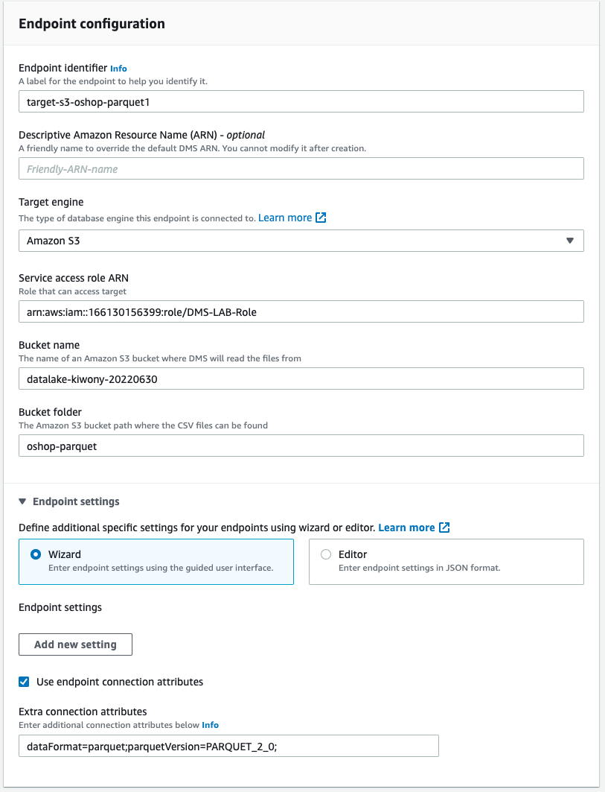

---

4. **target-s3-oshop-parquet** 선택 후 Actions => Test Connection Click


---

5. Run Test 실행


---

6. **Database migration tasks** 이동 후 "Create task" Click

---

7. 다음의 정보대로 **Task Configuration**를 구성하고 **Create Task** Click

```
Task identifier	: oracle-oshop-parquet-to-s3
Replication instance :	DMSReplication
Source database endpoint :	source-oracle
Target database endpoint	: target-S3-parquet
Migration type :	Migrate existing data

# Task settings
CDC stop mode	: Don’t use custom CDC stop mode
Target table preparation mode	: Do nothing
Include LOB columns in replication	: Limited LOB mode
Max LOB size (KB)	: 32
Enable validation	: Unchecked
Enable CloudWatch logs	: Checked

# Table mappings
Editing mode : JSON editor 선택 후 아래 JSON으로 변경

{
  "rules": [
    {
      "rule-type": "selection",
      "rule-id": "526223095",
      "rule-name": "526223095",
      "object-locator": {
        "schema-name": "OSHOP",
        "table-name": "EMP"
      },
      "rule-action": "include",
      "filters": []
    }
  ]
}
```

---

8. 데이터 이관 확인 및 S3 Parquet 파일 확인

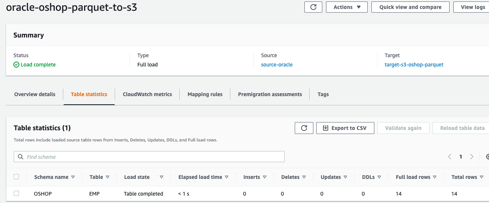

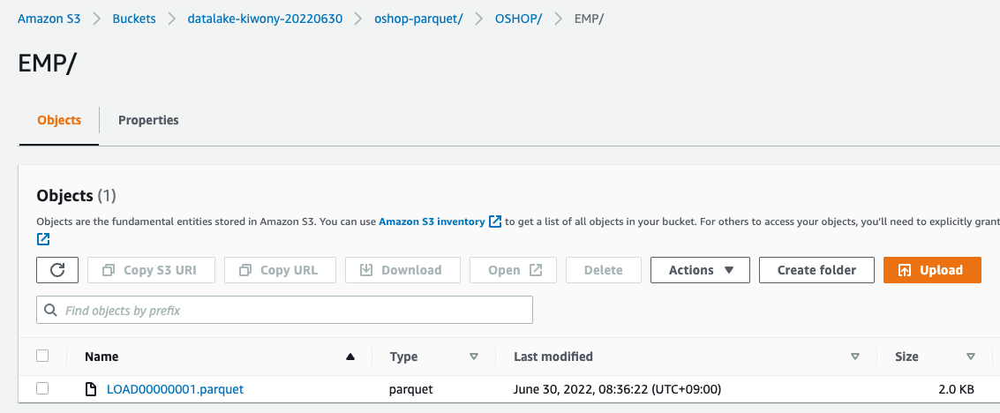

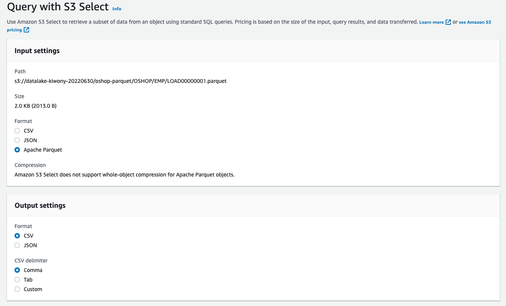

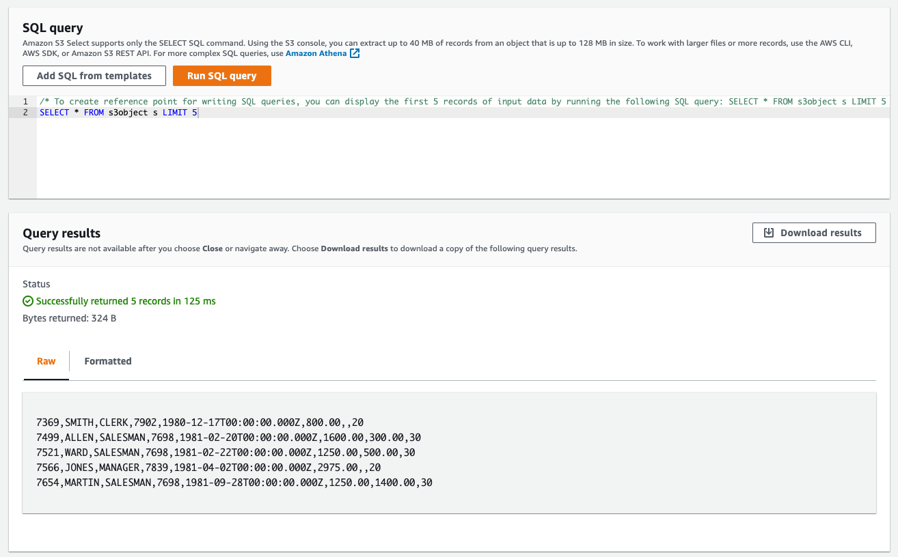

----


### C. 특정 테이블들만 Data 이관

---

#### Endpoint 생성

---

1. 좌측 메뉴 "Endpoints" Click

------

2. **Create Endpoints** Click

------

3. 다음의 정보대로 Target Endpoint를 구성하고

   **Run Test** 를 Click하여 **RI(Replication Instance)** 와 접속 여부를 확인

   접속이 successful이 되면 **Create endpoint** Click

```
Endpoint Type	: Target endpoint
Endpoint Identifier :	target-s3-soe-orders03x
Source Engine	: Amazon S3
Service access role ARN : < ARN of the DMS-LAB-Role > (앞의 IAM에서 복사한 IAM Role ARN사용)
Bucket name	: < Name of Your S3 Bucket > (앞서 생성한 Bucket 이름 사용)
Bucket folder	: soe-orders03x (Bucket아래에 생성했던 Folder 이름 사용)

```

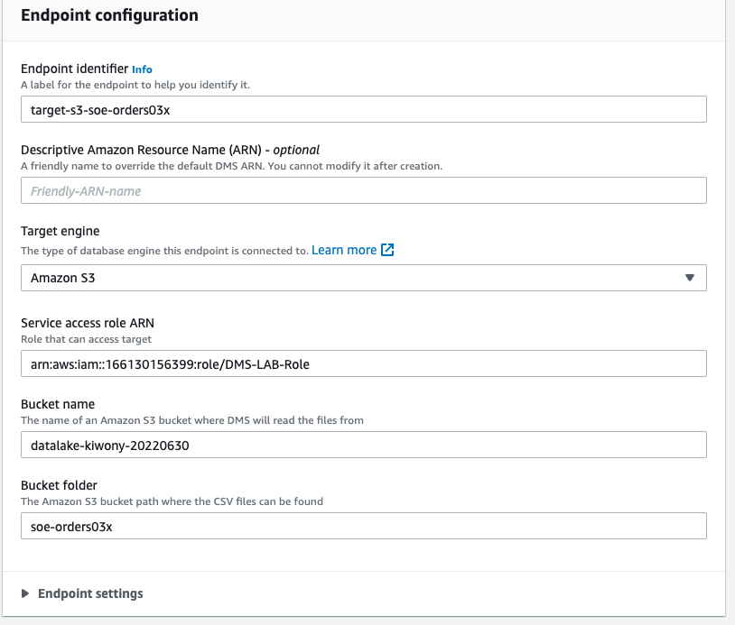

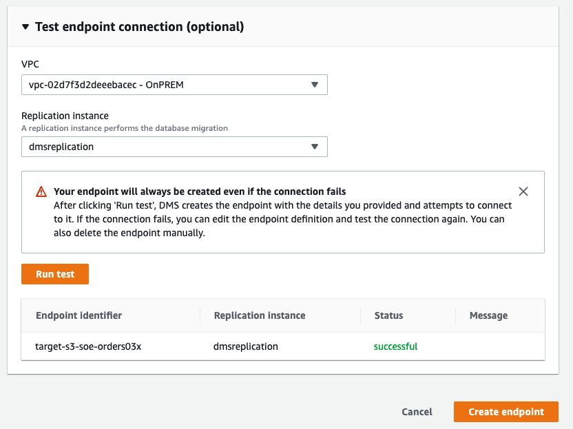


---

1. 메뉴 좌측 "Database Migration tasks" Click

------

2. **Create Task** Click

---

3. 다음의 정보대로 **Task Configuration**를 구성하고 **Create Task** Click

```
Task identifier	: oracle-soe-order03x-to-s3
Replication instance :	DMSReplication
Source database endpoint :	source-oracle
Target database endpoint	: target-S3-soe-orders03x
Migration type :	Migrate existing data

# Task settings
CDC stop mode	: Don’t use custom CDC stop mode
Target table preparation mode	: Do nothing
Include LOB columns in replication	: Limited LOB mode
Max LOB size (KB)	: 32
Enable validation	: Unchecked
Enable CloudWatch logs	: Checked

# Table mappings
Editing mode : JSON editor 선택 후 아래 JSON으로 변경

{
  "rules": [
    {
      "rule-type": "selection",
      "rule-id": "546340111",
      "rule-name": "546340111",
      "object-locator": {
        "schema-name": "SOE",
        "table-name": "ORDERS03%"
      },
      "rule-action": "include",
      "filters": []
    }
  ]
}
```

---

4. 이관 확인 및 S3 확인

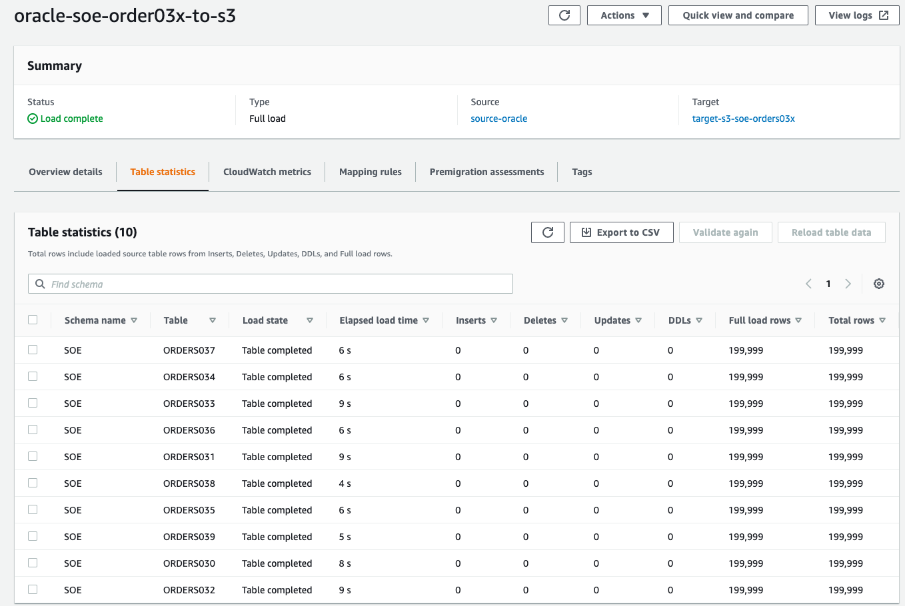

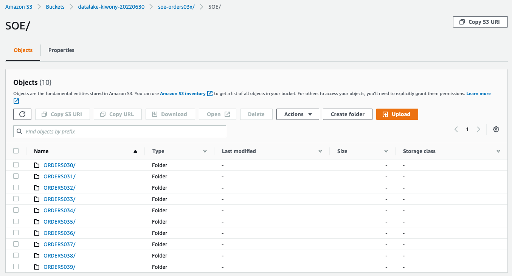

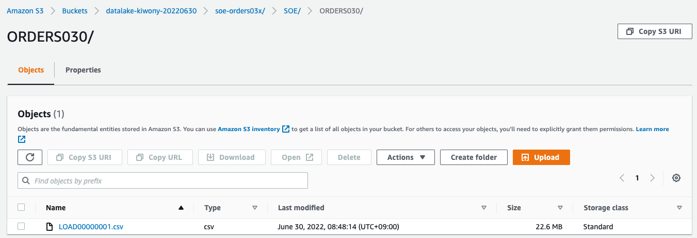

---


### D. 특정 조건 Data 이관

----

#### Endpoint 생성

---

1. 좌측 메뉴 "Endpoints" Click

------

2. **Create Endpoints** Click

------

3. 다음의 정보대로 Target Endpoint를 구성하고

   **Run Test** 를 Click하여 **RI(Replication Instance)** 와 접속 여부를 확인

   접속이 successful이 되면 **Create endpoint** Click

```
Endpoint Type	: Target endpoint
Endpoint Identifier :	target-s3-soe-orders-23-jul-20
Source Engine	: Amazon S3
Service access role ARN : < ARN of the DMS-LAB-Role > (앞의 IAM에서 복사한 IAM Role ARN사용)
Bucket name	: < Name of Your S3 Bucket > (앞서 생성한 Bucket 이름 사용)
Bucket folder	: soe-23-jul-20 (Bucket아래에 생성했던 Folder 이름 사용)

```


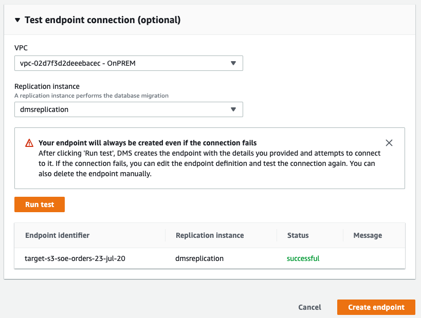

---

1. 메뉴 좌측 "Database Migration tasks" Click

------

2. **Create Task** Click

---

3. 다음의 정보대로 **Task Configuration**를 구성하고 **Create Task** Click

```
Task identifier	: oracle-soe-orders-23-jul-20
Replication instance :	DMSReplication
Source database endpoint :	source-oracle
Target database endpoint	: target-S3-soe-orders-23-jul-20
Migration type :	Migrate existing data

# Task settings
CDC stop mode	: Don’t use custom CDC stop mode
Target table preparation mode	: Do nothing
Include LOB columns in replication	: Limited LOB mode
Max LOB size (KB)	: 32
Enable validation	: Unchecked
Enable CloudWatch logs	: Checked

# Table mappings
Editing mode : JSON editor 선택 후 아래 JSON으로 변경

{
    "rules": [
        {
            "rule-type": "selection",
            "rule-id": "526223095",
            "rule-name": "526223095",
            "object-locator": {
                "schema-name": "SOE",
                "table-name": "ORDERS001"
            },
            "rule-action": "include",
            "filters": [
                {
                    "filter-type": "source",
                    "column-name": "ORDER_DATE",
                    "filter-conditions": [
                        {
                            "filter-operator": "gte",
                            "value": "2019-01-01"
                        }
                    ]
                }
            ]
        }
    ]
}
```

---

4. 이관 확인 및 S3 확인

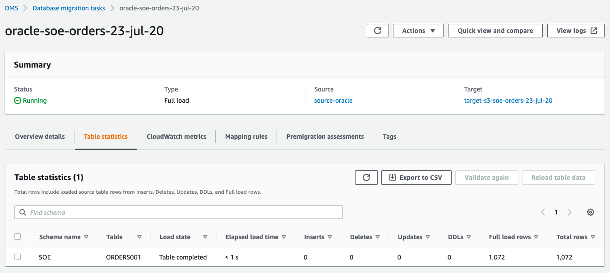

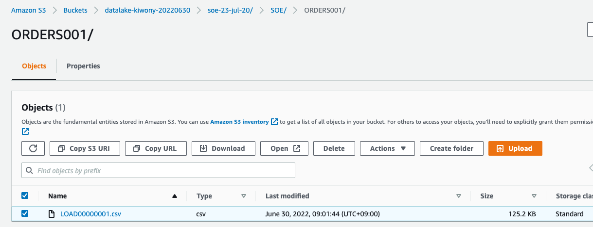

---

고생 하셨습니다.


