# Just Full Loading Oracle -> s3 -> RDS

## Oracle to S3

### Oracle Source Endpoint

### S3 Target Endpoint

**IAM Policy**

```
{
    "Version": "2012-10-17",
    "Statement": [
        {
            "Sid": "VisualEditor0",
            "Effect": "Allow",
            "Action": [
                "s3:GetAccessPoint",
                "s3:PutAccountPublicAccessBlock",
                "s3:GetAccountPublicAccessBlock",
                "s3:ListAllMyBuckets",
                "s3:ListAccessPoints",
                "s3:ListJobs",
                "s3:CreateJob",
                "s3:HeadBucket"
            ],
            "Resource": "*"
        },
        {
            "Sid": "VisualEditor1",
            "Effect": "Allow",
            "Action": "s3:*",
            "Resource": "arn:aws:s3:::a01-kiwony*"
        },
        {
            "Sid": "VisualEditor2",
            "Effect": "Allow",
            "Action": "s3:ListBucket",
            "Resource": "arn:aws:s3:::a01-kiwony*"
        }
    ]
}
```

**S3 Target Endpoint Detail**

<kbd>  </kbd>

**Task configuration**

<kbd>  </kbd>

**Mapping Rules**

```
{
    "rules": [
        {
            "rule-type": "transformation",
            "rule-id": "1",
            "rule-name": "1",
            "rule-target": "schema",
            "object-locator": {
                "schema-name": "OSHOP"
            },
            "rule-action": "rename",
            "value": "OSHOP",
            "old-value": null
        },
        {
            "rule-type": "selection",
            "rule-id": "2",
            "rule-name": "2",
            "object-locator": {
                "schema-name": "OSHOP",
                "table-name": "%"
            },
            "rule-action": "include",
            "filters": []
        }
    ]
}
```

**S3 csv file**

<kbd>  </kbd>

## S3 to RDS Target

### S3 Source Endpoint

<kbd>  </kbd>

**Table Structure**

```
{
    "TableCount": "1",
    "Tables": [
        {
            "TableName": "DUMMY",
            "TablePath": "OSHOP/DUMMY/",
            "TableOwner": "OSHOP",
            "TableColumns": [
                {
                    "ColumnName": "Id",
                    "ColumnType": "INT8",
                    "ColumnNullable": "false",
                    "ColumnIsPk": "true"
                },
                {
                    "ColumnName": "Id1",
                    "ColumnType": "INT8",
                    "ColumnNullable": "false",
                    "ColumnIsPk": "true"
                },
                {
                    "ColumnName": "Id2",
                    "ColumnType": "INT8",
                    "ColumnNullable": "false",
                    "ColumnIsPk": "true"
                }
            ],
            "TableColumnsTotal": "3"
        }
    ]
}
```

### RDS Target Endpoint

<kbd>  </kbd>

### Task Setup

**Table Mapping Rule**

```
{
    "rules": [
        {
            "rule-type": "transformation",
            "rule-id": "1",
            "rule-name": "1",
            "rule-target": "schema",
            "object-locator": {
                "schema-name": "OSHOP"
            },
            "rule-action": "rename",
            "value": "OSHOP",
            "old-value": null
        },
        {
            "rule-type": "selection",
            "rule-id": "2",
            "rule-name": "2",
            "object-locator": {
                "schema-name": "OSHOP",
                "table-name": "%"
            },
            "rule-action": "include",
            "filters": []
        }
    ]
}
```

**TASK status**

<kbd> 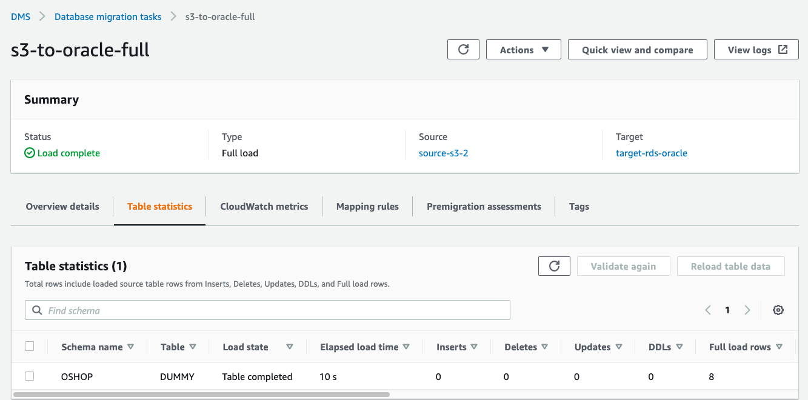 </kbd>

**CW log**

<kbd>  </kbd>

# FULL Load + CDC Oracle -> s3 -> RDS

## Oracle to S3

### S3 Target end point

<kbd> 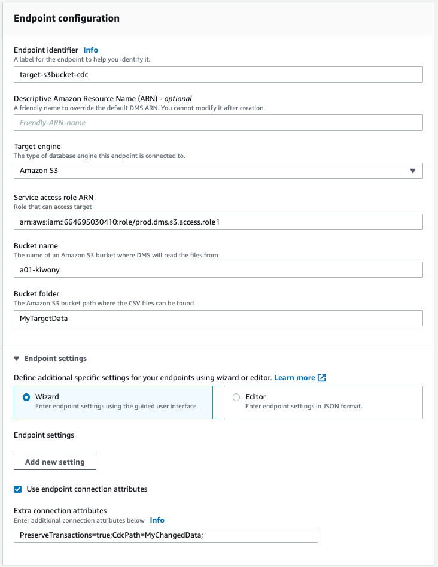 </kbd>

**Task Status and CSV file**

<kbd> 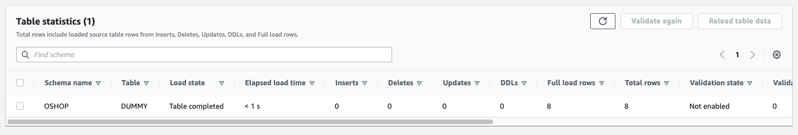 </kbd>

<kbd>  </kbd>

**Update 2 rows**

```
SQL> update dummy set ID1=11,ID2=11 where ID=1;
SQL> update dummy set ID1=22,ID2=22 where ID=2;
commit;
```

<kbd> 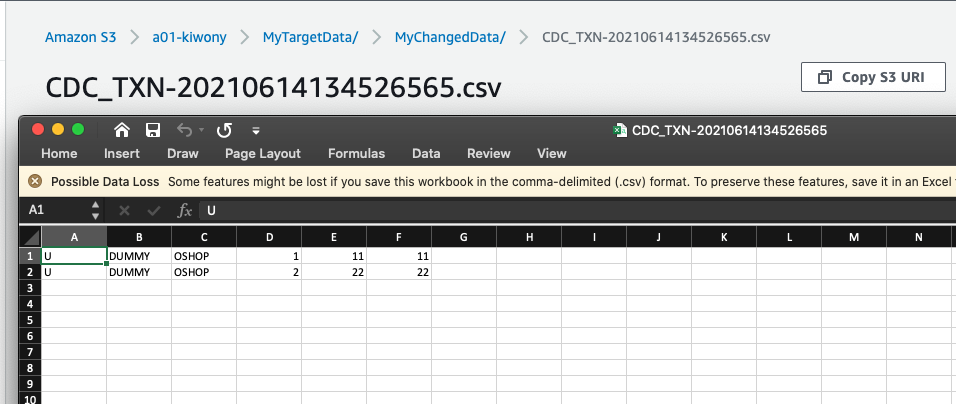 </kbd>

### S3 Source End point

<kbd> 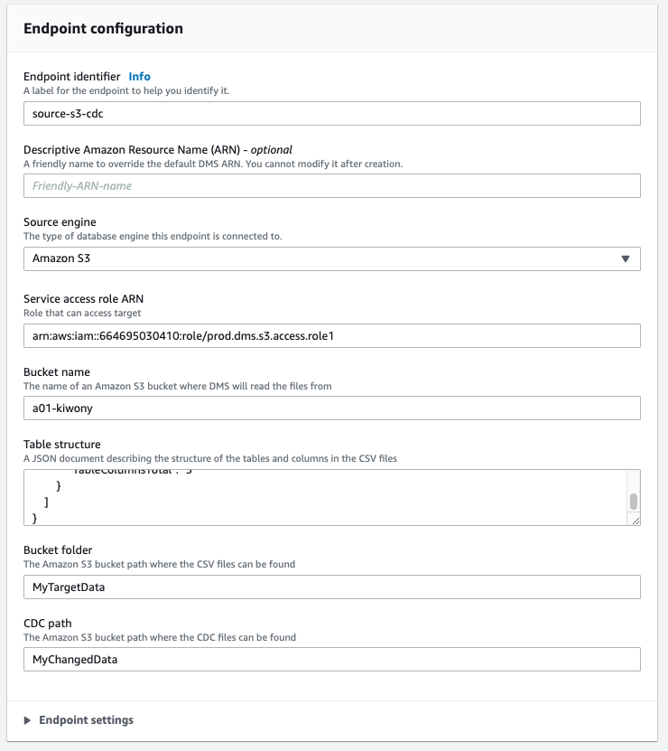 </kbd>

**Task status and RDS status**

`just initial data loaded and no changed data applied`

<kbd> 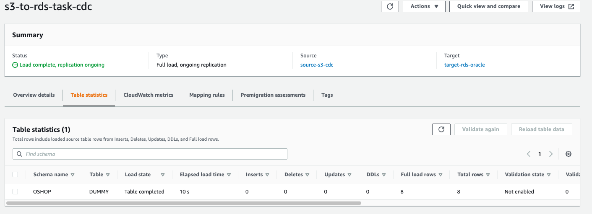 </kbd>

<kbd> 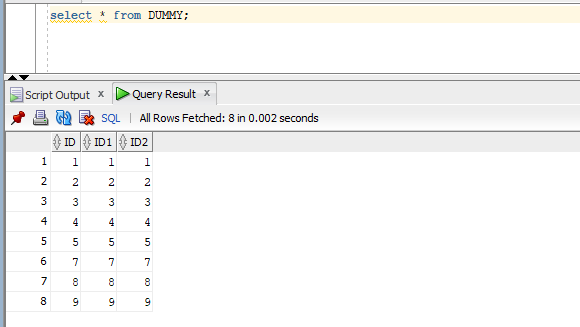 </kbd>

**update rows**

```
SQL> update dummy set ID1=33,ID2=33 where ID=3;
SQL> update dummy set ID1=44,ID2=44 where ID=4;
commit;
```

**Check S3 CDC bucket**

<kbd> 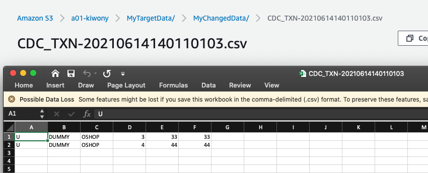 </kbd>

**Check Task status and RDS data**

<kbd> 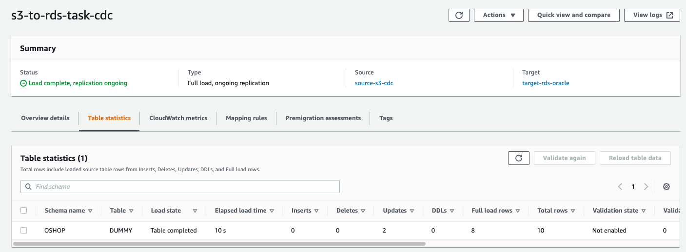 </kbd>

<kbd> 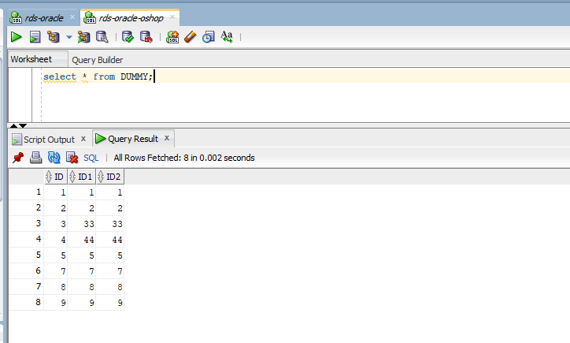 </kbd>

```
Must setup CDC setup frmo S3 to RDS before starting CDC
위의 결과에서 알 수 있듯이 Oracle -> s3 -> RDS로 CDC를 걸기 위해선 TX가 발생 전에 TASK가 동작하고 있어야 함.
Task 생성 후부터 TX에 대한 반영이 됨
```

**Insert and delete some data**

```
SQL> insert into dummy values (10,10,10);
SQL> insert into dummy values (11,11,11);
SQL> commit;
```

<kbd> 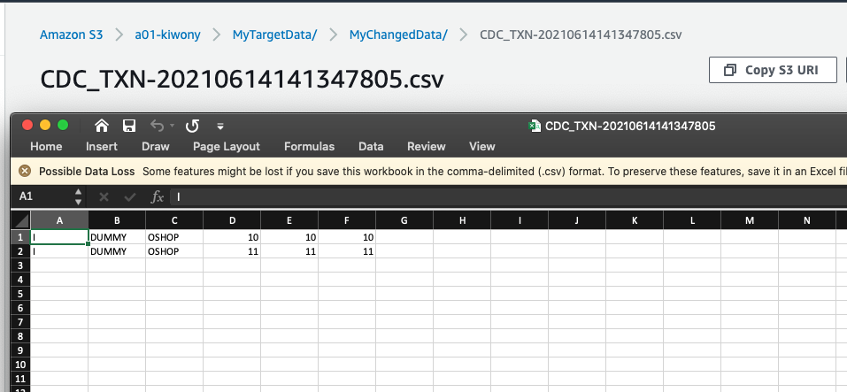 </kbd>

<kbd> 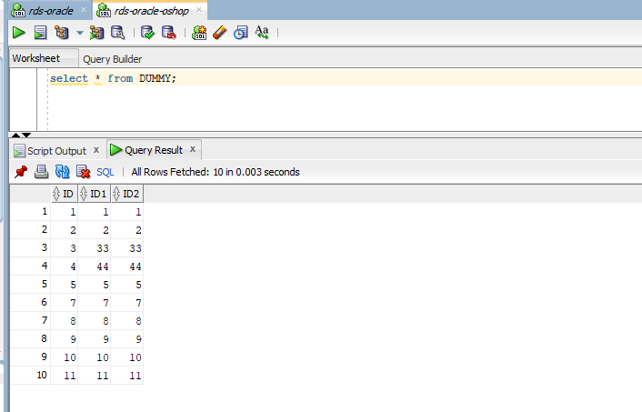 </kbd>

```
SQL> delete dummy where id=5;
SQL> delete dummy where id=7;
SQL> commit;
```

<kbd> 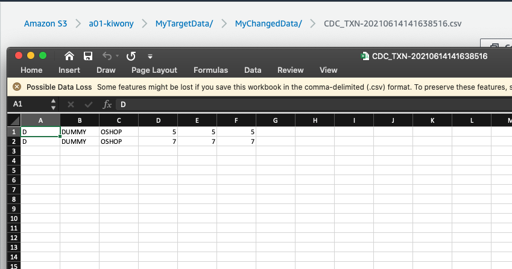 </kbd>

<kbd> 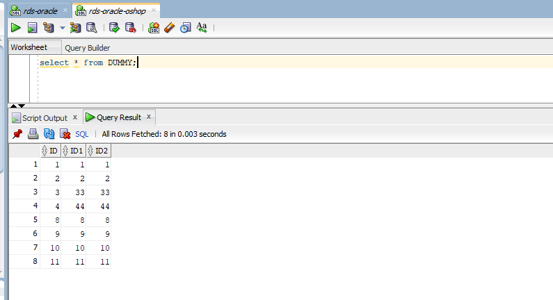 </kbd>
