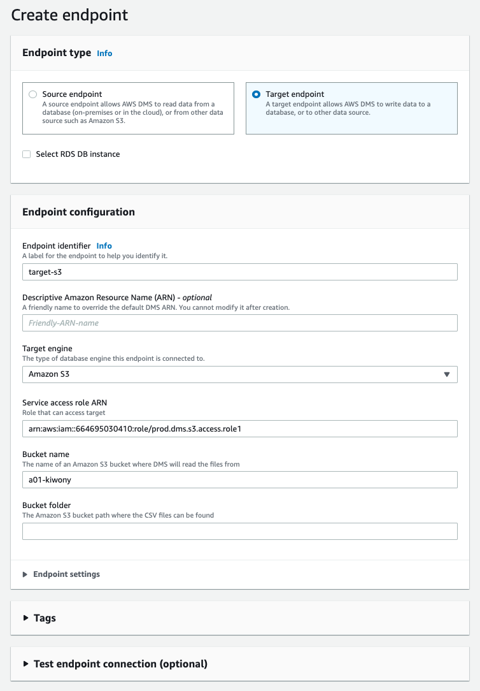
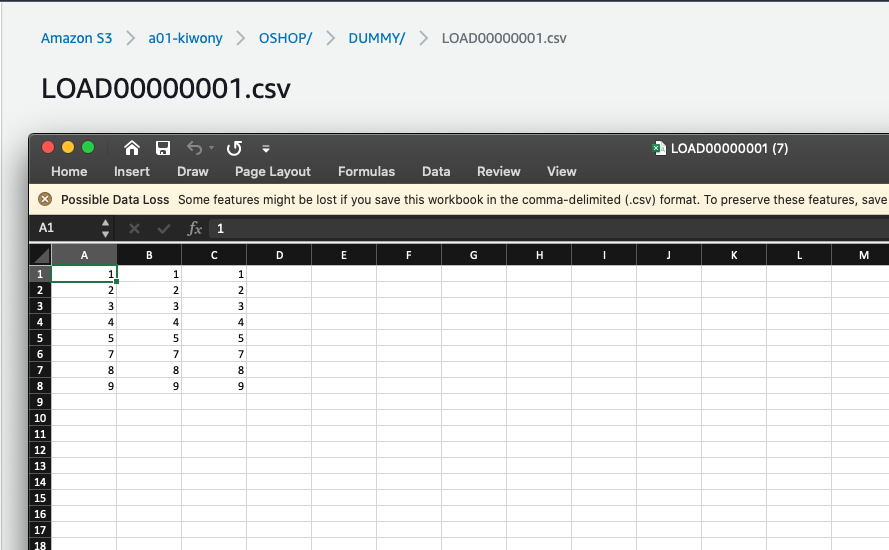
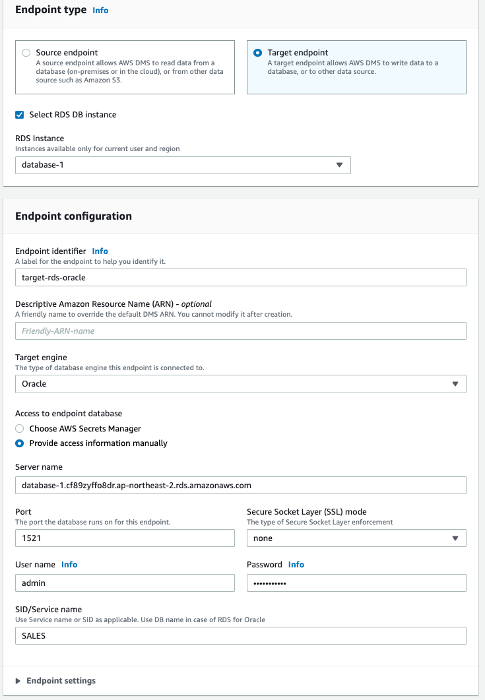

# Just Full Loading Oracle -> s3 -> RDS

## Oracle to S3

### Oracle Source Endpoint

### S3 Target Endpoint

**IAM Policy**

```
{
    "Version": "2012-10-17",
    "Statement": [
        {
            "Sid": "VisualEditor0",
            "Effect": "Allow",
            "Action": [
                "s3:GetAccessPoint",
                "s3:PutAccountPublicAccessBlock",
                "s3:GetAccountPublicAccessBlock",
                "s3:ListAllMyBuckets",
                "s3:ListAccessPoints",
                "s3:ListJobs",
                "s3:CreateJob",
                "s3:HeadBucket"
            ],
            "Resource": "*"
        },
        {
            "Sid": "VisualEditor1",
            "Effect": "Allow",
            "Action": "s3:*",
            "Resource": "arn:aws:s3:::a01-kiwony*"
        },
        {
            "Sid": "VisualEditor2",
            "Effect": "Allow",
            "Action": "s3:ListBucket",
            "Resource": "arn:aws:s3:::a01-kiwony*"
        }
    ]
}
```

**S3 Target Endpoint Detail**

<kbd>  </kbd>

**Task configuration**

<kbd>  </kbd>

**Mapping Rules**

```
{
    "rules": [
        {
            "rule-type": "transformation",
            "rule-id": "1",
            "rule-name": "1",
            "rule-target": "schema",
            "object-locator": {
                "schema-name": "OSHOP"
            },
            "rule-action": "rename",
            "value": "OSHOP",
            "old-value": null
        },
        {
            "rule-type": "selection",
            "rule-id": "2",
            "rule-name": "2",
            "object-locator": {
                "schema-name": "OSHOP",
                "table-name": "%"
            },
            "rule-action": "include",
            "filters": []
        }
    ]
}
```

**S3 csv file**

<kbd>  </kbd>

## S3 to RDS Target

### S3 Source Endpoint

<kbd>  </kbd>

**Table Structure**

```
{
    "TableCount": "1",
    "Tables": [
        {
            "TableName": "DUMMY",
            "TablePath": "OSHOP/DUMMY/",
            "TableOwner": "OSHOP",
            "TableColumns": [
                {
                    "ColumnName": "Id",
                    "ColumnType": "INT8",
                    "ColumnNullable": "false",
                    "ColumnIsPk": "true"
                },
                {
                    "ColumnName": "Id1",
                    "ColumnType": "INT8",
                    "ColumnNullable": "false",
                    "ColumnIsPk": "true"
                },
                {
                    "ColumnName": "Id2",
                    "ColumnType": "INT8",
                    "ColumnNullable": "false",
                    "ColumnIsPk": "true"
                }
            ],
            "TableColumnsTotal": "3"
        }
    ]
}
```

### RDS Target Endpoint

<kbd>  </kbd>

### Task Setup

**Table Mapping Rule**

```
{
    "rules": [
        {
            "rule-type": "transformation",
            "rule-id": "1",
            "rule-name": "1",
            "rule-target": "schema",
            "object-locator": {
                "schema-name": "OSHOP"
            },
            "rule-action": "rename",
            "value": "OSHOP",
            "old-value": null
        },
        {
            "rule-type": "selection",
            "rule-id": "2",
            "rule-name": "2",
            "object-locator": {
                "schema-name": "OSHOP",
                "table-name": "%"
            },
            "rule-action": "include",
            "filters": []
        }
    ]
}
```

**S3 Bucket Destination**

<kbd>  </kbd

## S3 to RDS Oracle

### S3 Source Endpoint

<kbd>  </kbd>

```
{
    "TableCount": "1",
    "Tables": [
        {
            "TableName": "DUMMY",
            "TablePath": "OSHOP/DUMMY/",
            "TableOwner": "OSHOP",
            "TableColumns": [
                {
                    "ColumnName": "Id",
                    "ColumnType": "INT8",
                    "ColumnNullable": "false",
                    "ColumnIsPk": "true"
                },
                {
                    "ColumnName": "Id1",
                    "ColumnType": "INT8",
                    "ColumnNullable": "false",
                    "ColumnIsPk": "true"
                },
                {
                    "ColumnName": "Id2",
                    "ColumnType": "INT8",
                    "ColumnNullable": "false",
                    "ColumnIsPk": "true"
                },
            ],
            "TableColumnsTotal": "3"
        }
    ]
}
```
