# 실습 환경 생성

CloudFormation은 Infra as Code service로 여러분의 Production/Test 환경을 Code로 Define해두고, Code를 통해 Immutable Infra를 생성 할 수 있게 해줍니다. 미리 정의되어 있는 yaml file을 통해 오늘 실습 환경을 생성하게 됩니다.


Workshop Yaml 파일을 사용하여 실습 환경용 1) VPC를 비롯한 Network Resource, 2) Source MySQL이 설치된 EC2, 3) Target Aurora Postgres 등이 자동으로 생성되게 됩니다.

---


1. [여기 ](https://console.aws.amazon.com/cloudformation/) 를 새 창(새 탭)으로 띄워서 CloudFormation으로 이동합니다.

---

2. "Create stack"을 클릭합니다.


---

3. Amazon S3 URL 부분에 `https://shared-kiwony.s3.ap-northeast-2.amazonaws.com/DBforMSA-20230330.yaml` 를 입력합니다. 입력 후 "Next"를 Click 합니다.

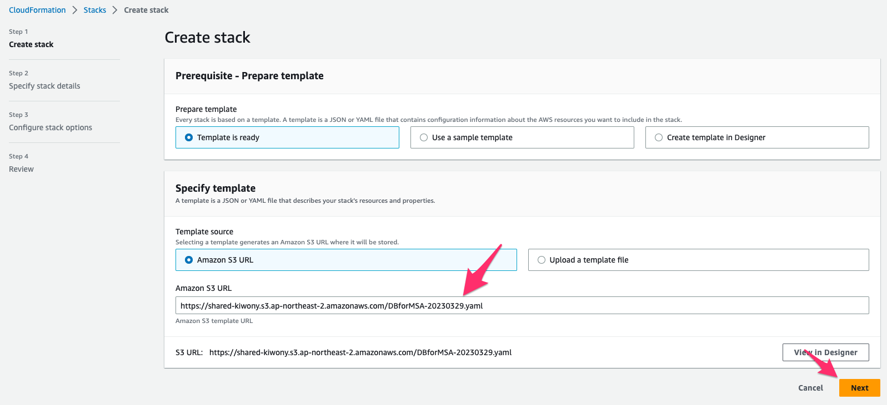

---


4. 다음과 같이 입력 하고 "Next"를 클릭 합니다.

```
Stack name : BLOB-Migration
EnvironmentName : BLOB-Migration

KeyName : ee-default-keypair

```

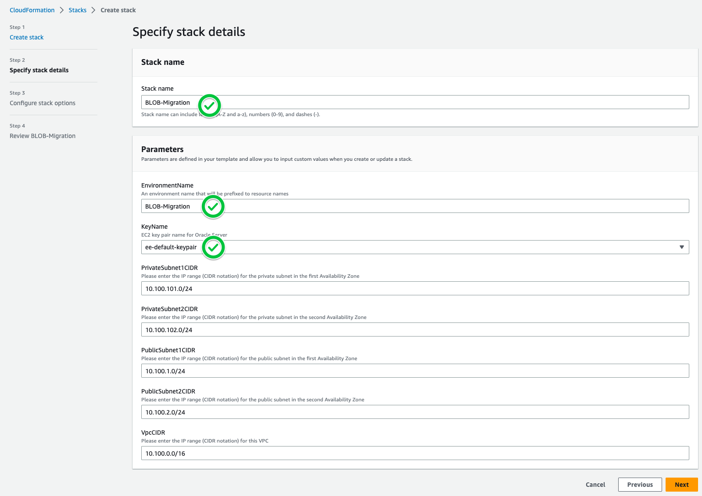

---

5. "Configure stack options" Page에서 "Next"를 Click

---

6. Review Page에서 **I acknowledge that AWS CloudFormation might create IAM resources with custom names.** 를 체크하고 `Submit` Click합니다.

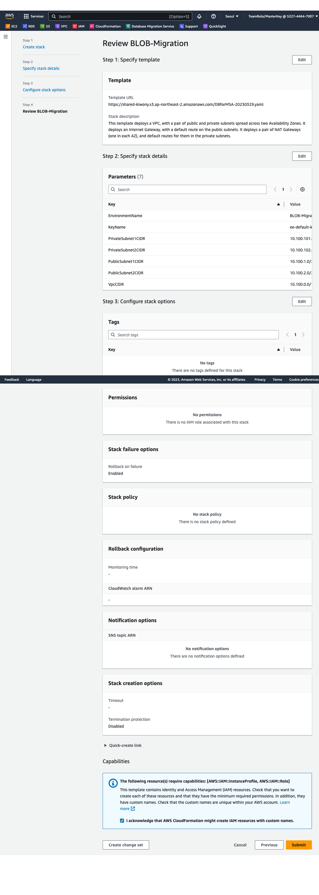

---

7. CloudFormation이 CREATE_IN_PROGRESS로 바뀌는 것을 확인하고 CREATE_COMPLETE 가 될때까지 기다립니다. (약 15분 소요 - Coffee Break)

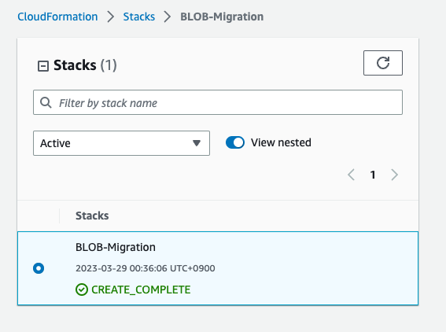

---

8. Outputs Tab을 Click하여 `02WindowServerPublicIP, 03SourceAuroraEndpoint,04TargetAuroraEndpoint ` 정보를 확인하고 메모장에 저장합니다.

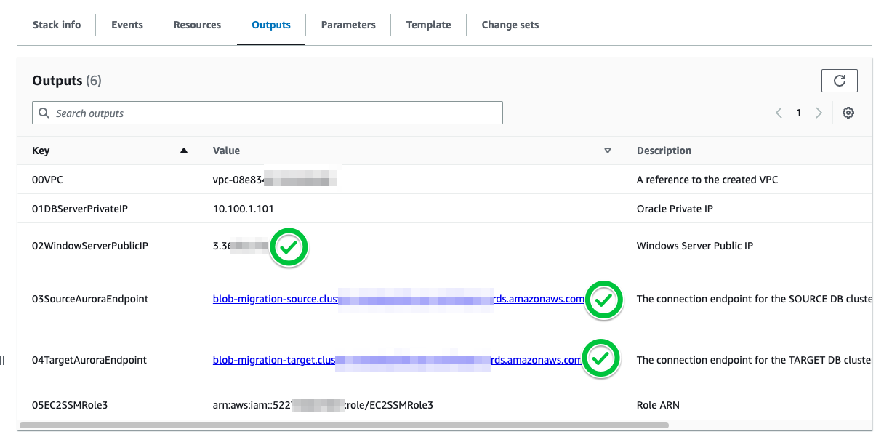


---

9. Windows의 경우  `mstsc.exe`  MAC의 경우  `Remote Desktop` 을 사용하여 위에서 확인한 `IPWindowsPublicIP` 를 이용하여 Bastion Host에 접속합니다.

   ```
   Administrator // Octank#1234
   ```

   

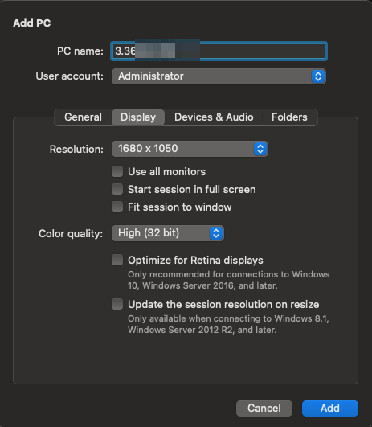

---

10. `MySQL Workbench` 을 실행합니다.

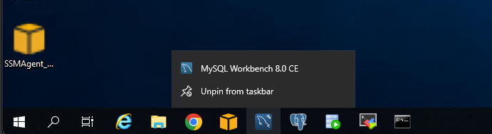

---

11. `+` 버튼을 Click하여 Source DB 정보를 입력합니다.

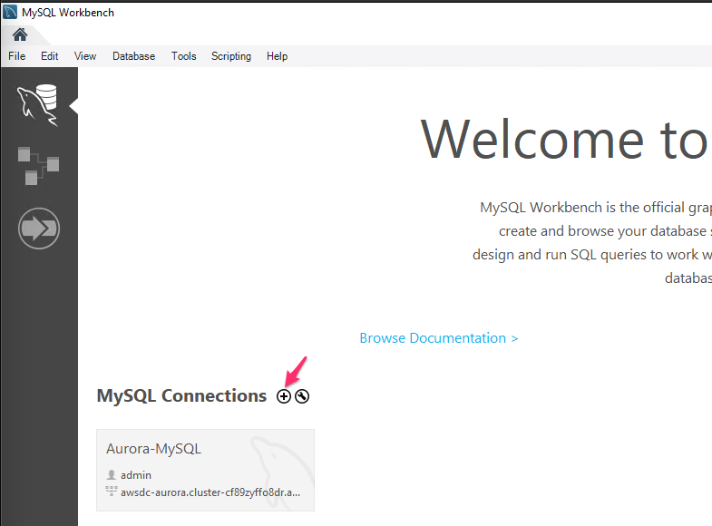

---


12. 다음과 같이 정보를 입력 후 `Test Connection`을 Click합니다. 아래처럼 `Successful` Message를 확인 후  `OK` 를 Click합니다.

```
Connection Name : Source-DB
Hostname : 8번 Step에서 복사한 03SourceAuroraEndpoint의 주소를 입력합니다.
Username : admin
Password : Store in Vault를 Click 후 :: Octank#1234 

```

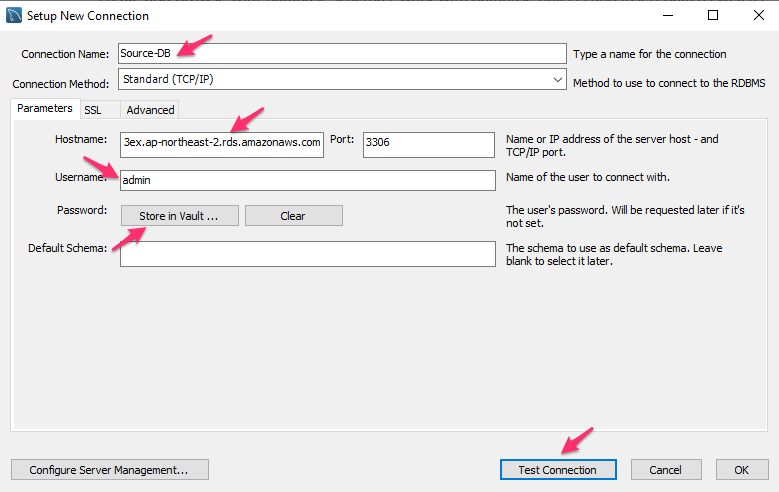

---

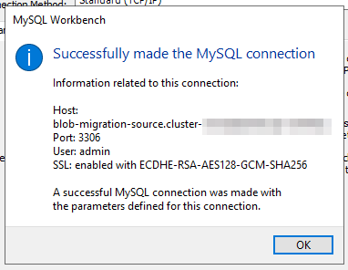


---

13. `+` 버튼을 Click하여 Target DB 정보를 입력합니다.


---

14. 다음과 같이 정보를 입력 후 `Test Connection`을 Click합니다. 아래처럼 `Successful` Message를 확인 후  `OK` 를 Click합니다.

```
Connection Name : Target-DB
Hostname : 8번 Step에서 복사한 03SourceAuroraEndpoint의 주소를 입력합니다.
Username : admin
Password : Store in Vault를 Click 후 :: Octank#1234 

```

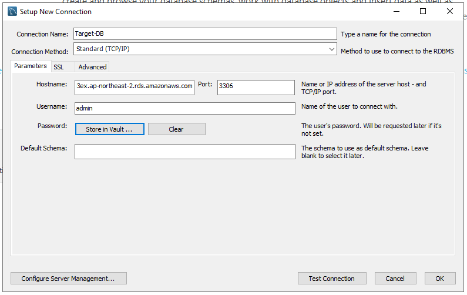

---

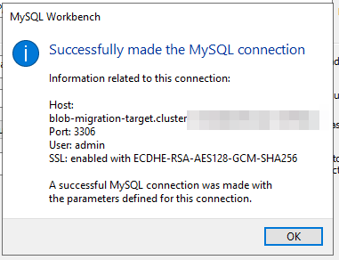

---

15. 수행할 Script와 dumpfile을 download 합니다. 이를 위해서 `mobaXterm` 을 실행합니다.

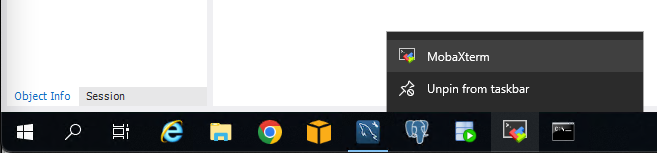

---

16. `Start local terminal` Click

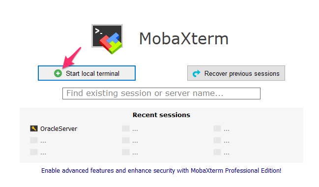

---

17. 접속한 Terminal에서 아래 명령어들을 실행합니다.

```
cd c:\jdbc
wget https://shared-kiwony.s3.ap-northeast-2.amazonaws.com/gallery.sql
ls -alh gallery.sql
wget https://shared-kiwony.s3.ap-northeast-2.amazonaws.com/source-sql1.sql


```

---


19. `MySQL Workbench` 에서 먼저 `Source_DB` 를 Click하여 접속합니다.

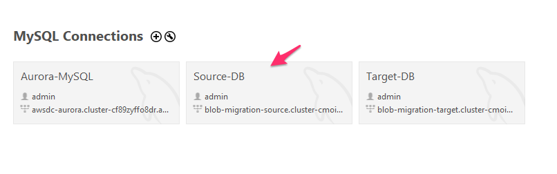

---

20. `File` => `Open SQL script` 선택 후, `C:\jdbc\source-sql1.sql` 을 선택하여 Open합니다.

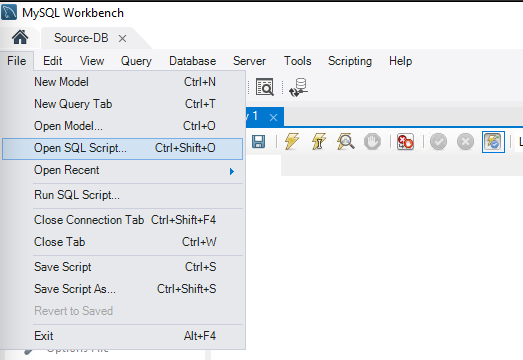

---

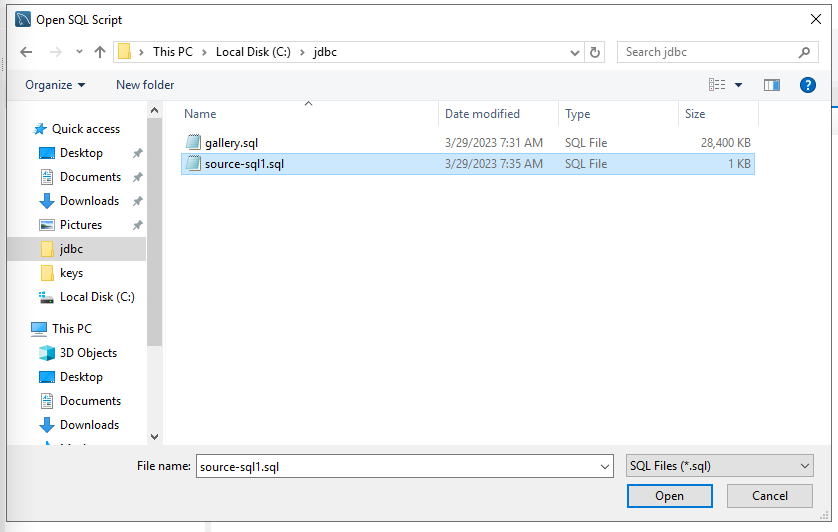

---

21. `SQL Editor` 창에서 아래 SQL들을 모두 실행합니다.

```
call mysql.rds_set_configuration('binlog retention hours', 24);

create database demo;
use demo;

CREATE TABLE gallery (
id INT AUTO_INCREMENT PRIMARY KEY,
name VARCHAR (255) NOT NULL,
image BLOB NOT NULL
);

```

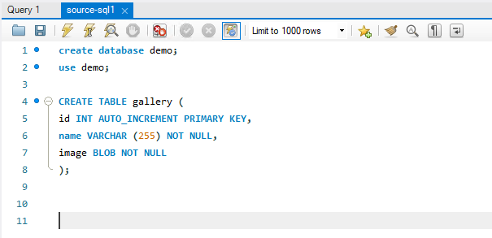

---

22. `Server` => `Data Import` 실행합니다.

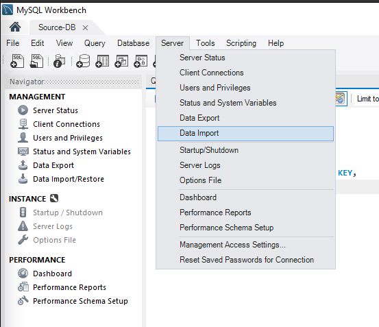

---

23. `Import from Self-Contained File` 을 선택 후 `C:\jdbc\gallery.sql` 을 선택합니다.

    `Default Target Schema`는 `demo` 를 선택합니다.

    `Start Import`를 누릅니다.


---

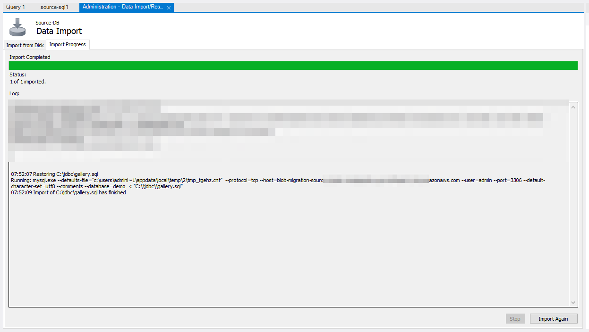

---

24. 다음의 SQL을 실행하여 Data가 정상적으로 Import 되었는지 확인합니다.

```
select * from gallery order by 1 limit 10;

select count(*) from gallery;
358
```

---

25. `MySQL Workbench` 에서  `Target_DB` 를 Click하여 접속합니다.

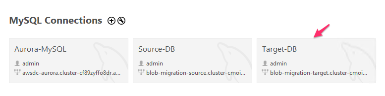

---

26. `File` => `Open SQL script` 선택 후, `C:\jdbc\source-sql1.sql` 을 선택하여 Open합니다.

​      `SQL Editor` 창에서 아래 SQL들을 모두 실행합니다.

```
create database demo;
use demo;

CREATE TABLE gallery (
id INT AUTO_INCREMENT PRIMARY KEY,
name VARCHAR (255) NOT NULL,
image BLOB NOT NULL
);
```

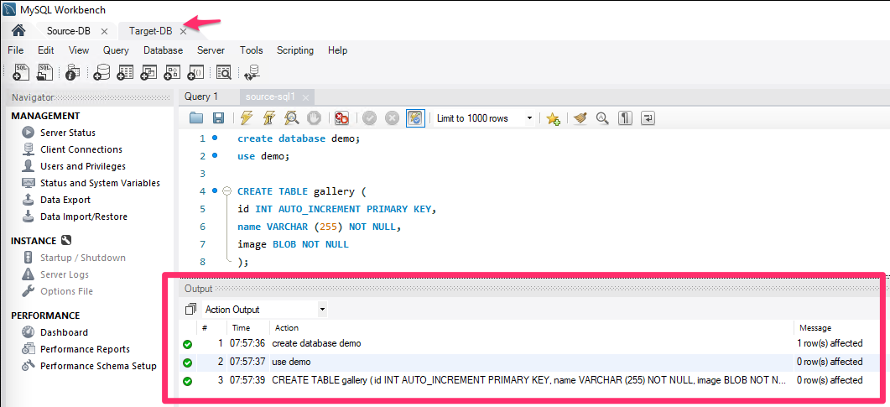

---


---


[<다음> Aurora MySQL Parameter 수정](./03.md)