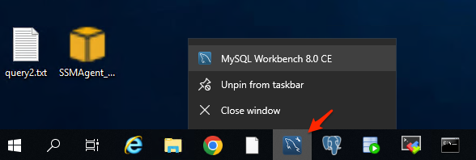
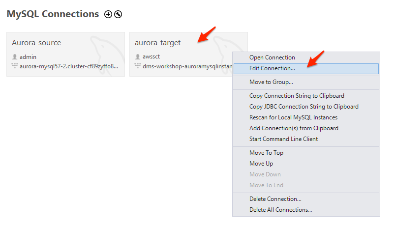
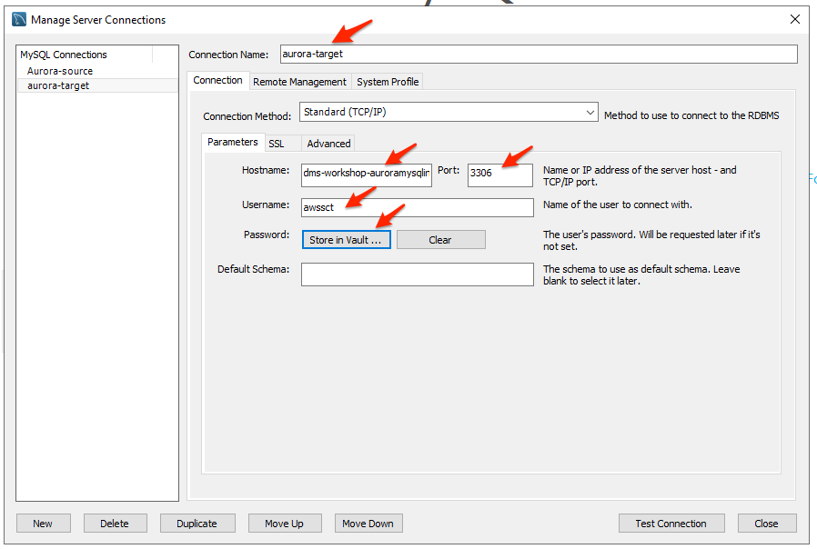
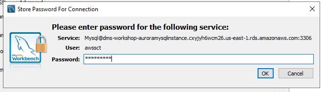
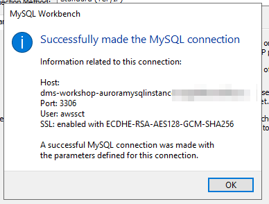
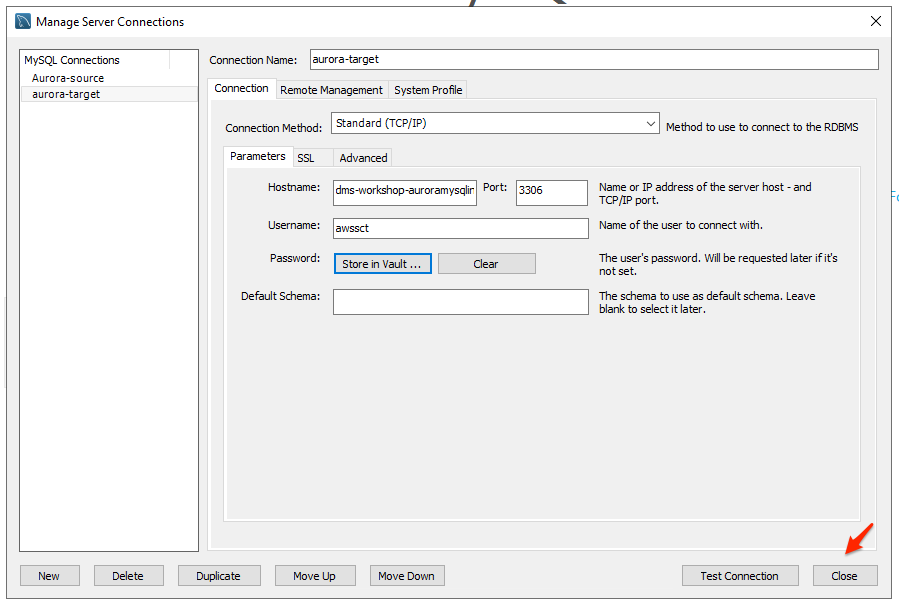
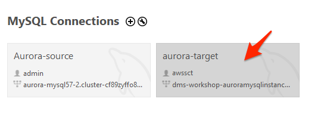
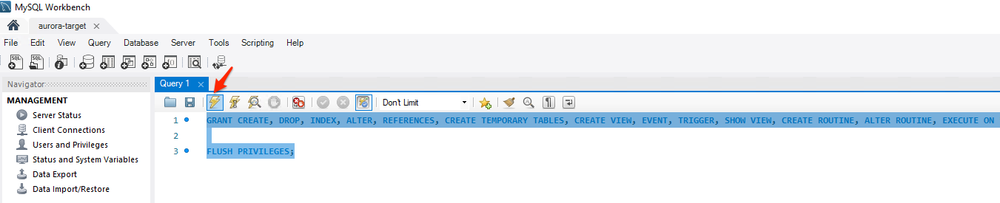
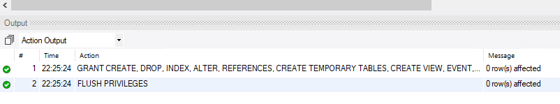

# Target Aurora MySQL 권한 설정

Schema Conversion Tool을 이용하여 Oracle의 Schema를 Aurora MySQL로 이관 하기 위하여 사전 작업을 수행합니다.

---


1. `MySQL Workbench` 를 실행합니다.




---

2. `aurora-target`을 선택 후 마우스 우측 버튼을 누르고 `Edit Connection` 을 Click 합니다.




---

3. 다음과 같이 입력 후 `Test Connection` Click 합니다.

```
Connection Name : aurora-target

Hostname : 이전 실습 환경 생성 과정 Step 8에서 확인 했던 TargetAuroraMySQLEndpoint의 DB 주소를 입력 합니다.
Port : 3306
Username : awssct
Password : Store in Vault 클릭 후 : Password1 입력
```





---

4. 아래와 같이 정상적으로 접속되는지 확인 후  'OK' Click




---

5. `Close` Click




---

6. `aurora-target`을 Click 하여 Aurora MySQL에 접속 합니다.




---

7. Query 창이 뜨면 아래의 두 Query를 복사하여 붙여 넣고 실행합니다.

   쿼리 2개를 모두 선택 후 번개 표시 실행 버튼을 누릅니다.

```
GRANT CREATE, DROP, INDEX, ALTER, REFERENCES, CREATE TEMPORARY TABLES, CREATE VIEW, EVENT, TRIGGER, SHOW VIEW, CREATE ROUTINE, ALTER ROUTINE, EXECUTE ON *.* TO 'awssct'@'%';

FLUSH PRIVILEGES;
```




---

8. 아래 처럼 Output 부분에 성공적으로 두 Query가 실행되었는지 확인합니다.




---


[<다음> Schema Converstion Tool을 이용하여 Schema 이관](./04.md)


