# Schema Converstion Tool을 이용한 Schema 이관

###  Source Oracle DB의 DMS_SAMPLE Schema를 Target Aurora MySQL로 이관 합니다.

---

1. Windows 버튼을 클릭 후 `Schema`라고 검색 후 Schema Convertion Tool` 을 실행합니다.

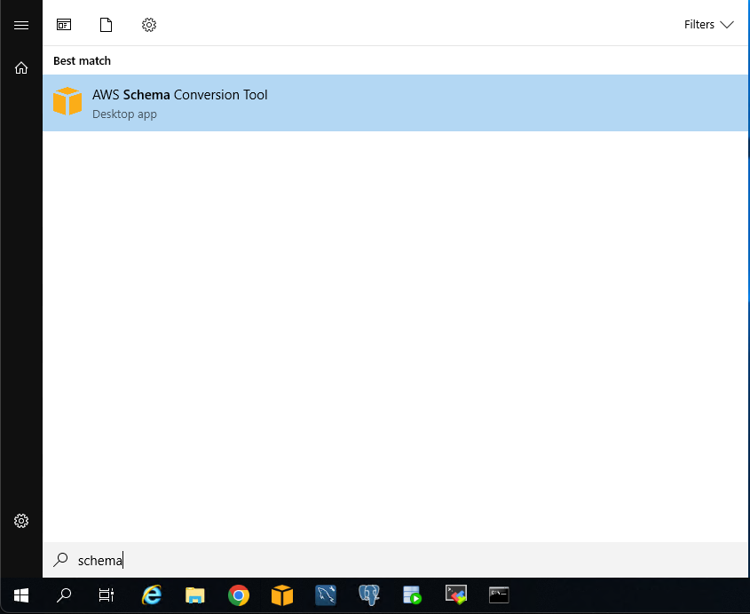


2. `File` => `New Project Wizard` 선택 후 , 다음처럼 선택 후  `Next` Click

``` 
Source engine : Oracle
I want to switch engines and optimize for ther cloud
```


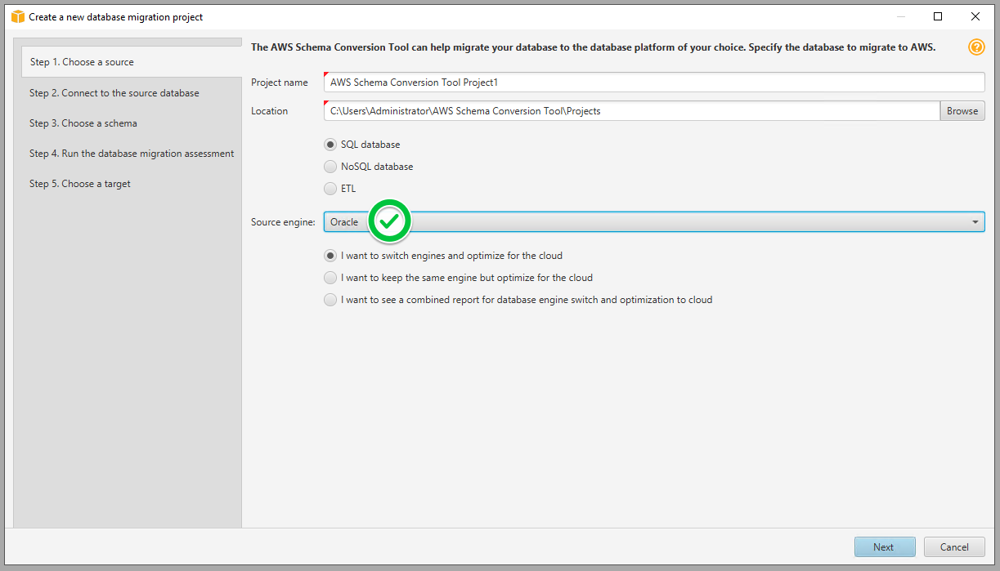


---

3. 먼저 Source Oracle DB에 접속을 위해, 다음처럼 정보를 입력 후 `Test Connection` Click

```
Connection Name : oracle-source

Type : SID
Server name : 8번 스텝에서 확인 했던 SourceOracleEndpoint의 주소를 입력
Server port : 1521
Oracle SID : ORACLEDB
User name : dbmaster
Password : dbmaster123

Store Password : 체크
```

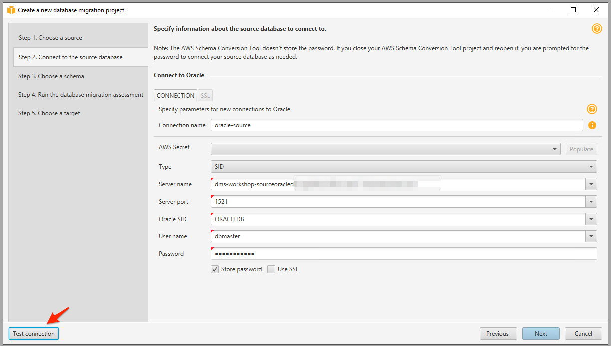


----

3-1.  다음의 경고 창이 뜨면 `Accept the risk and continue` Click

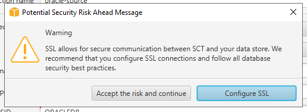


---

3-2.  다음처럼 테스트 접속 성공 화면이 나오면 `OK` Click 후, `Next` Click, 12-1의 경고창이 나올 경우 `Accept the risk and continue` Click.

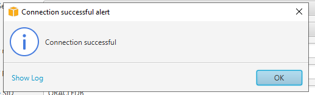


---

4. `Step 3. Choose a Schema`에서 Tree 맨 위의 `oracle-source` 를 클릭하여 모두 `Uncheck` 후 `DMS_SAMPLE` 만 `Check` 후 Click.

Check 후 Click하면 `Next` 버튼 Click.

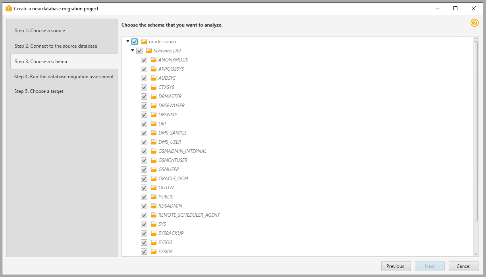

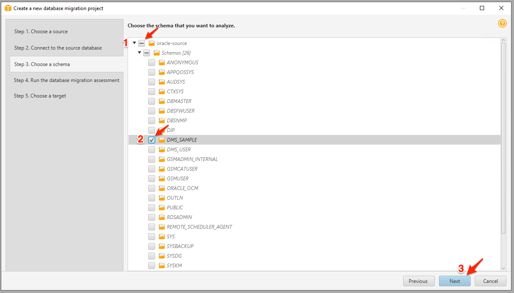


---

5. Migration Assessment Report에서 여러 Database Engine 별로 자동 변환 및 DBA 개입이 필요한 Object에 대한 Reporting을 보여줍니다.

스크롤을 아래로 내려서 어떤 Object들이 DBA  개입이 필요한지 확인해 봅니다. 확인 후  `Next` 를 Click 합니다.

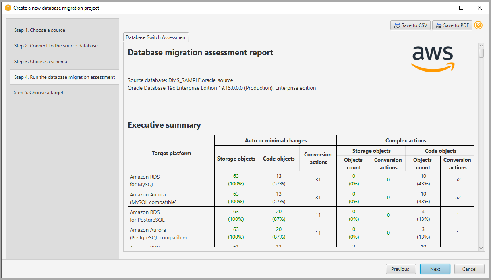

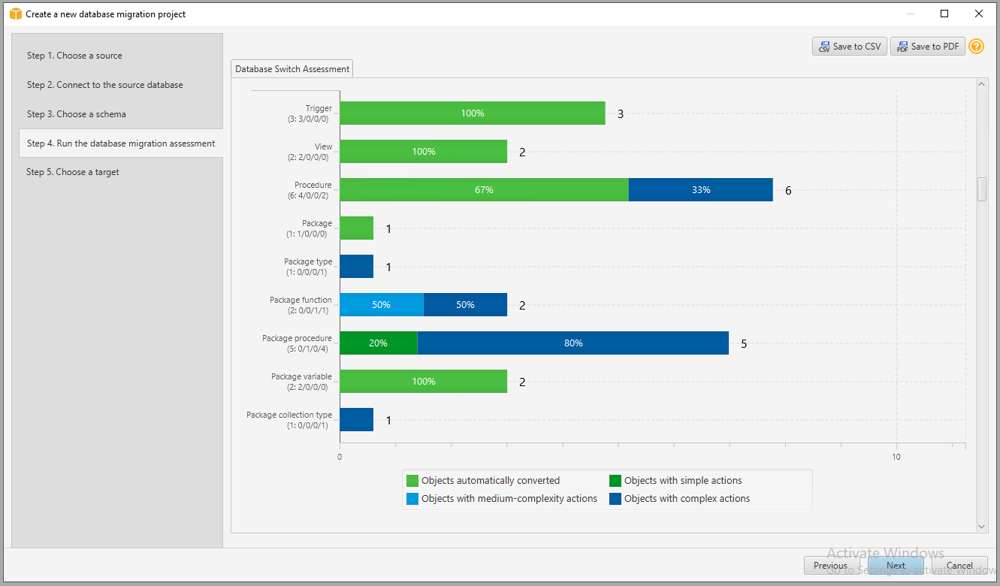


---

6. 이제 Target Aurora MySQL DB에 접속을 위해, 다음처럼 정보를 입력 후 `Test Connection` Click

```
Connection Name : aurora-target

Type : SID
Server name : 8번 스텝에서 확인 했던 TargetAuroraMySQLEndpoint의 주소를 입력
Server port : 3306
User name : awssct
Password : Password1

Store Password : 체크
```

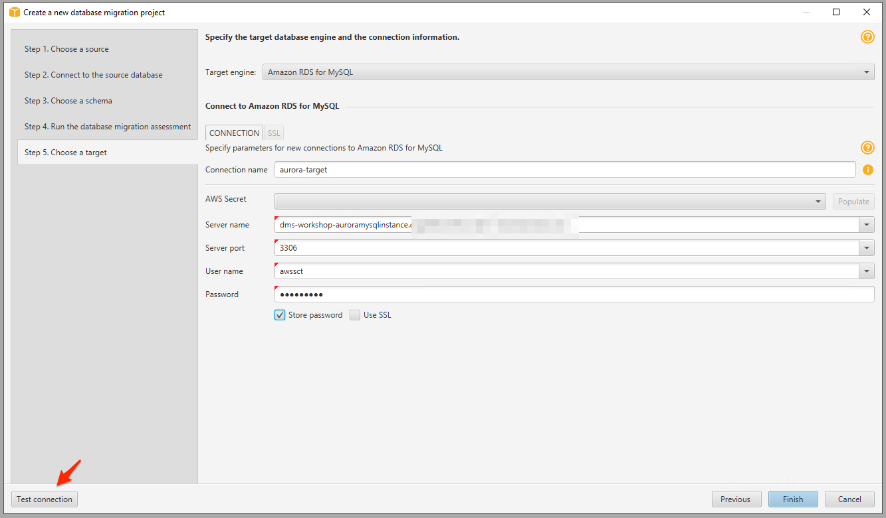

---

6-1. 다음의 경고 창이 뜨면 `Accept the risk and continue` Click


---

6-2. 다음처럼 테스트 접속 성공 화면이 나오면 `OK` Click 후, `Next` Click, 12-1의 경고창이 나올 경우 `Accept the risk and continue` Click.


---

6-3. `Finish` Click 후, 경고 창이 뜨면 `Accept the risk and continue` Click.


---

7. 잠시 기다리면 다음과 같이 Schema Conversion Tool이 실행됩니다.

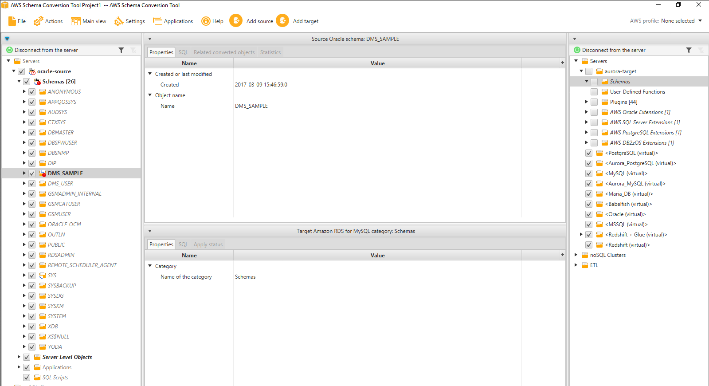


---

8. `DMS_SAMPLE` 을 선택 후, `Main View` => `Assessment Report view` Click

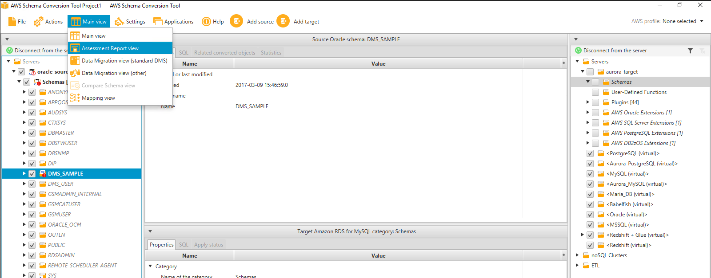


---

9. Source Oracle에서 Aurora MySQL로 Schema 이관 시 자동으로 변환 되는 Object와 DBA 개입이 필요한 Object들을 확인

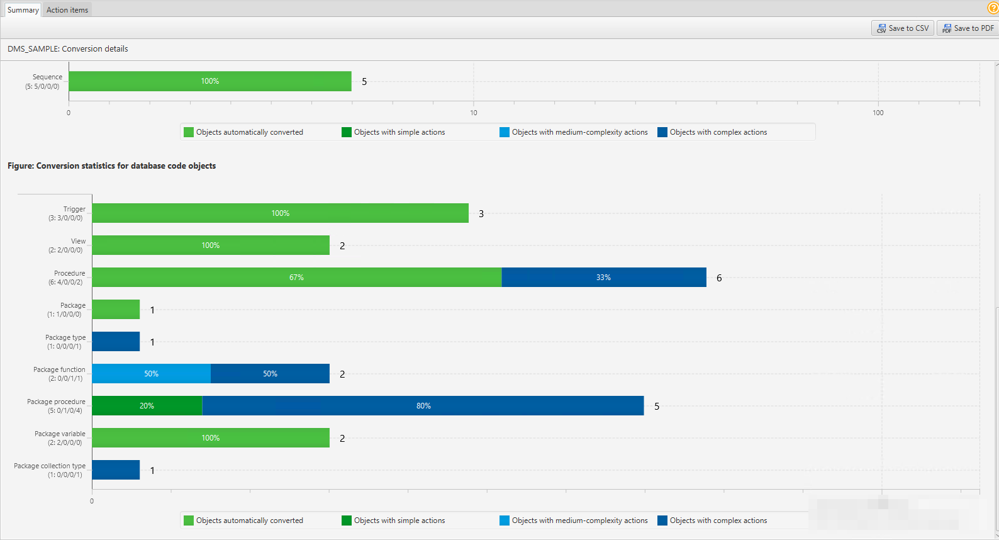


---

10. `Action items` 를 Click 하여 원래 화면으로 돌아갑니다.

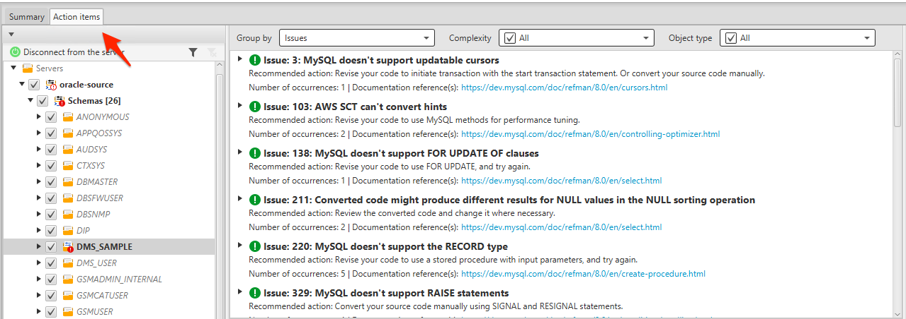


---

11. `DMS_SAMPLE` Schema를 Expand하여 Procedure 들을 확인합니다.

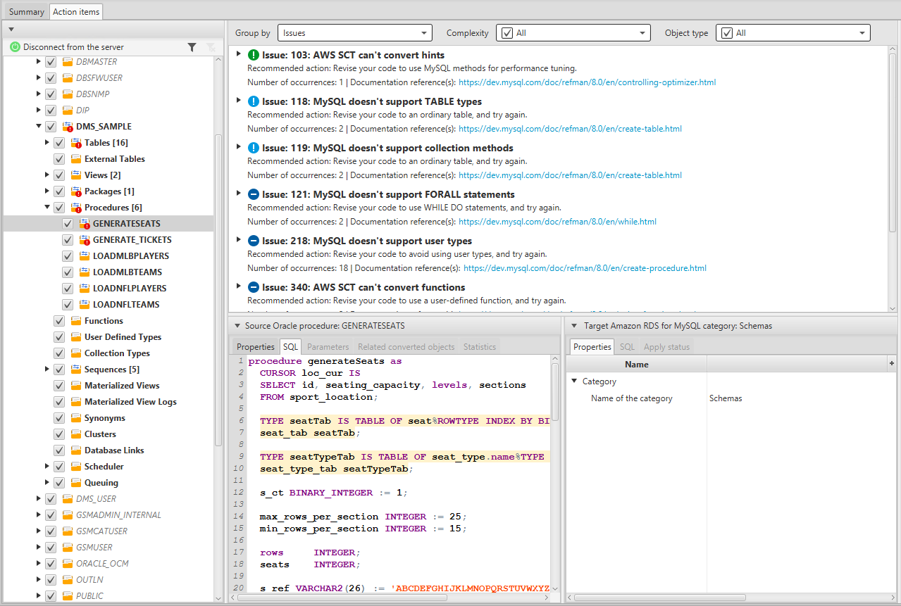


---

12. `왼쪽 Source Oracle Panel`에서 `DMS_SAMPLE` 선택 후 마우스 오른쪽 버튼을 눌러서 `Convert Schema` 를 Click

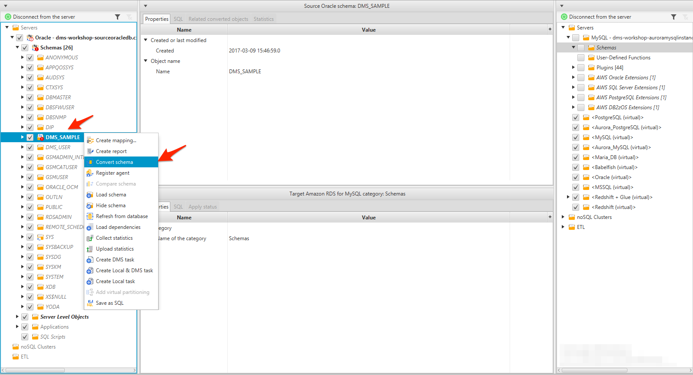


---

13. Target Database에 같은 이름의 Schema가 있을 경우, 삭제 후 재생성된다는 경고창이 뜹니다. (Production 환경에서는 매우 주의가 필요합니다!)

`Yes` 를 Click 합니다.

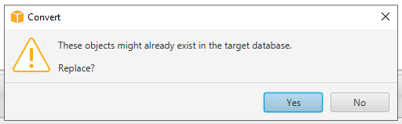


---

14. `오른쪽 Target Aurora MySQL Panel`에서 `dms_sample`을 선택 후 마우스 오른쪽 버튼을 누르고 `Apply to database` Click 합니다.

이 과정을 통해 Source Oracle DB의 DMS_SAMPLE Schema가 Target Aurora MySQL로 이관됩니다.

경고창이 뜨면 `Yes` 를 선택 합니다.

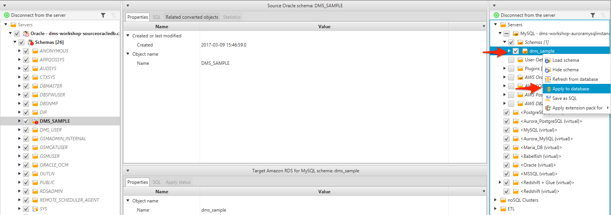


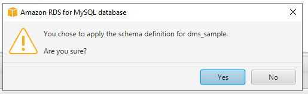


---

15. `Tables`를 Expand하고 `mlb_data` Table을 클릭 하여 DDL을 확인해 봅니다.

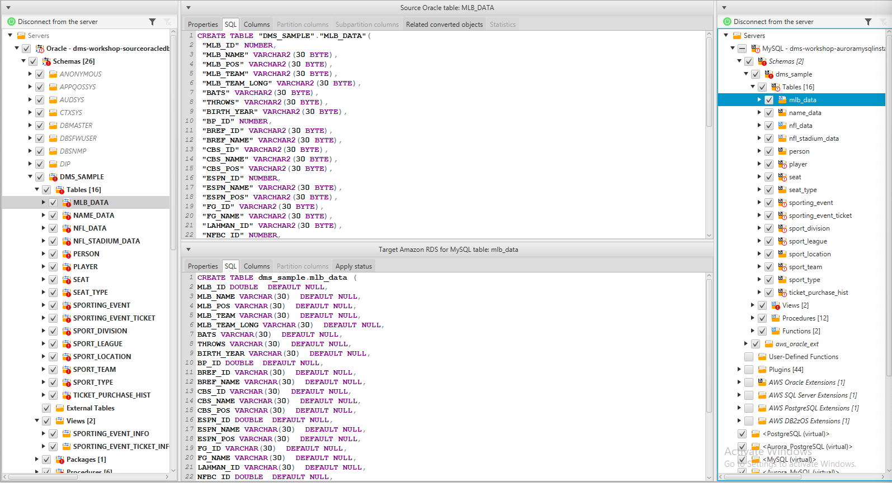


---

16. 이제 여러분은 SCT를 사용하여  Oracle Database의 DMS_SAMPLE Schema를 Aurora MySQL로 이관하였습니다.


---


[<다음> Source Oracle 이관 사전 작업 수행](./05.md)

