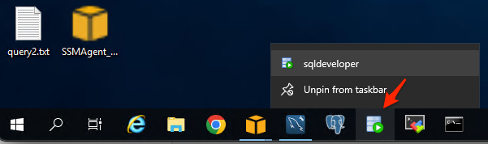
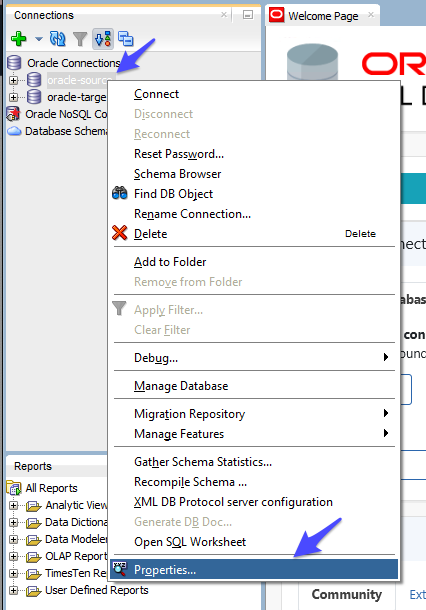
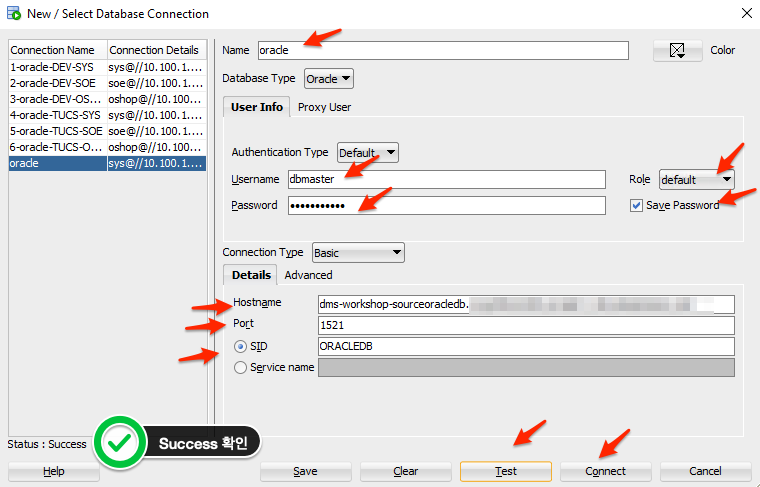
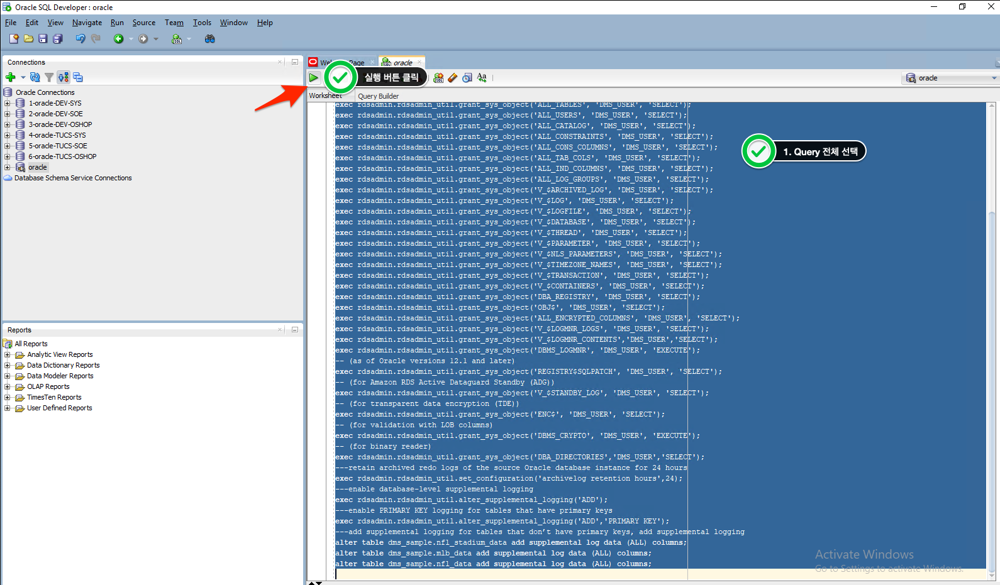
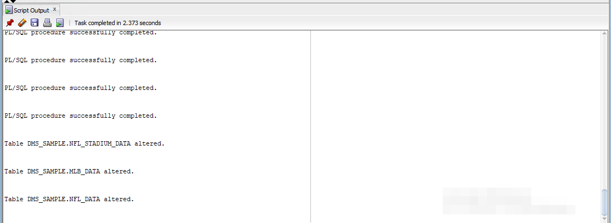

# Source Oracle 이관 사전 작업 수행

###  이관 작업용 유저 및 권한을 설정합니다.

---


1. `SQL Developer`를 실행합니다.




---

2. 맨 아래 `oracle-source`를 선택 후 마우스 우측 버튼 클릭 후 `Properties` Click 합니다.




---

3. 다음과 같이 입력 후 `Test` 를 Click 합니다.

   입력 후 `Test` 를 Click 하고 `Status : Success` 를 확인합니다.

   `Connect` 를 Click합니다. 잠시 기다리면 SQL Worksheet가 뜹니다.

```
Name : oracle

User Info
Username : dbmaster
Role : default
Password : dbmaster123
Save Password : Check

Hostname : 실습 환경생성 Step 8에서 저장해둔 SourceOracleEndpoint의 주소를 입력
Port : 1521
SID : ORACLEDB

```




---

4. 다음의 Query들을 모두 복사하여 `SQL Worksheet`에 붙여 넣습니다.

```
GRANT CREATE SESSION to DMS_USER;
GRANT SELECT ANY TABLE to DMS_USER;
GRANT SELECT ANY TRANSACTION to DMS_USER;
GRANT SELECT on DBA_TABLESPACES to DMS_USER;
--GRANT SELECT ON any-replicated-table to DMS_USER; ---has issues
GRANT EXECUTE on rdsadmin.rdsadmin_util to DMS_USER;
 -- For Oracle 12c only:
GRANT LOGMINING to DMS_USER;
exec rdsadmin.rdsadmin_util.grant_sys_object('ALL_VIEWS', 'DMS_USER', 'SELECT');
exec rdsadmin.rdsadmin_util.grant_sys_object('ALL_TAB_PARTITIONS', 'DMS_USER', 'SELECT');
exec rdsadmin.rdsadmin_util.grant_sys_object('ALL_INDEXES', 'DMS_USER', 'SELECT');
exec rdsadmin.rdsadmin_util.grant_sys_object('ALL_OBJECTS', 'DMS_USER', 'SELECT');
exec rdsadmin.rdsadmin_util.grant_sys_object('ALL_TABLES', 'DMS_USER', 'SELECT');
exec rdsadmin.rdsadmin_util.grant_sys_object('ALL_USERS', 'DMS_USER', 'SELECT');
exec rdsadmin.rdsadmin_util.grant_sys_object('ALL_CATALOG', 'DMS_USER', 'SELECT');
exec rdsadmin.rdsadmin_util.grant_sys_object('ALL_CONSTRAINTS', 'DMS_USER', 'SELECT');
exec rdsadmin.rdsadmin_util.grant_sys_object('ALL_CONS_COLUMNS', 'DMS_USER', 'SELECT');
exec rdsadmin.rdsadmin_util.grant_sys_object('ALL_TAB_COLS', 'DMS_USER', 'SELECT');
exec rdsadmin.rdsadmin_util.grant_sys_object('ALL_IND_COLUMNS', 'DMS_USER', 'SELECT');
exec rdsadmin.rdsadmin_util.grant_sys_object('ALL_LOG_GROUPS', 'DMS_USER', 'SELECT');
exec rdsadmin.rdsadmin_util.grant_sys_object('V_$ARCHIVED_LOG', 'DMS_USER', 'SELECT');
exec rdsadmin.rdsadmin_util.grant_sys_object('V_$LOG', 'DMS_USER', 'SELECT');
exec rdsadmin.rdsadmin_util.grant_sys_object('V_$LOGFILE', 'DMS_USER', 'SELECT');
exec rdsadmin.rdsadmin_util.grant_sys_object('V_$DATABASE', 'DMS_USER', 'SELECT');
exec rdsadmin.rdsadmin_util.grant_sys_object('V_$THREAD', 'DMS_USER', 'SELECT');
exec rdsadmin.rdsadmin_util.grant_sys_object('V_$PARAMETER', 'DMS_USER', 'SELECT');
exec rdsadmin.rdsadmin_util.grant_sys_object('V_$NLS_PARAMETERS', 'DMS_USER', 'SELECT');
exec rdsadmin.rdsadmin_util.grant_sys_object('V_$TIMEZONE_NAMES', 'DMS_USER', 'SELECT');
exec rdsadmin.rdsadmin_util.grant_sys_object('V_$TRANSACTION', 'DMS_USER', 'SELECT');
exec rdsadmin.rdsadmin_util.grant_sys_object('V_$CONTAINERS', 'DMS_USER', 'SELECT');
exec rdsadmin.rdsadmin_util.grant_sys_object('DBA_REGISTRY', 'DMS_USER', 'SELECT');
exec rdsadmin.rdsadmin_util.grant_sys_object('OBJ$', 'DMS_USER', 'SELECT');
exec rdsadmin.rdsadmin_util.grant_sys_object('ALL_ENCRYPTED_COLUMNS', 'DMS_USER', 'SELECT');
exec rdsadmin.rdsadmin_util.grant_sys_object('V_$LOGMNR_LOGS', 'DMS_USER', 'SELECT');
exec rdsadmin.rdsadmin_util.grant_sys_object('V_$LOGMNR_CONTENTS','DMS_USER','SELECT');
exec rdsadmin.rdsadmin_util.grant_sys_object('DBMS_LOGMNR', 'DMS_USER', 'EXECUTE');
-- (as of Oracle versions 12.1 and later)
exec rdsadmin.rdsadmin_util.grant_sys_object('REGISTRY$SQLPATCH', 'DMS_USER', 'SELECT');
-- (for Amazon RDS Active Dataguard Standby (ADG))
exec rdsadmin.rdsadmin_util.grant_sys_object('V_$STANDBY_LOG', 'DMS_USER', 'SELECT'); 
-- (for transparent data encryption (TDE))
exec rdsadmin.rdsadmin_util.grant_sys_object('ENC$', 'DMS_USER', 'SELECT'); 
-- (for validation with LOB columns)
exec rdsadmin.rdsadmin_util.grant_sys_object('DBMS_CRYPTO', 'DMS_USER', 'EXECUTE');
-- (for binary reader)
exec rdsadmin.rdsadmin_util.grant_sys_object('DBA_DIRECTORIES','DMS_USER','SELECT');  
---retain archived redo logs of the source Oracle database instance for 24 hours
exec rdsadmin.rdsadmin_util.set_configuration('archivelog retention hours',24);
---enable database-level supplemental logging
exec rdsadmin.rdsadmin_util.alter_supplemental_logging('ADD');
---enable PRIMARY KEY logging for tables that have primary keys
exec rdsadmin.rdsadmin_util.alter_supplemental_logging('ADD','PRIMARY KEY');
---add supplemental logging for tables that don’t have primary keys, add supplemental logging
alter table dms_sample.nfl_stadium_data add supplemental log data (ALL) columns;
alter table dms_sample.mlb_data add supplemental log data (ALL) columns;
alter table dms_sample.nfl_data add supplemental log data (ALL) columns;

```


---

5. CTRL+A(모두 선택)을 한 후 실행 Button 을 Click합니다.




---

6. `Script Output`에서 수행 결과를 확인 합니다.




---

[<다음> DMS를 활용한 Data 이관](./06.md)

