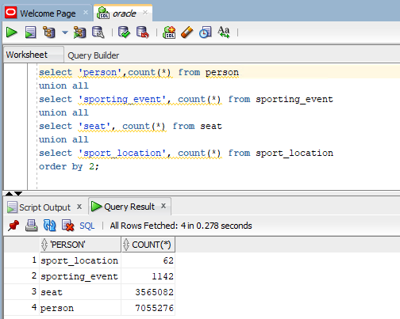

# Target Aurora MySQL 데이터 이관 확인

###  DMS를 통한 Data 이관이 잘 되었는지 확인합니다.


---

1. `Target Aurora MySQL 권한 설정` 과정에서 열어 둔 `MySQL Workbench` 로 이동합니다. (03.md에서 이미 `Target Aurora MySQL` 에 접속한 상태)


---

2. 다음의 Query들을 `SQL Workbench` 에 붙여 넣고 실행합니다.

```
use dms_sample;

select 'person',count(*) from person
union all 
select 'sporting_event', count(*) from sporting_event
union all 
select 'seat', count(*) from seat
union all 
select 'sport_location', count(*) from sport_location
order by 2;
```


#### 참고 Oracle 같은 Query 조회 결과



---

3. `DMS Task의 Table Statistics 정보`, `MySQL Query결과`, `Oracle Query` 결과 DMS_SAMPLE Schema에 대한 이관이 정상적으로 수행 되었음을 알 수 있습니다.


---

4. 이제 초기 데이터 복제가 끝났고, 변경 데이터들이 CDC로 반영이 잘 되는지 확인 하겠습니다.


---

[<다음> Change Data Capture(CDC) 기능 확인](./08.md)
