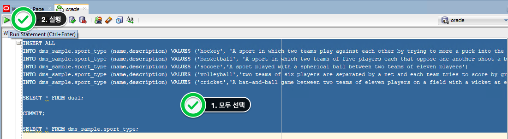
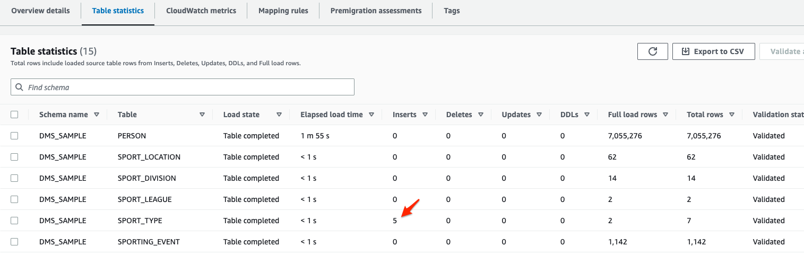
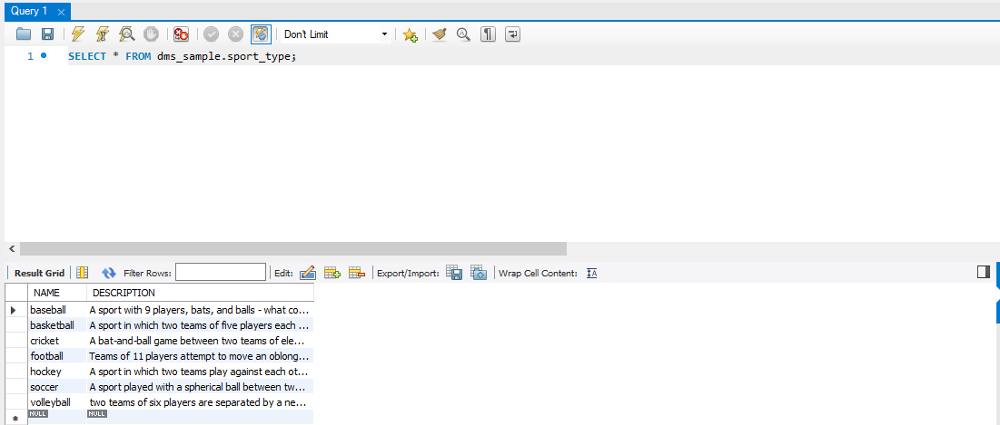
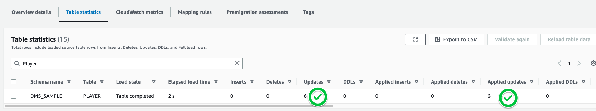
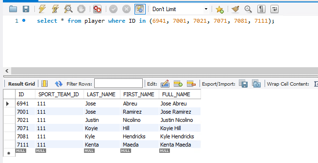
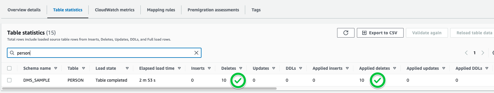
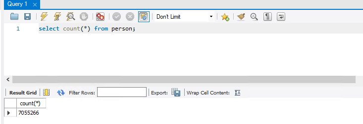

# 변경 데이터 CDC 기능 확인

###  Source Oracle의 DML이 Target Aurora MySQL로 잘 반영되는지 확인합니다.


---

1. `SQL Developer` 를 사용하여 다음의 INSERT 문장을 실행합니다.

```
INSERT ALL

INTO dms_sample.sport_type (name,description) VALUES ('hockey', 'A sport in which two teams play against each other by trying to more a puck into the opponents goal using a hockey stick')

INTO dms_sample.sport_type (name,description) VALUES ('basketball', 'A sport in which two teams of five players each that oppose one another shoot a basketball through the defenders hoop')

INTO dms_sample.sport_type (name,description) VALUES ('soccer','A sport played with a spherical ball between two teams of eleven players')

INTO dms_sample.sport_type (name,description) VALUES ('volleyball','two teams of six players are separated by a net and each team tries to score by grounding a ball on the others court')

INTO dms_sample.sport_type (name,description) VALUES ('cricket','A bat-and-ball game between two teams of eleven players on a field with a wicket at each end')

SELECT * FROM dual; 

COMMIT;

SELECT * FROM dms_sample.sport_type; 

```




---

2. `DMS Console의 Table Statistics` 에 Insert DML이 Capture되었는지 확인 합니다.





---

3. `MySQL Workbench` 에서도 다음의 Query로 5건이 신규로 Insert되었는지 확인합니다.

```
select * from dms_sample.sport_type;
```





---

4. 선수들이 팀을 옮겼습니다. `Player` Table을 Update해봅니다. 다음 Update DML을 `SQL Developer`에서 수행합니다.

DMS Console에서 Update Capture를 확인 합니다. 

```
update PLAYER set SPORT_TEAM_ID=111 where ID in (6941, 7001, 7021, 7071, 7081, 7111);
commit;
```





---

5. `SQL Workbench`를 이용하여 Update가 Aurora MySQL로 정상적으로 반영되었는지 확인합니다.




---

6. 이번엔 사용자 정보를 삭제해보겠습니다. 아래의 Delete DML을 `SQL Developer`에서 실행합니다.

```
delete from person where id between 101 and  110;
commit;
```


---

7. DMS Console에서 Delete Capture를 확인합니다.




---

8. `SQL Workbench`를 이용하여 Delete가 Aurora MySQL로 정상적으로 반영되었는지 확인합니다.

기존 Data건수 7055276건에서 10건이 삭제 반영되어, 7055266건임을 확인합니다.




---

9. 원하시는 DML을 수행하셔서 잘 반영되는지 확인합니다.


---


## 이제 여러분은 Database Migration Service와  Schema Conversion Tool을 이용하여 Oracle Data를 Aurora MySQL로 이관하였습니다. DMS를 활용하면, 이외에도 다양한 작업들을 하실 수 있습니다. 


