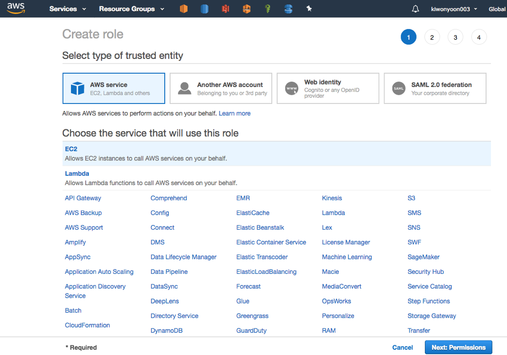
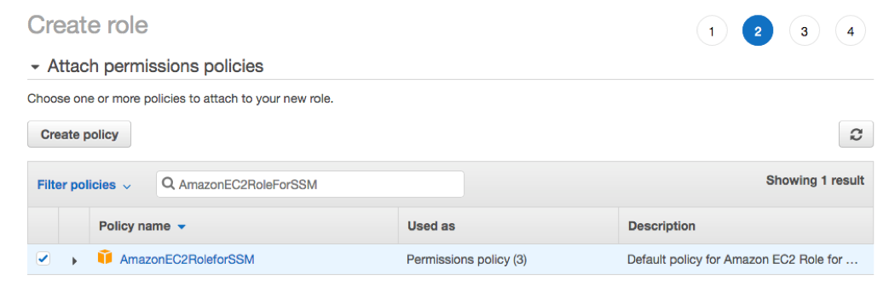
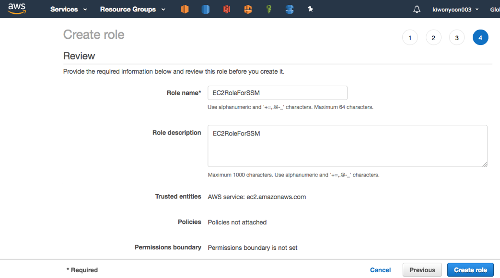

# Migration from Oracle to Aurora MySql Using DMS and SCT

## CF

## Create EC2 Role for using System Manager

1. Services -> IAM
2. Click "Role" in left pane
3. "Create Role" Click
   1. Select type of trusted entity : AWS Service
   2. Choose the service that will use this role : EC2
   3. Click "Next: Permissions"

<kbd>  </kbd>

4. Attached the policy "AmazonEc2RoleforSSM" into role and click "Next: Tags"

<kbd>  </kbd>

5. Click "Next:Review"

6. Fill "Ec2RoleForSSM" in "Role Name" and "Role Description" in Review Page

<kbd>  </kbd>

7. Role Creation

<kbd>  </kbd>
