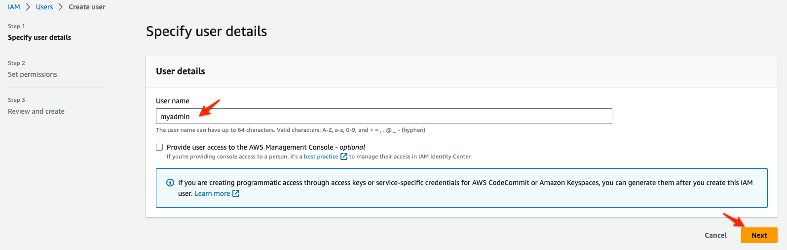

# 실습 환경 확인

RDS Oracle to Redshift Data 이관을 위한 실습 환경이 사용자별로 구성되어 있습니다.

아래 과정을 통해서 실습 환경을 확인합니다.


---

1. [여기 ](https://us-east-1.console.aws.amazon.com/cloudformation/home?region=us-east-1#/stacks/outputs?filteringText=&filteringStatus=active&viewNested=true&stackId=arn%3Aaws%3Acloudformation%3Aus-east-1%3A675653054329%3Astack%2Fdmslab%2Fe7785590-3ff3-11ee-87f9-0a1f7fdc5033) 를 새 창(새 탭)으로 띄워서 CloudFormation으로 이동합니다.


---

2. Outputs Tab을 Click하여  다음의 정보들을 메모장에 저장해둡니다.

```
DMSDBSecretU : Oracle DB User 이름
DMSDBSecretP : Oracle DB User Password 
SourceEC2PrivateDNS : Bastion Host Private IP
SourceEC2PublicDNS : Bastion Host Public IP(RDP)
SourceOracleEndpoint : RDS Oracle Endpoint
```


---

3. [여기 ](https://s3.console.aws.amazon.com/s3/home?region=us-east-1#) 를 새 창(새 탭)으로 띄워서 S3 Console로 이동합니다.
4. `dmsb-xxxxxxxxxxxxxx` bucket 이름을 복사해서 메모장에 저장해둡니다.


---

5. Windows의 경우  `mstsc.exe`  , MAC의 경우  `Remote Desktop` 을 사용하여, 2번 스텝에서 확인한 `SourceEC2PublicDNS` 를 이용하여 Bastion Host에 접속합니다.

```
계정 : Administrator 
비밀번호 : Octank#1234
```


---

6. RDP로 접속 후 `Schema Conversion tool` 을 실행합니다.


---

7. [여기 ](https://us-east-1.console.aws.amazon.com/iamv2/home?region=us-east-1#/users) 를 새 창(새 탭)으로 띄워서 IAM Console로 이동합니다. `Create User`를 Click합니다.


---

8. `Step 1`에서 User name에  `myadmin` 을 입력 후 `Next` Click




---

9. `Step 2`에서 `Attach policies directly` 를 선택 후 Policy Name 중 `AdministratorAccess` 앞의 CheckBox를 선택 후 `Next` Click


---

10. `Step 3`에서 `Create User` Click


---

11. 방금 생성된 `myadmin` User를 Click


---

12. `Create access key` Click합니다.


---

13. `Application running on an AWS compute service` 를 선택 

    맨 아래 `I understand the above recommendation and want to proceed to create an access key.` 도 Check 

    `Next` Click


---

14. `Description tag value` 에 `myadmin` 입력 후 `Create access key`  Click


---

15. `Download .csv file`을 Click하여 Access/Serect Key 파일을 Download합니다.


---

16. 다운로드 된 CSV 파일을 열고 `access key ID`와 `Secret access key`를 메모장에 복사해둡니다.


---

[<다음> Target - Redshift Cluster 생성](./03.md)


