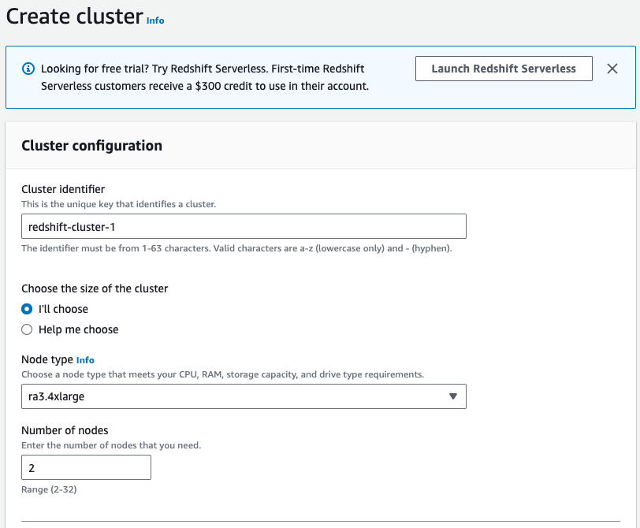
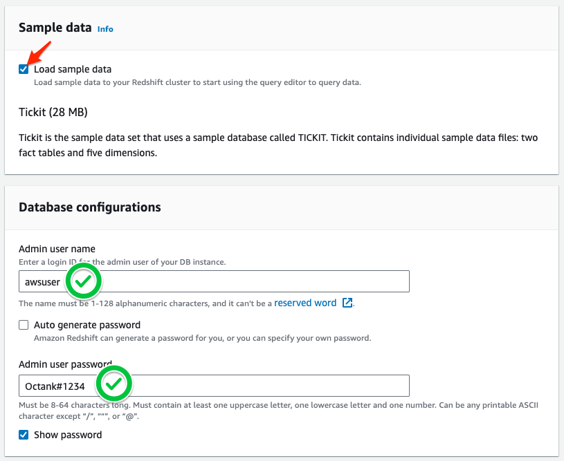

# Target용 Redshift Cluster생성

Source Oracle의 Data를 이관할 Target Redshift Cluster를 생성합니다.


이 과정에서는 수동으로 Redshift를 생성 합니다.


---

1. [여기 ](https://us-east-1.console.aws.amazon.com/redshiftv2/home?region=us-east-1#subnet-groups) 를 새 창(새 탭)으로 띄워서 Redshift Console로 이동합니다.


---

2. `Create clustersubnet group` 를 Click 합니다.


---

3. 아래와 같이 설정합니다.

```
Name : cluster-subnet-group-1
Description : cluster-subnet-group-1

```


3-1. `Add subnets` 에서 다음과 같이 설정 후 `Add all the subnets for this VPC`를 Click합니다.

```
VPC : dmslab-DmsVPC

```


3-2. `Create cluster subnet group` 을 Click합니다.


---

4. `Cluster subnet groups`에서 `refresh` 를 Click하여 Subnet 생성을 확인합니다.


---

5. [여기 ](https://us-east-1.console.aws.amazon.com/redshiftv2/home?region=us-east-1#dashboard) 를 새 창(새 탭)으로 띄우고 `Create cluster`를 Click 합니다.


---

6. `Cluster configuration` 은 Default 값을 유지합니다.
7. `Sample data` 에서 `Load sample data` 를 Check 합니다.
8. `Database configurations` 에서 다음과 같이 입력합니다.

```
Admin user name : awsuser
Admin user password : Octank#1234
```






9. `Additional configurations` 옆의 `use defaults` 를 `Disable` 합니다.

   `Network and security`에서 다음과  입력 후 `Create cluster`를 click합니다.

   ```
   Virtual private cloud(VPC) : dmslab-DmsVpc
   
   Vpc Security groups : dmslab-InstanceSecurityGroup
   
   Cluster usbnet group : cluster-subnet-group-1
   
   ```

   
   
   
   
   


---

10. Status가 'Available'으로 변경 됨을 확인합니다. `redshift-cluster-1` 을 Click 합니다.


---

11. `Endpoint` 앞의 사각형을 Click하여 Endpoint URL을 복사합니다. Redshift의 Endpoint를 메모장에 저장해둡니다.


---

[<다음> Schema Conversion Tool을 활용한 Schema 이관](./04.md)


