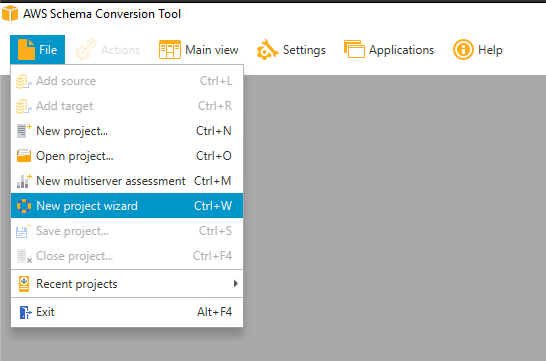
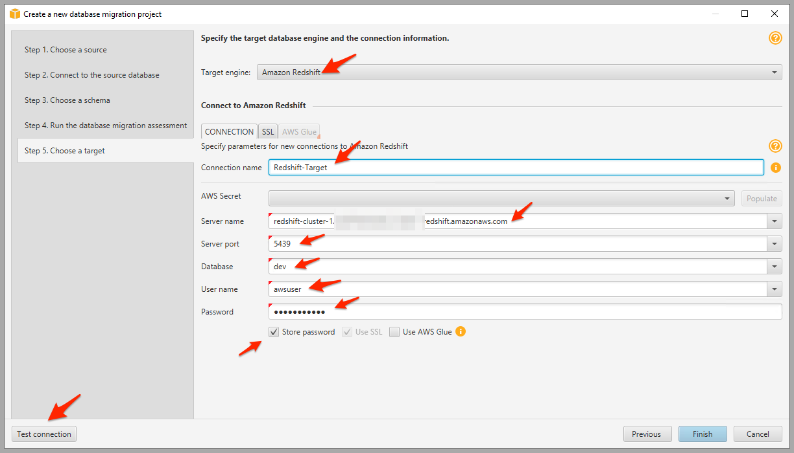

# Schema Converstion Tool을 이용한 Schema 이관

###  Source Oracle DB의 SOE Schema를 Redshift로 이관 합니다.

---

1. 실습환경확인(02.md)에서 실행했던 RDP(Remote Desktop)  화면으로 이동합니다. 


---

2. `File` => `New project Wizard` 를 선택합니다.




---

3. `Step 1` 에서 아래와 같이 입력 후 `Next` Click

```
Project name : 기본 값 사용
Location : 기본 값 사용

SQL database 선택
Source engine : Oracle
I want to switch engines and optimze for the cloud 선택
```


---

4. `Step 2` 에서 아래와 같이 입력 후 `Test Connection` Click

```
Connection name : Oracle-Source

Server name : 실습환경확인(02.md)에서 확인한 SourceOracleEndpoint의 값을 입력
Server port : 1521
Oracle SID : ORACLEDB
User name : dbmaster
Password : dbmaster123
Store Password : Check
```


----

4-1. 보안 경고 창이 뜨면 `Accept the risk and continue` Click 후 `Connection successful` Message 확인 후  `Next` Click


4-2. 다시 한번 보안 경고 창이 뜨면 동일하게 `Accept the risk and continue` Click


---

5. `Step 3` 에서 Oracle-Source 옆의 선택 버튼을 눌러서 전체 선택 취소 후 `SOE`만 선택 후 `Next` Click


---

6. `Step 4`에서는 Assessment Report를 확인 할 수 있습니다. `Next` 를 Click 합니다.


---

7. `Step 5` 에서 Target Redshift 정보를 입력합니다. 아래와 같이 입력 후 `Test Connection`을 Click합니다.

```
Target engine : Amazon Redshift

Connection name : Redshift-Target

Server name : Redshift생성(03.md)의 Step 11에서 복사한 Redshift URL중 주소 부분만 입력합니다.(포트 및 DB이름 부분 제외)
Port : 5439
Database : dev
User name : awsuser
Password : Octank#1234

Store Password : Check

```




---

7-1.  `Connection successful` Message 확인 후  `Finish` Click


---

8. 왼쪽의 Source-Oracle Panel에서 `SOE`를 선택 후 마우스 우측 버튼 Click후 `Convert Schema` Click

   


---

8-1. `Convert` 경고창이 뜨면 `Yes` 선택


---

8-2. `Convert Schema` 경고창이 뜨면 `Continue` Click


---

9. 우측 Redshift-Target Panel에서 `soe` Schema가 생성됨을 확인


---

10. `soe` Schema를 선택 후 마우스 우측 버튼 Click 후 `Apply to database` 선택


---

11. Schema 생성 경고창이 뜨면 `Yes` 선택


---

12. Profile 경고 창이 뜨면 `Global settings` 를 Click합니다.


---

13. `Add a new AWS service profile` 을 CLick합니다.


---

14. 아래의 정보처럼 입력 후 `Test connection` Click

```
Profile Name : NewProfile 1

AWS Access Key : 실습환경확인 (02.md) 의 16번 Step에서 복사 해둔 Access Key 입력
AWS serect Key : 실습환경확인 (02.md) 의 16번 Step에서 복사 해둔 Secret Key 입력
Region : US East(N.Virginia) us-east-1
Amazon S3 bucket folder : 실습환경확인 (02.md) 의 3번 Step에서 복사 해둔 S3 Bucket 이름 입력
```


---

15. Test 결과에서 Snowball을 제외한 모든 것이 Pass인 것을 확인 후 `OK` Click, 다시 `OK` Click


---

16. 자동으로 `soe` Schema가 Redshift에 생성되는 것을 기다렸다가 확인


---


[<다음> DMS를 이용한 Data 이관](./05.md)


