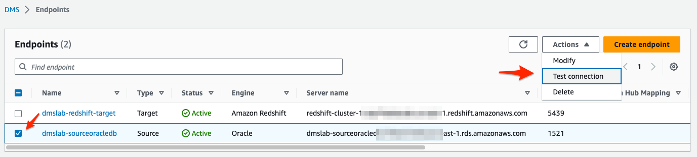

# Database Migration Service를 사용한 Data 이관

###  Source Oracle DB의 초기 Data를 Aurora MySQL로 이관 합니다.


---

1. [여기 ](https://ap-northeast-2.console.aws.amazon.com/dms/v2/home?region=us-east-1#replicationInstances) 를 새 창(새 탭)으로 띄워서 `DMS-ReplicaionInstance Console` 로 이동합니다.


---

2. `Create replication Instance` Click합니다.


---

3. 다음과 같이 정보를 입력 후 `Create replication Instance` 를 Click합니다. 

`The IAM Role arn:aws:iam::xxxxxxxxxxxxx:role/dms-vpc-role is not configured properly.` Error 발생 시 10초 정도 있다가 다시 `Create replication Instance`를 Click합니다.

```
Settings
Name : ReplicationInstance
Description : ReplicationInstance

Instance configuration
Instance class : Default (dms.t3.medium)
Engine Version : Default (3.5.1)
High Availability : DEV or test workload(Single-AZ)

Storage
Allocated storage (GiB) : 50

Connectivity and security
Virtual private cloud (VPC) for IPv4 : dmslab-DmsVpc
Public accessible : Uncheck
```


---


---

4. Replication Instance가 만들어지는 동안 `Source Endpoint`와 `Target Endpoint`를 만들어 보겠습니다.


---

5. [여기 ](https://ap-northeast-2.console.aws.amazon.com/dms/v2/home?region=us-east-1#endpointList) 를 새 창(새 탭)으로 띄워서 `DMS-EndPoint Console` 로 이동합니다.


---

6. 먼저 `Source Endpoint` 를 생성하겠습니다. `Create endpoint` Click 후 다음과 같이 정보를 입력합니다.

   모두 입력 후 `Create endpoint` Click합니다. 

   % 주의 :: RDS Instance 항목에 아무것도 나오지 않을 경우, 브라우저를 2-3회정도 새로 고침합니다.

```
Endpoint type : Source endpoint
Select RDS DB Instance : Check

RDS Instance : dmslab-sourceoracledb

Endpoint configuration
Endpoint identifier : dmslab-sourceoracledb
Source engine : Oracle (default)

Access to endpoint database : Provide access information manually
server Name, Port, User name 모두 자동 입력 값 사용 (default)
Password : dbmaster123

SID/Service name : ORACLEDB (default)
```


---


---

7. 다음으로  `Target Endpoint` 를 생성하겠습니다. `Create endpoint` Click 후 다음과 같이 정보를 입력합니다.

   모두 입력 후 `Create endpoint` Click합니다.

```
Endpoint type : Target endpoint

Endpoint configuration
Endpoint identifier : dmslab-redshift-target
Target engine : Amazon Redshift

Access to endpoint database : Provide access information manually
Server name : Redshift생성(03.md)의 11번 Step에서 복사해둔 Redshift Endpoint 중 Port와 Database 명을 제외하고 입력
Port : 5439
User name : awsuser
Password : Octank#1234

Database Name : dev


```


---


---

8. [여기 ](https://ap-northeast-2.console.aws.amazon.com/dms/v2/home?region=us-east-1#replicationInstances) 를 새 창(새 탭)으로 띄워서 `DMS-ReplicaionInstance Console` 로 이동하여 RI가 생성되었는지 확인 합니다.


---


9. [여기 ](https://ap-northeast-2.console.aws.amazon.com/dms/v2/home?region=us-east-1#endpointList) 를 새 창(새 탭)으로 띄워서 `DMS-EndPoint Console` 로 이동합니다.

   `Source DB`를 선택 후 `Actions` => `Test Connection`을 수행합니다.

   `Run test`를 Click합니다.

   `Status`가 `Successful` 인지 확인합니다.




---

10. [여기 ](https://ap-northeast-2.console.aws.amazon.com/dms/v2/home?region=us-east-1#endpointList) 를 새 창(새 탭)으로 띄워서 `DMS-EndPoint Console` 로 이동합니다.

    `Target DB`를 선택 후 `Actions` => `Test Connection`을 수행합니다.

    `Run test`를 Click합니다.

    `Status`가 `Successful` 인지 확인합니다.


---

11. [여기 ](https://ap-northeast-2.console.aws.amazon.com/dms/v2/home?region=us-east-1#tasks) 를 새 창(새 탭)으로 띄워서 `DMS-Tasks Console` 로 이동합니다.

    `Create task`를 Click 후 다음처럼 정보를 입력 후  `Create task`를 Click합니다.

```
Task configuration
Task identifier : migration-task
Replication instance : replicationinstance

Source database endpoint : dmslab-sourceoracledb
Target database endpoint : dmslab-redshift-target
Migration type : Migrate existing data and replicate ongoing changes

Task settings
Target table preparation mode : Do nothing
Stop task after full load completes : Don't stop
Include LOB columns in replication : Limited LOB mode
LOB chunk size (kb) : 32

Validation
Turn on : Check 
Turn on cloudWatch Logs : Check
Turn on batch-optimized apply : Uncheck

Table mappings 
JSON editor 선택 후 다음 값 입력

{
  "rules": [
    {
      "rule-type": "selection",
      "rule-id": "625738871",
      "rule-name": "625738871",
      "object-locator": {
        "schema-name": "SOE",
        "table-name": "%"
      },
      "rule-action": "include",
      "filters": []
    }
  ]
}

```


---

12. `migration-task`를 Click하여 migration 상황을 확인합니다.


---

13. `Table statistics` 를 Click하여 초기 데이터 이관 상황을 모니터링 합니다.


---

14. Full Load가 정상적으로 완료되었습니다. Target Redshift에 접속해서 실제 데이터 이관이 잘 되었는지 확인하겠습니다.


---


[<다음> Redshift Data 확인](./06.md)


