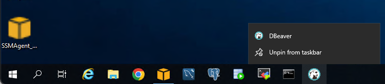
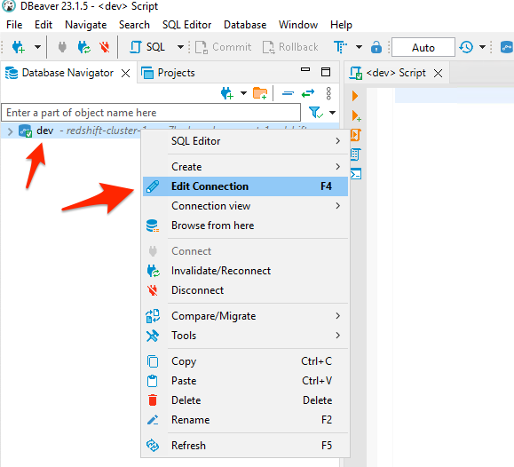
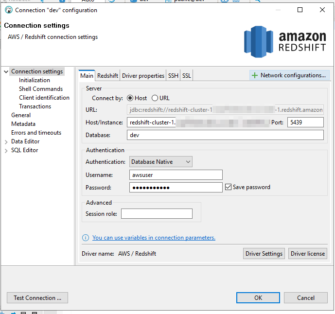
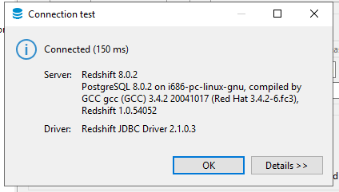
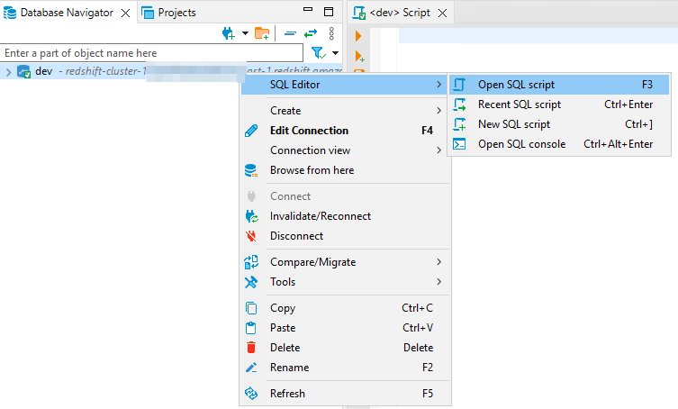
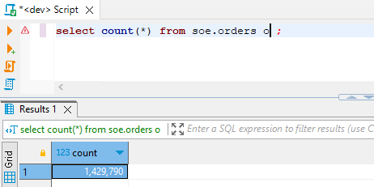
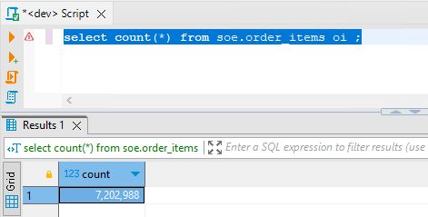
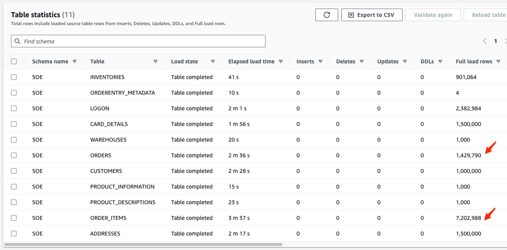

# Redshift Data 확인

###  Redshift에서 Migration 된 Data를 확인합니다.


---

1. Remote Desktop을 이용하여 DBeaver를 실행합니다.




---

2. 좌측 Panel에서 `dev`를 선택 후 마우스 우측 버튼 클릭 후 `Edit Connection` Click합니다.




---

3. 다음처럼 정보를 수정 후 `Test Connection` 후 `Ok` Click

```
Host/Instance : Redshift생성(03.md) 11번 Step에서 복사해둔 Redshift endpoint 중 Port와 Database 이름을 제외하고 입력
Port : 5439
Database : dev

Username : aswuser
Password : Octank#1234
Save Password : Check


```






---

4. `dev`를 선택 후 마우스 우측 버튼 Click 후 `SQL Editor` 실행




---

5. 다음의 Query들을 실행하여 Data를 확인합니다.

```
select count(*) from soe.orders o ;

select count(*) from soe.order_items oi ;
```







---

6. 앞서 DMS의 통계 정보와 비교합니다.




---

[<다음> CDC 기능 확인](./07.md)


