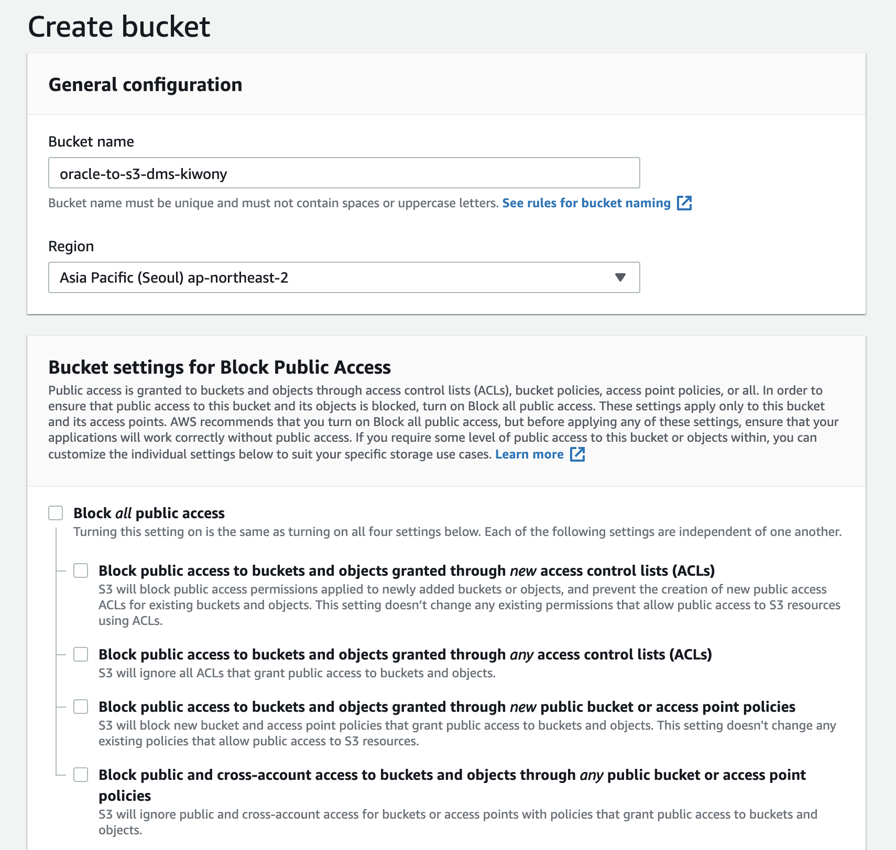

Welcome to the DMS wiki!


### Create S3 bucket
**Bucket Name** : `oracle-to-s3-dms-kiwony`

Format: 

### Create IAM Policy & Role
**Policy** : `DMS-S3-endpoint-access`

```
{
    "Version": "2012-10-17",
    "Statement": [
        {
            "Sid": "VisualEditor0",
            "Effect": "Allow",
            "Action": [
                "s3:GetAccessPoint",
                "s3:PutAccountPublicAccessBlock",
                "s3:GetAccountPublicAccessBlock",
                "s3:ListAllMyBuckets",
                "s3:ListAccessPoints",
                "s3:ListJobs",
                "s3:CreateJob",
                "s3:HeadBucket"
            ],
            "Resource": "*"
        },
        {
            "Sid": "VisualEditor1",
            "Effect": "Allow",
            "Action": "s3:*",
            "Resource": "arn:aws:s3:::dms01-kiwony*"
        },
        {
            "Sid": "VisualEditor2",
            "Effect": "Allow",
            "Action": "s3:ListBucket",
            "Resource": "arn:aws:s3:::dms01-kiwony*"
        }
    ]
}
```


### Create Role
**Role** : `dmstestrole`

**Attach Policy** : `DMS-S3-endpoint-access`


### Create DB Instance 
**AMI-ID** : `ami-0e63e3e96d7d9e456`


### DMS Pre-requirement for Oracle
```
create user dms_user identified by Octank#1234 default tablespace users temporary tablespace temp quota unlimited on users;
grant connect, resource to dms_user;
grant EXECUTE ON dbms_logmnr to dms_user;

GRANT SELECT ANY TRANSACTION to dms_user;
GRANT SELECT on V_$ARCHIVED_LOG to dms_user;
GRANT SELECT on V_$LOG to dms_user;
GRANT SELECT on V_$LOGFILE to dms_user;
GRANT SELECT on V_$DATABASE to dms_user;
GRANT SELECT on V_$THREAD to dms_user;
GRANT SELECT on V_$PARAMETER to dms_user;
GRANT SELECT on V_$NLS_PARAMETERS to dms_user;
GRANT SELECT on V_$TIMEZONE_NAMES to dms_user;
GRANT SELECT on V_$TRANSACTION to dms_user;
GRANT SELECT on ALL_INDEXES to dms_user;
GRANT SELECT on ALL_OBJECTS to dms_user;
GRANT SELECT on DBA_OBJECTS to dms_user; 
GRANT SELECT on ALL_TABLES to dms_user;
GRANT SELECT on ALL_USERS to dms_user;
GRANT SELECT on ALL_CATALOG to dms_user;
GRANT SELECT on ALL_CONSTRAINTS to dms_user;
GRANT SELECT on ALL_CONS_COLUMNS to dms_user;
GRANT SELECT on ALL_TAB_COLS to dms_user;
GRANT SELECT on ALL_IND_COLUMNS to dms_user;
GRANT SELECT on ALL_LOG_GROUPS to dms_user;
GRANT SELECT on SYS.DBA_REGISTRY to dms_user;
GRANT SELECT on SYS.OBJ$ to dms_user;
GRANT SELECT on DBA_TABLESPACES to dms_user;
GRANT SELECT on ALL_TAB_PARTITIONS to dms_user;
GRANT SELECT on ALL_ENCRYPTED_COLUMNS to dms_user;
GRANT SELECT on V_$LOGMNR_LOGS to dms_user;
GRANT SELECT on V_$LOGMNR_CONTENTS to dms_user;
GRANT SELECT on ALL_VIEWS to dms_user;
GRANT SELECT ANY TABLE to dms_user;
GRANT ALTER ANY TABLE to dms_user;
GRANT create any directory to dms_user;
ALTER DATABASE ADD SUPPLEMENTAL LOG DATA;
ALTER TABLE OSHOP.DUMMY ADD SUPPLEMENTAL LOG DATA (PRIMARY KEY) COLUMNS;
ALTER TABLE OSHOP.EMP ADD SUPPLEMENTAL LOG DATA (PRIMARY KEY) COLUMNS;
ALTER TABLE OSHOP.DEPT ADD SUPPLEMENTAL LOG DATA (PRIMARY KEY) COLUMNS;
ALTER TABLE OSHOP.BIGEMP ADD SUPPLEMENTAL LOG DATA (ALL) COLUMNS;
ALTER TABLE OSHOP.BONUS ADD SUPPLEMENTAL LOG DATA (ALL) COLUMNS;
ALTER TABLE OSHOP.SALGRADE ADD SUPPLEMENTAL LOG DATA (ALL) COLUMNS;

```


### Create Replication Instance 
**AMI-ID** : `ami-0e63e3e96d7d9e456`


### Create Endpoint and Test
**AMI-ID** : `ami-0e63e3e96d7d9e456`


### Create Task
**AMI-ID** : `ami-0e63e3e96d7d9e456`


### Subject
**AMI-ID** : `ami-0e63e3e96d7d9e456`

### Subject
**AMI-ID** : `ami-0e63e3e96d7d9e456`

### Subject
**AMI-ID** : `ami-0e63e3e96d7d9e456`

### Subject
**AMI-ID** : `ami-0e63e3e96d7d9e456`

### Subject
**AMI-ID** : `ami-0e63e3e96d7d9e456`


