## Appendix-1 - EC2 Instance에 Session Manager를 사용하여 Terminal 접속하는 방법

1. EC2 Console로 이동([link](https://ap-northeast-2.console.aws.amazon.com/ec2/home?region=ap-northeast-2#Instances:instanceState=running))


2. 접속하고자 하는 EC2 Instance 앞의 CheckBox를 선택하고, 화면 상단 중앙에 `Connect` Click

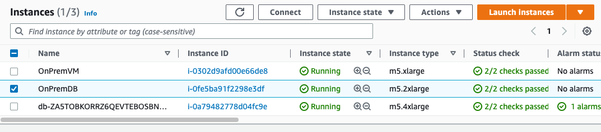


3. `Session Manager` Tab에서 `Connect` Click

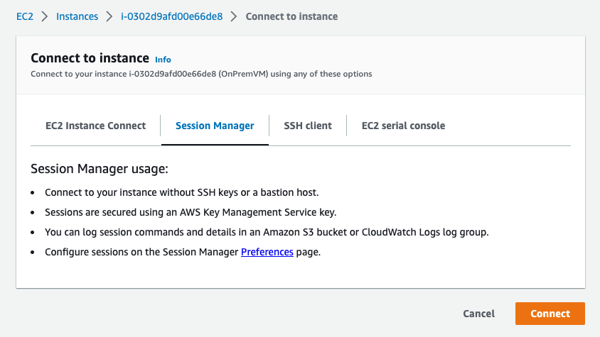


4. 다음의 Command를 수행하여 `oracle` user로 Switch 합니다.

```
sudo su -
su - oracle


Ternimal Output Example>>>
sh-4.2$ sudo su -
[root@ip-20-0-134-49 ~]# su - oracle
Last login: Mon Feb 20 05:13:20 UTC 2023
[oracle@ip-20-0-134-49 ~]$

```

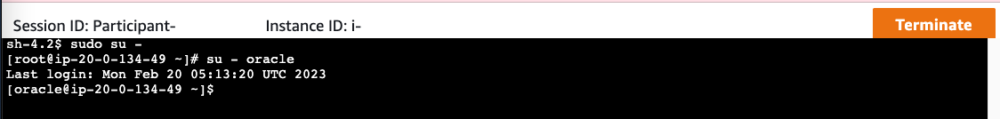


---

## Appendix-2 - Terminal에서 AWS Credential 설정 방법

1. `Access AWS Account` Page에서 export로 시작하는 3 Line을 복사합니다. (Copied! 버튼을 누르면 자동으로 복사 됩니다.)

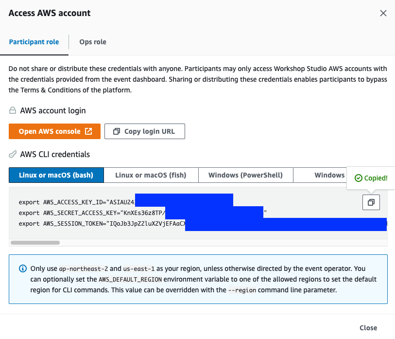

2. Terminal에 붙여 넣기 합니다. `aws sts get-caller-identity`를 실행하여 환경 설정이 잘 되었는지 확인합니다.

```
[oracle@ip-20-0-134-49 ~]$ export AWS_ACCESS_KEY_ID="ASIAU243AFXXXXXXXXXXXXX"
[oracle@ip-20-0-134-49 ~]$ export AWS_SECRET_ACCESS_KEY="KnXEs36z8TP/XXXXXXXXXXXXXXXXXXXXXXX"
[oracle@ip-20-0-134-49 ~]$ export AWS_SESSION_TOKEN="IQoJb3JpZ2luX2VjEFAaCXVzLWVhc3QtMSJIMEYCIQC19ohX//mObRwyrj8XxhzTJLr6CfYYhbpcC0YPQW/YFgIhAM7YpRTC6otkGjVlTpp7uReg7lFc5CcS9X7XqOk8V7efKqICCOj//////////wEQARoMMzMyNjQ4MTYzNjgyIgzMp59+11pLU5520LIq9gFhstv2YQqAEaQNbqESVdgDwhwI2gbvzMqs+hBbmkqdJSKYw1aHhYohfa5kBBfY/b+Dt4LpjfN6MSptdbayy46HVR1fvxhmhDjQ8dsHiniqcQCKQcP4Yhi2dx3SYlHMSOnqQZ0ikb7jIBgzgwiFthKEd5hnWyISHztT1JrC8iudis7bpxJHquvPxPqdRxn5qmil0uhh6mIUe2whbidv4RPY60+oHtEEXSxqT62NCt2UxtpT74G5ih8+6OLuWf8ZNEmltX+wa9ZxyTtRtbRoHWIqrSQtA1VPm4WHqTBDEgqA2bmAbN5ro8DR2Yregm2lPfMOyJ5j684wo6HcnwY6nAHmaNKErMt3YPWK0CWlgf8Iuwla/M/yjiTRQGtfI8Qow1v8mjTQKRa9M7ei49eAKP1+ja1YNEzicS+IhDgv0CnD1HgekoaEiKMHOBWftI1U1ys4nVvEzfiWCYERizWjnVnMCjV/kAIzVg9SmqJ5Jac6BdLzlbJFZ7j4df7WwlJjYcPFQHOKLfBRD3ziOBzJvXEGgDt2MTcxiiPiahs="
[oracle@ip-20-0-134-49 ~]$

[oracle@ip-20-0-134-49 ~]$ aws sts get-caller-identity
{
    "UserId": "AROAU243AFFRB5BAEW7GD:Participant",
    "Account": "332648XXXXXXX",
    "Arn": "arn:aws:sts::332648XXXXXXX:assumed-role/WSParticipantRole/Participant"
}
```


## Source Database 사전 작업

#### 1. Appendix-1을 참고하여 `OnPremDB` Terminal로 접속 후 oracle user로 Switch 합니다.

---

#### 2. OnPremDB-DEV에 sqlplus로 접속합니다.

```
[oracle@ip-20-0-134-49 ~]$ sqlplus / as sysdba
...
SQL>
```

---

#### 3. archivelog mode 설정 여부를 확인합니다.

```
SQL> archive log list;
Database log mode              Archive Mode
Automatic archival             Enabled
Archive destination            /opt/oracle/arch
Oldest online log sequence     264
Next log sequence to archive   266
Current log sequence           266
```

----

#### 4. Supplental Log 설정 확인 및 설정이 되어 있지 않으면 설정합니다.

```
SQL> SELECT supplemental_log_data_min FROM v$database;
SUPPLEME
--------
NO

SQL> ALTER DATABASE ADD SUPPLEMENTAL LOG DATA;
Database altered.

SQL> ALTER DATABASE ADD SUPPLEMENTAL LOG DATA (PRIMARY KEY) COLUMNS;
Database altered.

SQL> SELECT supplemental_log_data_min FROM v$database;
SUPPLEME
--------
YES
```

---

#### 5. DMS에서 사용할 DMS User를 생성하고 기본 권한들을 줍니다.

```
SQL> create user dms identified by dms;
User created.

SQL> grant connect, resource to dms;
Grant succeeded.
```

---

#### 6. DMS User에게 필요한 적절한 권한을 줍니다. 미리 만들어 둔 dms-user-grant.sql을 다운로드 하고 그 내용을 확인합니다.

```
SQL> !wget https://shared-kiwony.s3.ap-northeast-2.amazonaws.com/dms-user-grant.sql
...
2023-02-23 07:57:40 (100 MB/s) - ‘dms-user-grant.sql’ saved [1701/1701]

SQL> !cat dms-user-grant.sql
GRANT CREATE SESSION TO dms;GRANT SELECT ANY TRANSACTION TO dms;
GRANT SELECT ON V_$ARCHIVED_LOG TO dms;
...
GRANT SELECT on v_$transportable_platform to dms;
GRANT EXECUTE on DBMS_FILE_TRANSFER to dms;
GRANT EXECUTE on DBMS_FILE_GROUP to dms;

SQL>
```

---

#### 7. 다운로드 받은 dms-user-grant.sql을 사용하여 권한을 grant 합니다.

```
SQL> @dms-user-grant.sql

Grant succeeded.
Grant succeeded.
...
Grant succeeded.
Grant succeeded.

SQL>
```

---

#### 8. 이관 대상이 되는 Table 중에 CDC를 통해 변경분 적용이 필요한 Table들을 PK-Supplemental Log 설정해야합니다. 미리 만들어둔 Script를 Download하고 내용을 확인합니다.

```
SQL> !wget https://shared-kiwony.s3.ap-northeast-2.amazonaws.com/dms-soe-supplemental.sql
...
2023-02-23 08:07:59 (38.4 MB/s) - ‘dms-soe-supplemental.sql’ saved [857/857]

SQL> !cat dms-soe-supplemental.sql
ALTER TABLE SOE.CUSTOMERS ADD SUPPLEMENTAL LOG DATA (PRIMARY KEY) COLUMNS;
ALTER TABLE SOE.ADDRESSES ADD SUPPLEMENTAL LOG DATA (PRIMARY KEY) COLUMNS;
ALTER TABLE SOE.CARD_DETAILS ADD SUPPLEMENTAL LOG DATA (PRIMARY KEY) COLUMNS;
ALTER TABLE SOE.WAREHOUSES ADD SUPPLEMENTAL LOG DATA (PRIMARY KEY) COLUMNS;
ALTER TABLE SOE.ORDER_ITEMS ADD SUPPLEMENTAL LOG DATA (PRIMARY KEY) COLUMNS;
ALTER TABLE SOE.ORDERS ADD SUPPLEMENTAL LOG DATA (PRIMARY KEY) COLUMNS;
ALTER TABLE SOE.INVENTORIES ADD SUPPLEMENTAL LOG DATA (PRIMARY KEY) COLUMNS;
ALTER TABLE SOE.PRODUCT_INFORMATION ADD SUPPLEMENTAL LOG DATA (PRIMARY KEY) COLUMNS;
ALTER TABLE SOE.LOGON ADD SUPPLEMENTAL LOG DATA (PRIMARY KEY) COLUMNS;
ALTER TABLE SOE.PRODUCT_DESCRIPTIONS ADD SUPPLEMENTAL LOG DATA (PRIMARY KEY) COLUMNS;
ALTER TABLE SOE.ORDERENTRY_METADATA ADD SUPPLEMENTAL LOG DATA (PRIMARY KEY) COLUMNS;

SQL>
```

---

#### 9. 다운로드 받은 dms-soe-supplemental.sql을 실행하여 supplemental log를 설정합니다.

```
SQL> @dms-soe-supplemental.sql
SQL>
Table altered.
...
SQL>
Table altered.

SQL>
```

---


# Target Database SOE Schema 생성

1. Appendix-1을 참고하여 EC2명이 `db-xxxxxxx`로 시작하는 EC2의 Terminal로 접속 후 oracle user로 Switch 합니다. 
2. `sqlplus` 를 사용하여 `RDS Custom for Oracle` Instance에 접속 합니다.

```
[ssm-user@ip-20-0-133-93 bin]$ sudo su -
Last login: Tue Feb 21 02:54:30 UTC 2023 on pts/0
[root@ip-20-0-133-93 ~]# su - oracle
Last login: Tue Feb 21 02:54:31 UTC 2023 on pts/0
-bash-4.2$ sqlplus / as sysdba
...
Connected to:
Oracle Database 19c Enterprise Edition Release 19.0.0.0.0 - Production
Version 19.3.0.0.0

SQL>

```


3. 다음의 명령어를 실행하여 `RDS Custom for Oracle` Instance에 `SOE` Shcema를 생성하고 필요한 권한을 줍니다.

```
SQL> create user soe identified by soe default tablespace users temporary tablespace temp quota unlimited on users;
User created.

SQL> grant connect,resource to soe;
Grant succeeded.

SQL>
```

---

# DMS를 활용하여 OnPremDB의 Data를 RDS Custom for Oracle로 이관

#### 1. Replication Instance 생성

1. DMS Console로 이동([link](https://ap-northeast-2.console.aws.amazon.com/dms/v2/home?region=ap-northeast-2#replicationInstances))


2. `Create replication instance` Click


3. 다음처럼 정보를 입력 후 `Create replication instance` Click

   !! Event Engine 사용시 아래처럼 **dms-vpc-role is not configured properly** 에러가 날 수 있습니다. 이럴 경우 10초 정도 기다렸다가 다시 `Create repliation instance` Click 하면 해결 됩니다.

```
Name : RI-OnPrem-To-RDS-Custom

Instance configuration
Instance Class : dms.t3.medium or dms.c5.large
Engine Version : 3.4.6
Multi AZ : Dev or test workload

Storage
Allocated storage(GIB) : 50

Connectivity and security
Network type : IPv4
Virtual private cloud (VPC) for IPv4 : RDS-Custom-VPC
Replication subnet group : Default 유지
Public accessible : Uncheck
```


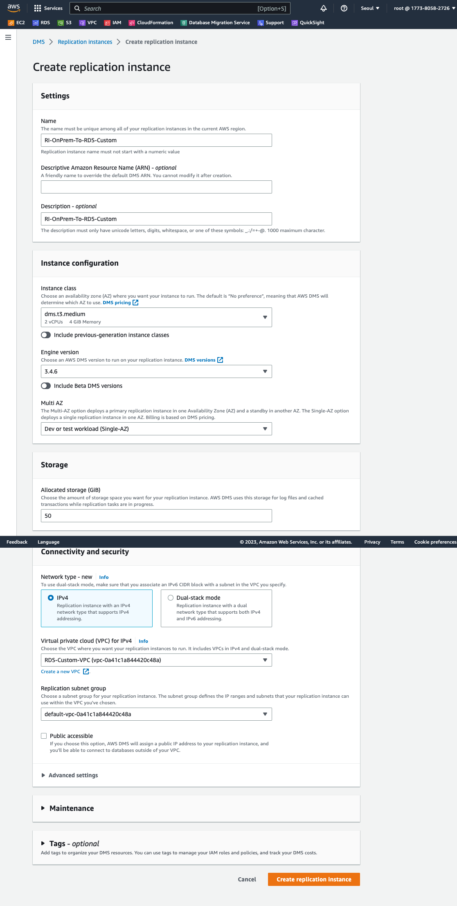


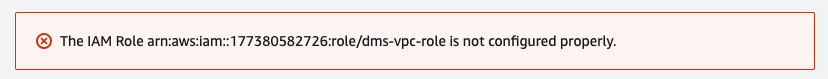


4. Replication Instance 생성 확인

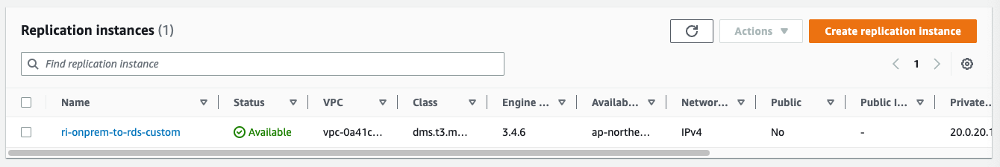


5. Source Endpoint 생성. 화면 좌측 `Endpoints` Click 후 `Create endpoint` Click

6. 다음처럼 정보 입력 후 `Create endpoint` Click

```
Endpoint Type : Source endpoint

Endpoint Configuration
Endpoint Identifier : Source-Oracle-SOE
Source Engine : Oracle
Access to endpoint database : Provide access information manually

Server Name : EC2의 OnPremDB의 Private IP Address를 입력
Port : 1521
Username : dms
Password : dms
SID/Service name : ONPREMDB
```

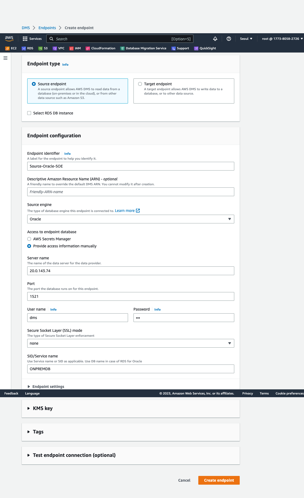


7. 생성된 Endpoint : source-oracle-soe 앞의 CheckBox를 체크 후 `Actions`=> `Test Connection` Click
8. `Run Test` Click 후 `status`가 `successful`인지 확인 ' 후 `Back` Click

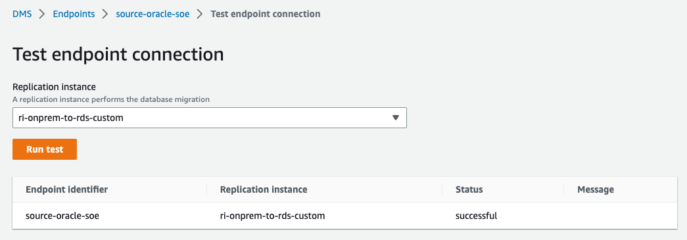

9. Target Endpoint를 생성합니다. `Create Endpoint` Click

10. 다음처럼 정보를 입력하고 `Create endpoint` Click

```
Endpoint type : Target endpoint

Endpoint Configuration
Endpoint identifier : target-rds-custom-oracle
Target Engine : Oracle

Access to endpoint database : Provide access information manually
Server name : EC2의 RDS Custom For Oracle EC2 인스턴스의 Private IP Address를 입력 또는 RDS Endpoint 입력
Port : 1521
User name : admin
Password : <Secrets Manager> :: rds-custom-key에서 "Retreive secret value"로 확인한 비밀번호 입력
SID/Service Name : DEV
```

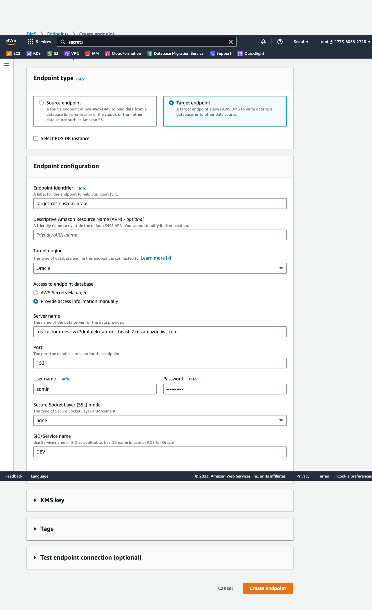


11. target-rds-custom-oracle를 선택 후 `Actions`=> `Test Connection` Click
12. `Run Test` Click 후 `status`가 `successful`인지 확인 ' 후 `Back` Click

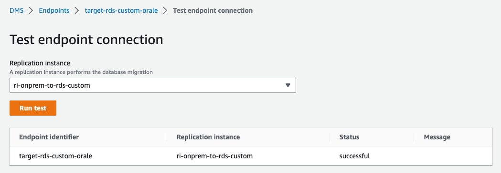


13. DMS Task 생성. 화면 좌측의 `Database migration tasks` Click
14. `Create Task` Click

15. 다음처럼 정보 입력 후 `Create Task` Click

```
Task configuration
Task identifier : ONPREMDB-to-RDSCustomOracle-SOE
Replication Instance : ri-onprem-to-rds-custom
Source database endpoint : source-oracle-soe
Target database endpoint : target-rds-custom-oracle
Migration Type : Migrate existing data and replicate ongoing changes

Task Settings
Custom CDC stop mode for source transactions : Disable
Target table preparation mode : Drop tables on target
Stop task after full load completes : Don't stop
Include LOB columns in replication : Limited LOB mode
Maximum LOB size (KB) : 32
Turn on validation : Check
Turn on CloudWatch logs : Check
Turn on batch-optimzied apply : Uncheck

Table mappings
Editing mode : JSON Editor

{
  "rules": [
    {
      "rule-type": "transformation",
      "rule-id": "699231213",
      "rule-name": "699231213",
      "rule-target": "schema",
      "object-locator": {
        "schema-name": "SOE"
      },
      "rule-action": "rename",
      "value": "SOE",
      "old-value": null
    },
    {
      "rule-type": "selection",
      "rule-id": "699221474",
      "rule-name": "699221474",
      "object-locator": {
        "schema-name": "SOE",
        "table-name": "CUSTOMERS"
      },
      "rule-action": "include",
      "filters": []
    }
  ]
}

```


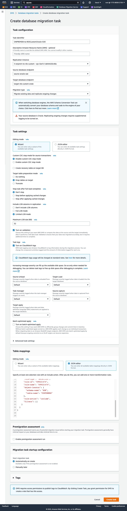


13. Task가 Staring 상태가 되면 Identifier를 Click

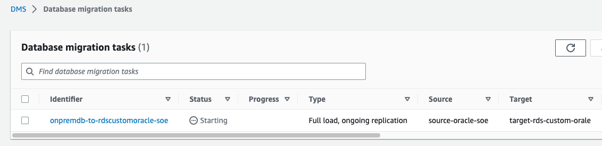


14. `Table statistics` 를 Click하면 진행 상황을 확인 가능합니다. 현재 `Full Load` Running 상태이며 현재까지 3,965,000건이 Migration되었음을 알 수 있습니다.


15. `Full Load`가 완료되고 `replication ongoing(CDC)`이 진행중입니다. Full Load 건수는 8,114,213건이고 추가 및 변경된 데이가 각각 143, 31건임을 알 수 있습니다. (Background로 지속적으로 데이터 추가 및 변경이 이뤄지고 있기 때문에 Test환경마다 숫자는 모두 다를 것입니다.)

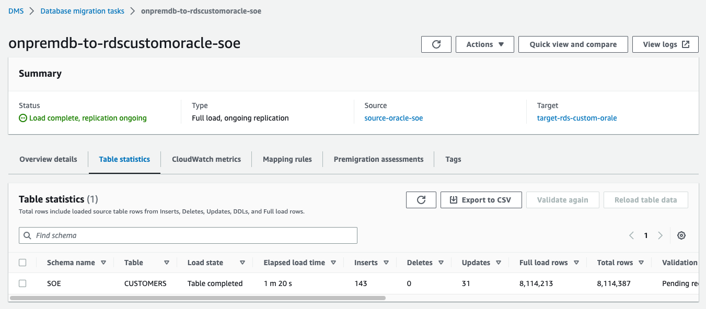


---


# Target RDS Custom For Oracle Data 확인

1. Appendix-1을 참고하여 EC2명이 `db-xxxxxxx`로 시작하는 EC2의 Terminal로 접속 후 oracle user로 Switch 합니다. 

2. `sqlplus / as sysdba` 를 사용하여 `RDS Custom for Oracle` Instance에 접속 합니다.

```
ssm-user@ip-20-0-133-93 bin]$ sudo su -
Last login: Thu Feb 23 08:13:50 UTC 2023 on pts/0
[root@ip-20-0-133-93 ~]# su - oracle
Last login: Thu Feb 23 08:13:51 UTC 2023 on pts/0
-bash-4.2$ sqlplus / as sysdba
...
Connected to:
Oracle Database 19c Enterprise Edition Release 19.0.0.0.0 - Production
Version 19.3.0.0.0

SQL>

```

3. 다음의 query로 데이터가 제대로 이관되고 있는지 확인합니다.

```
SQL> select count(*) from soe.customers;

  COUNT(*)
----------
   8265515
```

---


### DMS를 활용해서  RDS Custom for Oracle로 Data Migration을 완료하셨습니다.

---


https://332648163682.signin.aws.amazon.com/console


#### DMS User에게 Migration 대상 Schema를 읽을 수 있는 권한 할당(CMD로 나온 Command들을 SQLPLUS에서 실행)

```
 
select 'GRANT SELECT on '||owner||'.'||table_name||' to dms;' as CMD from dba_tables where owner='SOE';

SQL> select 'GRANT SELECT on '||owner||'.'||table_name||' to dms;' as CMD from dba_tables where owner='SOE';

CMD
--------------------------------------------------------------------------------
GRANT SELECT on SOE.CUSTOMERS to dms;
GRANT SELECT on SOE.ADDRESSES to dms;
GRANT SELECT on SOE.CARD_DETAILS to dms;
GRANT SELECT on SOE.WAREHOUSES to dms;
GRANT SELECT on SOE.ORDER_ITEMS to dms;
GRANT SELECT on SOE.ORDERS to dms;
GRANT SELECT on SOE.INVENTORIES to dms;
GRANT SELECT on SOE.PRODUCT_INFORMATION to dms;
GRANT SELECT on SOE.LOGON to dms;
GRANT SELECT on SOE.PRODUCT_DESCRIPTIONS to dms;
GRANT SELECT on SOE.ORDERENTRY_METADATA to dms;

11 rows selected.
```

```
SQL> !cat grant2.sql
GRANT SELECT on SOE.CUSTOMERS to dms;
GRANT SELECT on SOE.ADDRESSES to dms;
GRANT SELECT on SOE.CARD_DETAILS to dms;
GRANT SELECT on SOE.WAREHOUSES to dms;
GRANT SELECT on SOE.ORDER_ITEMS to dms;
GRANT SELECT on SOE.ORDERS to dms;
GRANT SELECT on SOE.INVENTORIES to dms;
GRANT SELECT on SOE.PRODUCT_INFORMATION to dms;
GRANT SELECT on SOE.LOGON to dms;
GRANT SELECT on SOE.PRODUCT_DESCRIPTIONS to dms;
GRANT SELECT on SOE.ORDERENTRY_METADATA to dms;

SQL> !vi grant2.sql

SQL> @grant2

Grant succeeded.
...
...
Grant succeeded.
```


#### 
