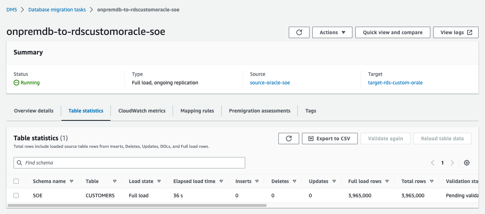

## Source Database 사전 작업

### Supplemental Log 확인 및 설정

```
SELECT supplemental_log_data_min FROM v$database;
ALTER DATABASE ADD SUPPLEMENTAL LOG DATA;
ALTER DATABASE ADD SUPPLEMENTAL LOG DATA (PRIMARY KEY) COLUMNS;

SQL> SELECT supplemental_log_data_min FROM v$database;

SUPPLEME
--------
YES
```


#### DMS User 생성 및 권한 grant

```
create user dms identified by dms;
grant connect, resource to dms;

```


#### grant.sql

```
GRANT CREATE SESSION TO dms;
GRANT SELECT ANY TRANSACTION TO dms;
GRANT SELECT ON V_$ARCHIVED_LOG TO dms;
GRANT SELECT ON V_$LOG TO dms;
GRANT SELECT ON V_$LOGFILE TO dms;
GRANT SELECT ON V_$LOGMNR_LOGS TO dms;
GRANT SELECT ON V_$LOGMNR_CONTENTS TO dms;
GRANT SELECT ON V_$DATABASE TO dms;
GRANT SELECT ON V_$THREAD TO dms;
GRANT SELECT ON V_$PARAMETER TO dms;
GRANT SELECT ON V_$NLS_PARAMETERS TO dms;
GRANT SELECT ON V_$TIMEZONE_NAMES TO dms;
GRANT SELECT ON V_$TRANSACTION TO dms;
GRANT SELECT ON V_$CONTAINERS TO dms;
GRANT SELECT ON ALL_INDEXES TO dms;
GRANT SELECT ON ALL_OBJECTS TO dms;
GRANT SELECT ON ALL_TABLES TO dms;
GRANT SELECT ON ALL_USERS TO dms;
GRANT SELECT ON ALL_CATALOG TO dms;
GRANT SELECT ON ALL_CONSTRAINTS TO dms;
GRANT SELECT ON ALL_CONS_COLUMNS TO dms;
GRANT SELECT ON ALL_TAB_COLS TO dms;
GRANT SELECT ON ALL_IND_COLUMNS TO dms;
GRANT SELECT ON ALL_ENCRYPTED_COLUMNS TO dms;
GRANT SELECT ON ALL_LOG_GROUPS TO dms;
GRANT SELECT ON ALL_TAB_PARTITIONS TO dms;
GRANT SELECT ON SYS.DBA_REGISTRY TO dms;
GRANT SELECT ON SYS.OBJ$ TO dms;
GRANT SELECT ON DBA_TABLESPACES TO dms;
GRANT SELECT ON DBA_OBJECTS TO dms;
GRANT SELECT ON SYS.ENC$ TO dms;
GRANT EXECUTE on DBMS_LOGMNR to dms;
GRANT EXECUTE ON SYS.DBMS_CRYPTO TO dms;
GRANT SELECT on V_$LOGMNR_LOGS to dms;
GRANT SELECT on V_$LOGMNR_CONTENTS to dms;
GRANT SELECT on V_$containers to dms;
GRANT SELECT ON SYS.DBA_DIRECTORIES TO dms;
GRANT SELECT on ALL_VIEWS to dms;
GRANT SELECT ANY TABLE to dms;
GRANT ALTER ANY TABLE to dms;
GRANT create any directory to dms;
GRANT LOGMINING to dms;
GRANT SELECT on v_$transportable_platform to dms;
GRANT EXECUTE on DBMS_FILE_TRANSFER to dms;  
GRANT EXECUTE on DBMS_FILE_GROUP to dms;
```

```
SQL> !cat grant.sql
GRANT CREATE SESSION TO dms;
GRANT SELECT ANY TRANSACTION TO dms;
GRANT SELECT ON V_$ARCHIVED_LOG TO dms;
GRANT SELECT ON V_$LOG TO dms;
GRANT SELECT ON V_$LOGFILE TO dms;
GRANT SELECT ON V_$LOGMNR_LOGS TO dms;
GRANT SELECT ON V_$LOGMNR_CONTENTS TO dms;
GRANT SELECT ON V_$DATABASE TO dms;
GRANT SELECT ON V_$THREAD TO dms;
GRANT SELECT ON V_$PARAMETER TO dms;
GRANT SELECT ON V_$NLS_PARAMETERS TO dms;
GRANT SELECT ON V_$TIMEZONE_NAMES TO dms;
GRANT SELECT ON V_$TRANSACTION TO dms;
GRANT SELECT ON V_$CONTAINERS TO dms;
GRANT SELECT ON ALL_INDEXES TO dms;
GRANT SELECT ON ALL_OBJECTS TO dms;
GRANT SELECT ON ALL_TABLES TO dms;
GRANT SELECT ON ALL_USERS TO dms;
GRANT SELECT ON ALL_CATALOG TO dms;
GRANT SELECT ON ALL_CONSTRAINTS TO dms;
GRANT SELECT ON ALL_CONS_COLUMNS TO dms;
GRANT SELECT ON ALL_TAB_COLS TO dms;
GRANT SELECT ON ALL_IND_COLUMNS TO dms;
GRANT SELECT ON ALL_ENCRYPTED_COLUMNS TO dms;
GRANT SELECT ON ALL_LOG_GROUPS TO dms;
GRANT SELECT ON ALL_TAB_PARTITIONS TO dms;
GRANT SELECT ON SYS.DBA_REGISTRY TO dms;
GRANT SELECT ON SYS.OBJ$ TO dms;
GRANT SELECT ON DBA_TABLESPACES TO dms;
GRANT SELECT ON DBA_OBJECTS TO dms;
GRANT SELECT ON SYS.ENC$ TO dms;
GRANT EXECUTE on DBMS_LOGMNR to dms;
GRANT EXECUTE ON SYS.DBMS_CRYPTO TO dms;
GRANT SELECT on V_$LOGMNR_LOGS to dms;
GRANT SELECT on V_$LOGMNR_CONTENTS to dms;
GRANT SELECT on V_$containers to dms;
GRANT SELECT ON SYS.DBA_DIRECTORIES TO dms;
GRANT SELECT on ALL_VIEWS to dms;
GRANT SELECT ANY TABLE to dms;
GRANT ALTER ANY TABLE to dms;
GRANT create any directory to dms;
GRANT LOGMINING to dms;
GRANT SELECT on v_$transportable_platform to dms;
GRANT EXECUTE on DBMS_FILE_TRANSFER to dms;  
GRANT EXECUTE on DBMS_FILE_GROUP to dms;


SQL> @grant.sql
Grant succeeded.
...
...
Grant succeeded.
```


#### DMS User에게 Migration 대상 Schema를 읽을 수 있는 권한 할당(CMD로 나온 Command들을 SQLPLUS에서 실행)

```
 
select 'GRANT SELECT on '||owner||'.'||table_name||' to dms;' as CMD from dba_tables where owner='SOE';

SQL> select 'GRANT SELECT on '||owner||'.'||table_name||' to dms;' as CMD from dba_tables where owner='SOE';

CMD
--------------------------------------------------------------------------------
GRANT SELECT on SOE.CUSTOMERS to dms;
GRANT SELECT on SOE.ADDRESSES to dms;
GRANT SELECT on SOE.CARD_DETAILS to dms;
GRANT SELECT on SOE.WAREHOUSES to dms;
GRANT SELECT on SOE.ORDER_ITEMS to dms;
GRANT SELECT on SOE.ORDERS to dms;
GRANT SELECT on SOE.INVENTORIES to dms;
GRANT SELECT on SOE.PRODUCT_INFORMATION to dms;
GRANT SELECT on SOE.LOGON to dms;
GRANT SELECT on SOE.PRODUCT_DESCRIPTIONS to dms;
GRANT SELECT on SOE.ORDERENTRY_METADATA to dms;

11 rows selected.
```

```
SQL> !cat grant2.sql
GRANT SELECT on SOE.CUSTOMERS to dms;
GRANT SELECT on SOE.ADDRESSES to dms;
GRANT SELECT on SOE.CARD_DETAILS to dms;
GRANT SELECT on SOE.WAREHOUSES to dms;
GRANT SELECT on SOE.ORDER_ITEMS to dms;
GRANT SELECT on SOE.ORDERS to dms;
GRANT SELECT on SOE.INVENTORIES to dms;
GRANT SELECT on SOE.PRODUCT_INFORMATION to dms;
GRANT SELECT on SOE.LOGON to dms;
GRANT SELECT on SOE.PRODUCT_DESCRIPTIONS to dms;
GRANT SELECT on SOE.ORDERENTRY_METADATA to dms;

SQL> !vi grant2.sql

SQL> @grant2

Grant succeeded.
...
...
Grant succeeded.
```


#### Supplemental Logging on Table

```
select 'ALTER TABLE '||owner||'.'||table_name||' ADD SUPPLEMENTAL LOG DATA (PRIMARY KEY) COLUMNS;' as CMD from dba_tables where owner='SOE';

SQL> select 'ALTER TABLE '||owner||'.'||table_name||' ADD SUPPLEMENTAL LOG DATA (PRIMARY KEY) COLUMNS;' as CMD from dba_tables where owner='SOE';

CMD
-----------------------------------------------------------------------------------------------------
ALTER TABLE SOE.CUSTOMERS ADD SUPPLEMENTAL LOG DATA (PRIMARY KEY) COLUMNS;
ALTER TABLE SOE.ADDRESSES ADD SUPPLEMENTAL LOG DATA (PRIMARY KEY) COLUMNS;
ALTER TABLE SOE.CARD_DETAILS ADD SUPPLEMENTAL LOG DATA (PRIMARY KEY) COLUMNS;
ALTER TABLE SOE.WAREHOUSES ADD SUPPLEMENTAL LOG DATA (PRIMARY KEY) COLUMNS;
ALTER TABLE SOE.ORDER_ITEMS ADD SUPPLEMENTAL LOG DATA (PRIMARY KEY) COLUMNS;
ALTER TABLE SOE.ORDERS ADD SUPPLEMENTAL LOG DATA (PRIMARY KEY) COLUMNS;
ALTER TABLE SOE.INVENTORIES ADD SUPPLEMENTAL LOG DATA (PRIMARY KEY) COLUMNS;
ALTER TABLE SOE.PRODUCT_INFORMATION ADD SUPPLEMENTAL LOG DATA (PRIMARY KEY) COLUMNS;
ALTER TABLE SOE.LOGON ADD SUPPLEMENTAL LOG DATA (PRIMARY KEY) COLUMNS;
ALTER TABLE SOE.PRODUCT_DESCRIPTIONS ADD SUPPLEMENTAL LOG DATA (PRIMARY KEY) COLUMNS;
ALTER TABLE SOE.ORDERENTRY_METADATA ADD SUPPLEMENTAL LOG DATA (PRIMARY KEY) COLUMNS;

11 rows selected.

```

```
SQL> !cat supplemental.sql
ALTER TABLE SOE.CUSTOMERS ADD SUPPLEMENTAL LOG DATA (PRIMARY KEY) COLUMNS;
ALTER TABLE SOE.ADDRESSES ADD SUPPLEMENTAL LOG DATA (PRIMARY KEY) COLUMNS;
ALTER TABLE SOE.CARD_DETAILS ADD SUPPLEMENTAL LOG DATA (PRIMARY KEY) COLUMNS;
ALTER TABLE SOE.WAREHOUSES ADD SUPPLEMENTAL LOG DATA (PRIMARY KEY) COLUMNS;
ALTER TABLE SOE.ORDER_ITEMS ADD SUPPLEMENTAL LOG DATA (PRIMARY KEY) COLUMNS;
ALTER TABLE SOE.ORDERS ADD SUPPLEMENTAL LOG DATA (PRIMARY KEY) COLUMNS;
ALTER TABLE SOE.INVENTORIES ADD SUPPLEMENTAL LOG DATA (PRIMARY KEY) COLUMNS;
ALTER TABLE SOE.PRODUCT_INFORMATION ADD SUPPLEMENTAL LOG DATA (PRIMARY KEY) COLUMNS;
ALTER TABLE SOE.LOGON ADD SUPPLEMENTAL LOG DATA (PRIMARY KEY) COLUMNS;
ALTER TABLE SOE.PRODUCT_DESCRIPTIONS ADD SUPPLEMENTAL LOG DATA (PRIMARY KEY) COLUMNS;
ALTER TABLE SOE.ORDERENTRY_METADATA ADD SUPPLEMENTAL LOG DATA (PRIMARY KEY) COLUMNS;

SQL> @supplemental.sql

Table altered.
...
...
Table altered.

```


# Target Database SOE Schema 생성

1. EC2 Console로 이동합니다.  ([link](https://ap-northeast-2.console.aws.amazon.com/ec2/home?region=ap-northeast-2#Instances:))

2. OnPremDB  앞의 CheckBox를 선택 후 화면 중앙 상단의 `Connect`를 Click

3. Connect to instance에서 `Connect` Click


---

## DMS를 활용한 DB Migration

---

### Replication Instance 생성 

1. DMS Console로 이동([link](https://ap-northeast-2.console.aws.amazon.com/dms/v2/home?region=ap-northeast-2#replicationInstances))


2. `Create replication instance` Click


3. 다음처럼 정보를 입력 후 `Create replication instance` Click(dms-vpc-role is not configured properly 에러 발생 시 10초 있다가 다시 생성 버튼을 Click)

```
Name : RI-OnPrem-To-RDS-Custom

Instance configuration
Instance Class : dms.t3.medium or dms.c5.large
Engine Version : 3.4.6
Multi AZ : Dev or test workload

Storage
Allocated storage(GIB) : 50

Connectivity and security
Network type : IPv4
Virtual private cloud (VPC) for IPv4 : RDS-Custom-VPC
Replication subnet group : Default 유지
Public accessible : Uncheck
```


4. Replication Instance 생성 확인


5. Source Endpoint 생성. 화면 좌측 `Endpoints` Click 후 `Create endpoint` Click

6. 다음처럼 정보 입력 후 `Create endpoint` Click

```
Endpoint Type : Source endpoint

Endpoint Configuration
Endpoint Identifier : Source-Oracle-SOE
Source Engine : Oracle
Access to endpoint database : Provide access information manually

Server Name : 20.0.143.74
Port : 1521
Username : dms
Password : dms
SID/Service name : ONPREMDB
```


7. source-oracle-soe를 선택 후 `Actions`=> `Test Connection` Click
8. `Run Test` Click 후 `status`가 `successful`인지 확인 ' 후 `Back` Click


9. Target Endpoint를 생성합니다. `Create Endpoint` Click

10. 다음처럼 정보를 입력하고 `Create endpoint` Click

```
Endpoint type : Target endpoint

Endpoint Configuration
Endpoint identifier : target-rds-custom-oracle
Target Engine : Oracle

Access to endpoint database : Provide access information manually
Server name : rds-custom-dev.cwx7dmluiekk.ap-northeast-2.rds.amazonaws.com
Port : 1521
User name : admin
Password : 
SID/Service Name : DEV
```


11. target-rds-custom-oracle를 선택 후 `Actions`=> `Test Connection` Click
12. `Run Test` Click 후 `status`가 `successful`인지 확인 ' 후 `Back` Click


13. DMS Task 생성. 화면 좌측의 `Database migration tasks` Click
14. `Create Task` Click

15. 다음처럼 정보 입력 후 `Create Task` Click

```
Task configuration
Task identifier : ONPREMDB-to-RDSCustomOracle-SOE
Replication Instance : ri-onprem-to-rds-custom
Source database endpoint : source-oracle-soe
Target database endpoint : target-rds-custom-oracle
Migration Type : Migrate existing data and replicate ongoing changes

Task Settings
Custom CDC stop mode for source transactions : Disable
Target table preparation mode : Drop tables on target
Stop task after full load completes : Don't stop
Include LOB columns in replication : Limited LOB mode
Maximum LOB size (KB) : 32
Turn on validation : Check
Turn on CloudWatch logs : Check
Turn on batch-optimzied apply : Uncheck

Table mappings
Editing mode : JSON Editor

{
  "rules": [
    {
      "rule-type": "transformation",
      "rule-id": "699231213",
      "rule-name": "699231213",
      "rule-target": "schema",
      "object-locator": {
        "schema-name": "SOE"
      },
      "rule-action": "rename",
      "value": "SOE",
      "old-value": null
    },
    {
      "rule-type": "selection",
      "rule-id": "699221474",
      "rule-name": "699221474",
      "object-locator": {
        "schema-name": "SOE",
        "table-name": "CUSTOMERS"
      },
      "rule-action": "include",
      "filters": []
    }
  ]
}

```


13. Task가 Staring 상태가 되면 Identifier를 Click


14. `Table statistics` 를 Click하면 진행 상황을 확인 가능합니다. 현재 `Full Load` Running 상태이며 현재까지 3,965,000건이 Migration되었음을 알 수 있습니다.




15. `Full Load`가 완료되고 `replication ongoing(CDC)`이 진행중입니다. Full Load 건수는 8,114,213건이고 추가 및 변경된 데이가 각각 143, 31건임을 알 수 있습니다. (Background로 지속적으로 데이터 추가 및 변경이 이뤄지고 있기 때문에 Test환경마다 숫자는 모두 다를 것입니다.)


